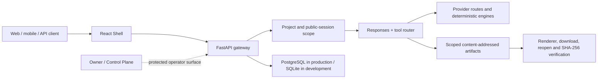

<p align="center">
  
</p>

<h1 align="center">Kolibri AI OS</h1>

<p align="center">
  Единое AI-пространство для диалога, исследований, смет, документов,
  изображений и проектных артефактов.
</p>

<p align="center">
  <a href="https://kolibriai.ru/">Портал</a> ·
  <a href="https://kolibriai.ru/app">Приложение</a> ·
  <a href="https://kolibriai.ru/developers">Developers</a> ·
  <a href="https://kolibriai.ru/docs">API Docs</a>
</p>

<p align="center">
  <a href="https://github.com/rd8r8bkd9m-tech/kolibri-ai-platform/actions/workflows/ci.yml"></a>
</p>

> **Статус:** активная разработка и подготовка release candidate. Наличие
> обработчика в исходном коде не означает, что соответствующий инструмент
> доступен в production. Актуальное состояние конкретного релиза публикует
> runtime registry: [`GET /v1/capabilities`](https://kolibriai.ru/v1/capabilities).
> Статус `available` появляется только после реального успешного invocation
> probe; `degraded` и `unavailable` не маскируются как успех.

## Продукт

Kolibri принимает запрос обычным языком и ведёт его в одном проекте от диалога
до проверяемого результата. Публичное имя модели — `kolibri`; внутренний
provider выбирается маршрутизатором по задаче, доступности, политике и бюджету.

Основные поверхности:

- проектный чат с сохранением истории, streaming, cancel и retry;
- source-backed веб-поиск для данных, которые меняются со временем;
- загрузка, анализ и поиск по файлам;
- редактируемые строительные сметы с Decimal-пересчётом и ревизиями;
- PDF, DOCX, XLSX и PPTX как настоящие сохраняемые артефакты;
- генерация и редактирование изображений при наличии подтверждённого маршрута;
- bundles сайтов и приложений, sandbox preview и повторное открытие;
- OpenAI-compatible Responses API и Chat Completions API;
- защищённый operator-контур фабрики, отделённый от public bundle.

## Truthful capability matrix

Матрица ниже описывает **реализованный контракт в этой ветке**, а не обещает
доступность внешнего provider в production. Истина исполнения находится в
runtime registry и привязана к `release_id`.

| Capability | Состояние контракта | Условие реальной доступности |
| --- | --- | --- |
| Projects, history, streaming, cancel, retry | Реализован | Успешный session bootstrap и response probe текущего релиза |
| Responses API, Chat Completions, structured JSON | Реализован | Валидный public session или API key и здоровый provider route |
| Web search | Реализован, fail-closed | Ответ содержит URL источника и время получения; без evidence текущий факт не выдаётся |
| File upload, analysis and search | Реализован | Bytes сохранены и повторно открыты; text-layer PDF поддержан, OCR пока не заявлен |
| PDF, DOCX, XLSX, PPTX | Реализован | Artifact bytes, MIME, size и SHA-256 прошли reopen verification |
| Estimates | Реализован | Итоги пересчитаны Decimal-движком; статус `verified` требует достаточных исходных данных и источников цен |
| Image generation and editing | Условный маршрут | Credential, policy, provider, renderer и raster-byte probe текущего релиза |
| Site/app bundle and preview | Реализован | Bundle сохранён в scoped CAS и sandbox preview успешно открыт |
| API keys | Реализован, owner-gated | Ключ показан один раз, в БД хранится только hash, revoke подтверждён |
| External integrations and automations | Недоступен по дизайну | Нужны отдельные handler, auth/permission gate и реальный invocation proof |
| Factory fleet | Operator-only | Membership/heartbeat не равен выполнению; нужен task artifact, hash и независимый verifier |

Подробный контракт статусов: [Backend capability runtime](kolibri-backend/docs/CAPABILITY_RUNTIME.md).

## Архитектура



Ключевые границы:

- **Shell** (`kolibri-v2/`) — React 19, TypeScript, Vite; public landing и
  session-bound application routes разделены.
- **Backend** (`kolibri-backend/`) — FastAPI, project/session scope,
  OpenAI-compatible endpoints, canonical capability registry и tool router.
- **Deterministic engines** — вычисления смет и экспорт документов не доверяют
  денежный итог свободному тексту модели.
- **Artifact store** — immutable revisions, MIME/size/SHA-256, scoped access,
  download и reopen contracts.
- **Release tooling** — side-by-side candidate, functional gate, atomic switch
  и rollback; production switch не выполняется из CI или обычного PR.
- **Factory** — отдельный operator-контур. Connected/fresh/schedulable/active/
  verified являются разными состояниями; heartbeat не доказывает execution.

## API

Основной публичный контракт совместим с привычной формой OpenAI API:

```http
POST /v1/responses
GET  /v1/responses/{id}
GET  /v1/responses/{id}/events
POST /v1/responses/{id}/cancel
POST /v1/responses/{id}/retry

POST /v1/chat/completions
GET  /v1/models
GET  /v1/capabilities
```

Дополнительные typed surfaces:

```http
POST /api/v1/shell/bootstrap
GET/POST/PATCH/DELETE /api/v1/projects
POST /api/v1/tools/invoke
POST /api/v1/files
POST /api/v1/files/{id}/analyze
GET  /api/v1/files/search
GET  /api/v1/artifacts/{id}
GET  /api/v1/artifacts/{id}/reopen
GET  /api/v1/artifacts/{id}/history
```

Неизвестный `/api/*`, `/v1/*` или hashed asset должен вернуть API/asset 404,
а не HTML приложения.

## Локальный quickstart

### Требования

- Node.js `24.18.0` и npm 11;
- Python `3.14.6`;
- системные библиотеки WeasyPrint для PDF;
- PostgreSQL для production-like запуска; SQLite допускается только для
  локальной разработки.

Версии зафиксированы в [`.node-version`](.node-version),
[`.python-version`](.python-version) и [`rust-toolchain.toml`](rust-toolchain.toml).
Политика обновлений описана в [docs/TOOLCHAIN_POLICY.md](docs/TOOLCHAIN_POLICY.md).

### Backend

```bash
cd kolibri-backend
python -m venv .venv
source .venv/bin/activate
python -m pip install --require-hashes -r requirements.lock
cp .env.example .env
# Задайте уникальные secrets и локальный DATABASE_URL. Не коммитьте .env.
python -m uvicorn app.main:app --reload --host 127.0.0.1 --port 8000
```

### Frontend

```bash
cd kolibri-v2
npm ci
KOLIBRI_API_PROXY=http://127.0.0.1:8000 npm run dev
```

Откройте `http://127.0.0.1:3000/`. Локальный запуск не доказывает production
availability внешних providers.

### Контейнеры

```bash
docker compose build
docker compose up
```

`docker-compose.yml` предназначен для разработки. Перед любым внешним
развёртыванием замените dev credentials, включите TLS, secret manager, backup
и release gate.

## Проверки

```bash
# Frontend
cd kolibri-v2
npm run lint
npm run test
npm run build

# Backend
cd kolibri-backend
python -m pytest app/tests/ -v

# Pinned toolchains
cd ..
python scripts/verify_toolchains.py
```

Pull request не считается готовым только по зелёному unit CI. Изменения
пользовательского сценария требуют browser E2E, а capability — полного пути
`invoke → bytes/result → persistence → renderer/download → reopen`.

## Безопасность

- Не публикуйте provider keys, Telegram tokens, owner tokens, cookies,
  browser sessions и содержимое `.env`.
- Public session не должна видеть внутреннюю топологию или operator actions.
- Project, file и artifact access должен проверять server-issued scope.
- API keys показываются один раз; на сервере хранится только hash.
- Production, DNS, firewall, credentials, destructive operations и model
  promotion требуют отдельного owner-approved change.
- Уязвимости не публикуются в issue tracker. Используйте процедуру
  [SECURITY.md](SECURITY.md).

## Roadmap

Roadmap отражает направление, а не обещанную дату:

1. **Release foundation** — закрыть session/artifact isolation, browser E2E,
   signed release identity и rollback gate.
2. **First paid workflow** — довести brief → source-backed estimate → editor →
   PDF/XLSX до измеримого пользовательского результата.
3. **Universal workspace** — documents, research, images, code and app preview
   через единый capability registry и artifact lifecycle.
4. **Factory scale** — доказанная capability campaign на каждом узле,
   durable leases, independent verification и честный Control Center.
5. **FormulaLM** — только sanitized, consent- и license-compatible datasets,
   independent evaluation, shadow, canary и rollback.

Приоритеты и scope обсуждаются в issues; production truth не заменяется
roadmap-текстом.

## Участие и поддержка

- Правила разработки: [CONTRIBUTING.md](CONTRIBUTING.md)
- Сообщить об ошибке или предложить улучшение:
  [GitHub Issues](https://github.com/rd8r8bkd9m-tech/kolibri-ai-platform/issues)
- Каналы поддержки и состав диагностических данных: [SUPPORT.md](SUPPORT.md)
- Ответственное сообщение об уязвимости: [SECURITY.md](SECURITY.md)

В репозитории нет файла `LICENSE`; отсутствие лицензии не предоставляет право
на копирование, распространение или коммерческое использование исходного кода.
