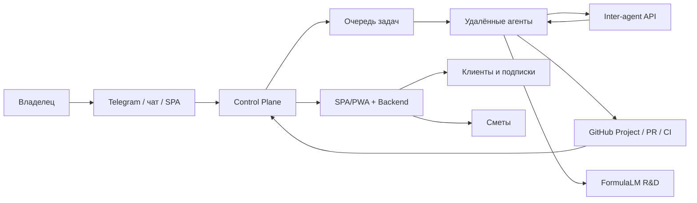

# Kolibri AI Platform

Kolibri AI Platform — русскоязычная AI-платформа и фабрика автономных
агентов. Главное правило проекта: мы создаём искусственный интеллект, а не
набор разрозненных скриптов или интерфейсов.

Цель продукта — платформа венчурного масштаба: SPA/PWA для пользователей,
Control Plane для серверов, агентная фабрика, детерминированный сметчик,
FormulaLM R&D, мобильный слой GoMesh и GitHub-контур, где видна работа всех
агентов.

## Что строим

- AI-фабрика, которая распределяет задачи между серверами и агентами.
- SPA/PWA с общением через чат и кнопку Control в правом нижнем углу.
- Светлая, системная и адаптивная тема интерфейса.
- Подписки и платежный контур T-Банк.
- Детерминированные строительные сметы с повторяемым результатом для
  одинаковых вводных.
- FormulaLM как отдельное направление R&D, тестируемое только на удалённых
  серверах.
- GitHub Project как операционный центр разработки, отчётов агентов, CI и
  инвесторского трека.

## Архитектура



## Документация

- [Главная документация](docs/README.md)
- [Фабрика агентов](docs/factory.md)
- [GitHub Project и CI](docs/github-ci.md)
- [Инвесторы и венчурная цель](docs/investors.md)
- [FormulaLM](docs/formulalm.md)
- [Мобильная стратегия и GoMesh](docs/mobile-gomesh.md)

## Быстрый старт

```bash
# Backend
cd backend
pip install -r requirements.txt
python -m uvicorn main:app --host 0.0.0.0 --port 8000

# Frontend
cd frontend
npm install
npm run dev
```

## Правила работы

- Вся документация и операционные отчёты ведутся на русском языке.
- Mac используется только как управляющая и редакторская поверхность.
- Эксперименты с моделями и FormulaLM выполняются только на удалённых серверах.
- Фабрика работает на целевой нагрузке 80%, оставляя 20% резерва.
- Каждый агент докладывает статус через inter-agent API, GitHub issues/PR и
  GitHub Project после включения нужного OAuth scope.
- Упавшие проверки GitHub не игнорируются: они мониторятся и исправляются.

## Репозиторий

```text
kolibri-ai-platform/
├── backend/      # FastAPI backend, сметы, платежи, API
├── frontend/     # React SPA/PWA
├── ops/          # Control Plane, agent host, bootstrap серверов
├── docs/         # Русская документация и схемы
├── scripts/      # Утилиты, бенчмарки, деплой
└── .github/      # CI и шаблоны отчётов
```

## Лицензия

Kolibri AI Platform.
