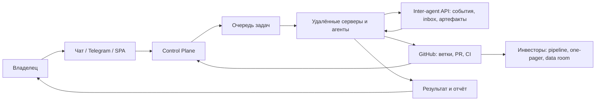

# Документация Kolibri

Главное правило проекта: мы создаём искусственный интеллект, а не просто
приложение. Интерфейс, серверы, агенты, FormulaLM, сметы, платежи и GitHub
процессы должны складываться в единую автономную систему, которая понимает
задачи, координирует работу, проверяет себя и возвращает полезный результат.

Стратегическая цель: построить платформу, которая может стоить несколько
миллиардов долларов за счёт сочетания AI-фабрики, вертикальных продуктов,
FormulaLM, подписочной модели и масштабируемой инфраструктуры агентов.

Документация ведётся на русском языке и должна быть понятной владельцу,
разработчикам и агентам фабрики. Для схем используем Mermaid, чтобы диаграммы
красиво отображались прямо в GitHub.

## Разделы

- [Фабрика агентов](factory.md)
- [Мобильная стратегия и GoMesh](mobile-gomesh.md)
- [FormulaLM](formulalm.md)
- [GitHub и CI-мониторинг](github-ci.md)
- [Инвесторы и венчурная цель](investors.md)
- [Живая птица Kolibri](living-bird.md)
- [Пул субагентов](subagent-pool.md)
- [Интеграционный отчёт agent-work](agent-work/docs-integration-report.md)

## Agent-work пакеты

Новые пакеты из `docs/agent-work/` являются рабочими операционными
артефактами. Основные документы выше дают владельцу короткую навигацию, а
пакеты ниже остаются источником детальных регламентов.

| Пакет | Куда интегрирован | Назначение |
| --- | --- | --- |
| [FormulaLM Remote R&D Pack](agent-work/formulalm-remote-rd-pack.md) | [FormulaLM](formulalm.md), [GitHub и CI](github-ci.md) | Remote-only benchmark protocol, гипотезы, метрики и blocker policy. |
| [QA-пакет релиза](agent-work/product-qa-pack.md) | [GitHub и CI](github-ci.md), [Пул субагентов](subagent-pool.md), [Живая птица](living-bird.md) | Pre-release проверки SPA/PWA, backend, billing, factory, Project и mobile. |
| [GitHub Project ops](agent-work/github-project-ops.md) | [GitHub и CI](github-ci.md), [Пул субагентов](subagent-pool.md) | Операционный регламент для issues, PR, Project fields и handoff. |
| [T-Банк billing ops](agent-work/tbank-billing-ops.md) | [Инвесторы](investors.md), [GitHub и CI](github-ci.md) | Checkout, fallback lead, notification security, charge-due и readiness. |
| [Mobile/GoMesh Integration Pack](agent-work/mobile-gomesh-integration-pack.md) | [Мобильная стратегия и GoMesh](mobile-gomesh.md), [GitHub и CI](github-ci.md), [Пул субагентов](subagent-pool.md) | PWA-first mobile path, GoMesh contracts, feature flags и fallback. |
| [Legacy Integration Plan](agent-work/kolibri-legacy-integration-plan.md) | [FormulaLM](formulalm.md), [Пул субагентов](subagent-pool.md), [Интеграционный отчёт](agent-work/docs-integration-report.md) | Sanitized перенос legacy-идей в текущие контракты без raw paths и секретов. |
| [Living Bird Rive Spec](agent-work/living-bird-rive-spec.md) | [Живая птица Kolibri](living-bird.md) | Rive state machine, SVG fallback, personality, performance и QA matrix. |
| [Investor Outreach Pack](agent-work/investor-outreach-pack.md) | [Инвесторы и венчурная цель](investors.md) | One-pager, outreach, CRM fields, evidence packs и честные claim boundaries. |

Отдельный `GitHub API inventory` пакет в `docs/agent-work/` на момент
интеграции не найден. Когда он появится, его нужно добавить в эту таблицу и в
[GitHub и CI-мониторинг](github-ci.md).

## Общая схема

## Правила качества

- Все эксперименты с моделями выполняются только на удалённых серверах.
- Mac используется только как точка управления и редактирования.
- Перед выдачей результата нужны локальная проверка, серверная проверка и
  независимый QA-прогон.
- Упавшие GitHub checks мониторятся и исправляются отдельной automation.
- GitHub Project является основным экраном мониторинга разработки, агентов,
  блокеров, инвесторского pipeline и FormulaLM R&D.
- Product QA пакет является обязательной рамкой перед release decision:
  релиз нельзя считать готовым без evidence по SPA/PWA, backend, billing,
  factory, GitHub Project, mobile/GoMesh fallback и living bird.
- GitHub Project уже создан:
  [Kolibri AI Platform: фабрика ИИ и продуктовый контур](https://github.com/users/rd8r8bkd9m-tech/projects/2).
  У `gh` включены scopes `repo`, `workflow`, `project`, `user`, `read:org`,
  `gist`; старый blocker про отсутствие Project API scope больше не актуален.
