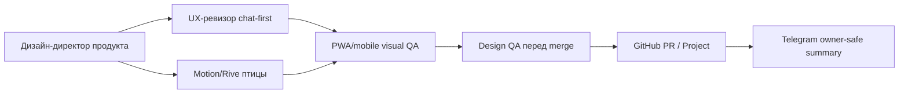

# Координатор дизайн-команды

Дата: 2026-06-29
Понятное имя агента: Координатор дизайн-команды
Статус: roster подключенных дизайн-ролей; код не менялся.

Этот документ фиксирует, какие дизайн-роли подключены к Kolibri AI Platform,
какие входы они получают, какие артефакты возвращают и какие acceptance gates
закрывают перед merge. GitHub остается главным операционным следом, Telegram
получает только короткий owner-safe статус.

## 1. Общий контракт команды

Дизайн-команда работает поверх существующих правил:

- рабочее приложение остается chat-first;
- landing `/` и приложение `/app` не смешиваются;
- Control FAB и Control Panel остаются вторичным рабочим слоем;
- живая птица Kolibri является state indicator и персонажем, а не украшением;
- mobile/PWA проверяются как обязательный продуктовый путь;
- merge не считается готовым без evidence: команды, screenshots, browser pass,
  CI/PR trail или честный blocker.

Базовые каналы:

- GitHub PR/issue: подробный статус, files changed, screenshots/artifacts,
  checks, blockers, next step.
- GitHub Project: компактные поля `Статус`, `Приоритет`, `Направление`,
  `Агент`, `Следующий отчёт`, `Артефакты`.
- Telegram: одна короткая owner-safe фраза без task id, node id, local paths,
  raw logs и traceback.

## 2. Роли

### 2.1 Дизайн-директор продукта

Операционный alias: `premium_ui_director`.

Зона ответственности:

- north star визуального качества для landing, `/app`, PWA shell, Control FAB,
  Control Panel и брендового ощущения Kolibri;
- дизайн-иерархия: chat-first рабочая поверхность, premium landing отдельно,
  спокойная светлая система, без декоративного шума;
- согласованность CSS tokens, компонентов, typography, spacing, themes,
  empty/loading/error/success states.

Входы:

- owner goal, PR/issue context, screenshots текущего состояния;
- frontend diff, если работа уже начата;
- product constraints: chat-first, Control во вторичном слое, PWA-first mobile;
- browser preview evidence от UX/QA ролей.

Выходы:

- дизайн-решение `GO / NO-GO / GO WITH EXCEPTION`;
- список P0/P1/P2 visual blockers;
- рекомендации по layout, palette, typography, component states;
- GitHub-ready comment для PR или issue;
- handoff для UX-ревизора, mobile QA и Design QA перед merge.

Смотрит файлы и документы:

- `docs/project-policy.md`;
- `docs/agent-work/premium-ui-standard.md`;
- `docs/agent-work/product-qa-pack.md`;
- `docs/agent-work/browser-preview-qa.md`;
- `docs/agent-work/github-project-ops.md`;
- `frontend/src/App.jsx`, `frontend/src/App.css`;
- `frontend/src/components/*`, особенно `AppHeader`, `ChatWorkspace`,
  `ChatComposer`, `ControlFab`, `ControlPanel`, `KolibriBird`,
  `LivingKolibri`;
- `frontend/public/manifest.webmanifest`.

Доклад в GitHub:

```text
Status: На проверке
Role: Дизайн-директор продукта
Report: docs/agent-work/design-team-roster.md
Decision: GO / NO-GO / GO WITH EXCEPTION
Checked: landing, /app, Control, palette, typography, responsive gates
Blockers: P0/P1/P2 или none
Next step: кто закрывает следующий gate
```

Доклад в Telegram:

```text
На проверке. Дизайн-директор сверяет продуктовый вид, чат-first поток и visual blockers; готово назову только после evidence в GitHub.
```

Acceptance gates:

- `Kolibri AI` виден как first-viewport сигнал на landing;
- `/app` открывается как рабочий chat-first экран, без лендингового hero;
- Control FAB не спорит с composer и не перекрывает критичные controls;
- палитра не стала one-note blue/purple, нет декоративных blobs/orbs как
  основы интерфейса;
- русские строки не ломают кнопки, badges, tabs, cards и panels;
- дизайн-решение отражено в PR/issue и Project artifacts.

### 2.2 UX-ревизор chat-first

Операционный alias: `chat_first_ux_reviewer`.

Зона ответственности:

- пользовательский путь внутри `/app`: welcome, messages, composer, quick
  actions, thinking/error/retry states;
- проверка, что вторичные операции не вытесняют диалог;
- доступность рабочего потока: focus, keyboard, Escape, touch targets,
  readable error states;
- проверка Control Panel как plugin layer, а не отдельного dashboard.

Входы:

- актуальный локальный preview URL `/app`;
- screenshots/video пользовательского сценария;
- product brief или issue acceptance;
- список измененных frontend-компонентов;
- known backend-offline constraints, если проверка visual-only.

Выходы:

- UX pass/fail по маршрутам: open app, type prompt, send, see thinking,
  receive result/error, open/close Control, switch plugin tab;
- список friction points и overlap defects;
- короткий сценарий воспроизведения для каждого blocker;
- PR comment или issue note с decision и next action.

Смотрит файлы и документы:

- `docs/project-policy.md`;
- `docs/agent-work/premium-ui-standard.md`;
- `docs/agent-work/browser-preview-qa.md`;
- `docs/agent-work/product-qa-pack.md`;
- `frontend/src/components/chat/ChatWorkspace.jsx`;
- `frontend/src/components/chat/ChatComposer.jsx`;
- `frontend/src/components/control/ControlFab.jsx`;
- `frontend/src/components/control/ControlPanel.jsx`;
- `frontend/src/components/AppHeader.jsx`;
- `frontend/src/App.jsx`, `frontend/src/App.css`.

Доклад в GitHub:

```text
Status: На проверке
Role: UX-ревизор chat-first
Checked flow: /app -> composer -> send -> response/error -> Control
Evidence: screenshots/video или browser notes
Decision: GO / NO-GO / GO WITH EXCEPTION
Blockers: сценарий, viewport, expected, actual
```

Доклад в Telegram:

```text
На проверке. UX-ревизор проходит основной чат и Control; если найдёт блокер, он будет описан в GitHub с экраном и шагами.
```

Acceptance gates:

- composer является главным действием на экране и остается доступным;
- send button стабилен, disabled state понятен, длинный ввод не ломает layout;
- loading/streaming/error/retry не вызывают layout shift и белый экран;
- Control Panel открывается и закрывается мышью, touch и Escape;
- keyboard focus идет предсказуемо: header, chat, composer, FAB, panel, close;
- secondary plugins не превращают `/app` в dashboard вместо chat-first продукта.

### 2.3 Motion/Rive птицы

Операционный alias: `living_character_director`.

Зона ответственности:

- Rive/SVG/Pixi contract живой птицы Kolibri;
- semantic state mapping: idle, listening, thinking, working, success,
  warning, error, offline, sleepy, celebrating;
- motion standard, reduced motion, performance и no-overlap с рабочим UI;
- связь персонажа с состояниями чата, фабрики, billing и network.

Входы:

- product state/events, которые должны отражаться птицей;
- текущий frontend diff по `KolibriBird` или `LivingKolibri`;
- Rive asset или описание fallback, если asset еще не готов;
- UX/visual blockers, связанные с motion, overlap или performance;
- mobile QA evidence для low-power и reduced motion.

Выходы:

- state machine acceptance note;
- список обязательных states и fallback map;
- motion decision: `GO`, `SVG fallback accepted`, `Rive blocker`, `NO-GO`;
- screenshots/video states idle/thinking/success/error/offline;
- performance/accessibility note.

Смотрит файлы и документы:

- `docs/living-bird.md`;
- `docs/agent-work/living-bird-rive-spec.md`;
- `docs/agent-work/premium-ui-standard.md`;
- `docs/agent-work/product-qa-pack.md`;
- `frontend/src/components/KolibriBird.jsx`;
- `frontend/src/components/LivingKolibri.jsx`;
- `frontend/src/components/KolibriAvatar.tsx`, если присутствует;
- `frontend/public/kolibri/*`, если Rive/Pixi assets добавлены.

Доклад в GitHub:

```text
Status: На проверке
Role: Motion/Rive птицы
Renderer: Rive / SVG fallback / Pixi experimental
States checked: idle, listening, thinking, working, success, warning, error, offline
Reduced motion: pass/fail
Overlap/performance: pass/fail
Decision: GO / SVG fallback accepted / NO-GO
```

Доклад в Telegram:

```text
На проверке. Птица Kolibri сверяется как индикатор состояния, а не декор; результат и fallback будут зафиксированы в GitHub.
```

Acceptance gates:

- птица не является единственным индикатором статуса, текстовые статусы
  остаются видимыми;
- `prefers-reduced-motion` снижает или отключает бесконечное движение;
- птица не перекрывает composer, Control FAB, toast/error и основной текст;
- state changes не создают layout shift;
- `aria-label` и `role="img"` сохранены для SVG/fallback path;
- Rive asset может отсутствовать только при явном accepted SVG fallback для
  текущего slice.

### 2.4 PWA/mobile visual QA

Операционный alias: `pwa_mobile_visual_qa`.

Зона ответственности:

- mobile/PWA визуальная пригодность на Android, iOS Home Screen и узких
  viewport;
- safe areas, keyboard, standalone mode, offline shell, installability;
- проверка, что composer, FAB, bottom sheet и системные зоны не конфликтуют;
- PWA boundary: GoMesh не трогается без передачи ответственности, fallback
  через Control Plane остается явным.

Входы:

- preview URL `/` и `/app`;
- build или production-like preview;
- manifest/service worker state;
- screenshots от browser preview или Playwright;
- feature flag state для GoMesh/mobile fallback.

Выходы:

- mobile visual decision `GO / NO-GO / GO WITH EXCEPTION`;
- screenshots 360x740, 390x844, 768x1024 и desktop контроль;
- install/offline/standalone notes;
- список viewport-specific blockers;
- GitHub PR comment с evidence и рекомендацией Project status.

Смотрит файлы и документы:

- `docs/agent-work/mobile-gomesh-integration-pack.md`;
- `docs/agent-work/browser-preview-qa.md`;
- `docs/agent-work/product-qa-pack.md`;
- `docs/agent-work/premium-ui-standard.md`;
- `docs/mobile-gomesh.md`;
- `frontend/public/manifest.webmanifest`;
- `frontend/src/App.css`;
- `frontend/src/components/chat/ChatComposer.jsx`;
- `frontend/src/components/control/ControlFab.jsx`;
- `frontend/src/components/control/ControlPanel.jsx`;
- service worker или PWA registration files, если они есть в diff.

Доклад в GitHub:

```text
Status: На проверке
Role: PWA/mobile visual QA
Viewports: 360x740, 390x844, 768x1024, 1440x1000
PWA: manifest, standalone, offline shell, icons
Safe area/keyboard: pass/fail
Decision: GO / NO-GO / GO WITH EXCEPTION
Evidence: screenshots, command output, known exceptions
```

Доклад в Telegram:

```text
На проверке. Mobile/PWA QA смотрит safe areas, установку, offline shell и отсутствие перекрытий; GitHub получит evidence.
```

Acceptance gates:

- на 360x740 и 390x844 нет horizontal scroll;
- composer доступен при mobile keyboard и не перекрывается Control FAB;
- Control Panel на mobile работает как bottom sheet и помещается по высоте;
- manifest installable: `name`, `short_name`, `lang`, `display`, `scope`,
  `start_url`, icons 192/512;
- standalone mode не скрывает критичные controls;
- offline shell не показывает пустую страницу;
- `npm --prefix frontend run test:mobile-layout --if-present` выполнен или
  blocker честно описан.

### 2.5 Design QA перед merge

Операционный alias: `design_merge_qa`.

Зона ответственности:

- финальная независимая проверка дизайна перед merge;
- сверка, что Design Director, UX, Motion/Rive и Mobile/PWA gates закрыты или
  имеют owner-approved exception;
- проверка PR description, screenshots, CI, Project row и Telegram-safe summary;
- запрет `Готово`, если нет artifact/report/evidence.

Входы:

- PR URL, branch, commit SHA, changed files;
- вывод `npm --prefix frontend run lint`, `npm --prefix frontend run build`,
  `npm --prefix frontend run test:mobile-layout --if-present`;
- browser preview screenshots и console/network notes;
- role decisions от остальных дизайн-ролей;
- GitHub Project row или documented `Project sync: pending`.

Выходы:

- финальное решение `MERGE GO / MERGE NO-GO / MERGE WITH OWNER EXCEPTION`;
- список незакрытых blockers с severity;
- PR comment с checked gates и evidence links;
- Project status recommendation;
- owner-safe Telegram summary.

Смотрит файлы и документы:

- `docs/agent-work/product-qa-pack.md`;
- `docs/agent-work/browser-preview-qa.md`;
- `docs/agent-work/github-project-ops.md`;
- `docs/agent-work/github-telegram-status-ops.md`;
- `docs/agent-work/premium-ui-standard.md`;
- `docs/agent-work/living-bird-rive-spec.md`;
- все frontend/docs файлы, измененные в PR;
- CI checks и PR comments/reviews.

Доклад в GitHub:

```text
Status: На проверке
Role: Design QA перед merge
Decision: MERGE GO / MERGE NO-GO / MERGE WITH OWNER EXCEPTION
Checked gates:
- Product design:
- Chat-first UX:
- Motion/Rive bird:
- PWA/mobile:
- Browser preview:
- CI/build/mobile-layout:
- Project/Telegram trail:
Blockers:
- P0:
- P1:
- P2:
Next step:
```

Доклад в Telegram:

```text
На проверке. Финальный Design QA сверяет evidence перед merge; готово будет только если gates закрыты или есть явное исключение.
```

Acceptance gates:

- есть PR/issue trail с русским summary, checks, blockers и next step;
- GitHub Project не ставится в `Готово` до acceptance evidence;
- frontend build/lint/mobile-layout выполнены или blocker зафиксирован;
- screenshots покрывают `/`, `/app`, Control Panel, mobile 390 px;
- console не содержит runtime blockers или они описаны как допустимые visual-only
  backend-offline errors;
- нет secrets, local paths, node ids, task ids и raw logs в owner-facing тексте;
- все P0 visual/UX/PWA/motion blockers закрыты до merge.

## 3. Последовательность handoff



Рекомендуемый порядок:

1. Дизайн-директор продукта фиксирует north star и visual blockers.
2. UX-ревизор проходит `/app` как рабочий чат.
3. Motion/Rive роль проверяет птицу и fallback независимо от общего UI.
4. PWA/mobile visual QA снимает мобильные и installability blockers.
5. Design QA перед merge собирает evidence и дает merge decision.

## 4. Общий GitHub status packet

```text
status: running | review | blocked | done
summary: короткий факт по-русски
role: одна из дизайн-ролей
report_file: docs/agent-work/design-team-roster.md
github: PR #... / issue #... / pending
project_sync: done | pending | blocked | not_needed
evidence: commands, screenshots, preview URL, CI checks
decision: GO / NO-GO / GO WITH EXCEPTION
next_step: одно действие и ответственный
```

Для design-задач Project direction выбирать по следующему активному шагу:

- `SPA/PWA` для landing, app, Control, composer, visual QA;
- `Живая птица` для Rive/SVG/personality/motion;
- `Мобильный слой` для PWA/mobile/GoMesh boundary;
- `GitHub/CI` для merge gates, checks и Project hygiene.

## 5. Общий Telegram формат

Telegram не хранит результат. Сообщение короткое:

```text
В работе. Дизайн-команда проверяет <короткая зона>; готово назову после evidence в GitHub.
```

Готовность:

```text
Готово. Дизайн-проверка закрыта: <короткий итог>. Подробности и evidence в GitHub.
```

Blocker:

```text
Требует разбора. Найден дизайн-блокер: <безопасное описание>. Разбор и следующий шаг зафиксированы в GitHub.
```

Запрещено в Telegram:

- task id, node id, hostname, local worktree;
- raw stdout/stderr, tracebacks, screenshots с секретами;
- внутренние Project field ids, OAuth details, private artifact paths;
- обещание `готово`, если GitHub/PR evidence еще не закрыт.

## 6. Merge checklist для координатора

- [ ] Дизайн-директор продукта дал decision.
- [ ] UX-ревизор chat-first прошел `/app` и Control.
- [ ] Motion/Rive птицы подтвердил states, reduced motion и fallback.
- [ ] PWA/mobile visual QA проверил mobile viewports, safe areas и installability.
- [ ] Design QA перед merge сверил PR, screenshots, checks и Project trail.
- [ ] Все P0 blockers закрыты или merge остановлен.
- [ ] Все P1 exceptions имеют owner approval, workaround и срок.
- [ ] Telegram summary не раскрывает внутренние id, пути, логи и секреты.
- [ ] GitHub Project не переведен в `Готово` без artifact/evidence.

## 7. Локальная проверка этого документа

```bash
test -f docs/agent-work/design-team-roster.md
rg -n "Дизайн-директор продукта|UX-ревизор chat-first|Motion/Rive птицы|PWA/mobile visual QA|Design QA перед merge|Telegram|acceptance" docs/agent-work/design-team-roster.md
git diff -- docs/agent-work/design-team-roster.md
git status --short docs/agent-work/design-team-roster.md
```
