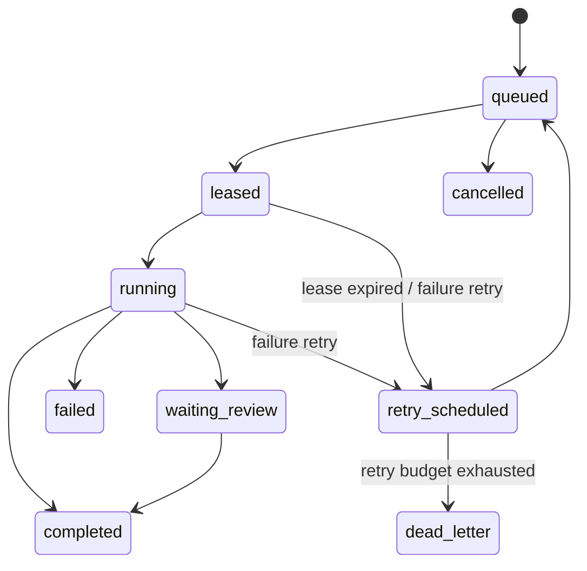

# Developer Portal Package: Kolibri AI Platform

Роль: `docs_steward`.
Дата подготовки: 2026-06-29.
Статус: пакет v1 для developer portal, собран в одном файле из-за ограничения на редактирование.

Этот документ можно перенести в полноценную структуру `docs/developer-portal/*` без изменения смысла. Он фиксирует целевую навигацию, API reference outline, quickstart, deployment guide, runbook, task envelope guide и inter-agent API guide для разработчиков, операторов фабрики и автономных агентов Kolibri.

## 1. Цели Developer Portal

Developer Portal должен отвечать на пять практических вопросов:

- как быстро поднять Kolibri локально или на сервере;
- какие API уже доступны и какие контракты являются целевыми;
- как безопасно деплоить публичный контур, Control Plane и Agent Host;
- как диагностировать фабрику без ручного SSH-управления как основного пути;
- как создавать task envelopes и обмениваться сообщениями между агентами.

Главный архитектурный принцип: Kolibri Factory является remote-first системой. Работа входит через Control Plane API и `ops/kolibri-dispatch submit --file`, исполняется в node-local worktree/artifacts, а результат возвращается через состояние задачи, result references и inter-agent feed.

## 2. Предлагаемая структура docs

Целевая структура developer portal:

```text
docs/
  developer-portal/
    README.md
    quickstart.md
    api-reference.md
    deployment.md
    runbook.md
    task-envelope-guide.md
    inter-agent-api-guide.md
    examples/
      task-envelope-generic-implementation.json
      task-envelope-read-only-probe.json
      curl-control-plane.sh
      curl-backend.sh
    operations/
      incident-report-template.md
      rollout-checklist.md
      node-onboarding-checklist.md
```

Навигация верхнего уровня:

- `README.md` - карта портала, аудитория, базовые адреса, remote-first правила.
- `quickstart.md` - локальный backend/frontend, базовые проверки, локальный Control Plane.
- `api-reference.md` - публичный backend, WebSocket, billing, proxy routes, Control Plane, inter-agent feed.
- `deployment.md` - public main server, nginx, systemd, Agent Host, bootstrap новых серверов, rollback.
- `runbook.md` - health checks, incident response, stale nodes, queue/lease issues, billing degradation.
- `task-envelope-guide.md` - обязательные поля envelope, lifecycle, примеры, acceptance criteria.
- `inter-agent-api-guide.md` - agent messages, inbox/feed, message kinds, artifact references, etiquette.

Пока пакет хранится в `docs/agent-work/docs-steward.md`; при снятии ограничения на запись его можно разнести по указанным файлам.

## 3. README.md Outline

# Kolibri AI Platform Developer Portal

Kolibri AI Platform объединяет публичное AI-приложение, backend API, PWA, Control Plane, Agent Host runtime и удаленную фабрику агентов. Портал предназначен для:

- product/backend/frontend разработчиков;
- операторов фабрики и SRE;
- агентов, создающих pull requests и артефакты;
- интеграторов, работающих с API, task envelopes и inter-agent feed.

Базовые адреса:

| Контур | Адрес |
| --- | --- |
| Публичное приложение | `http://104.253.43.117` |
| Backend API | `/api/*` |
| WebSocket chat | `/ws/chat` |
| Control Plane mesh | `http://10.99.0.2:9101` |

Remote-first правила:

- Все задачи фабрики отправляются через `/v1/tasks` или `ops/kolibri-dispatch submit --file <envelope.json>`.
- Agent Host регистрируется через `/v1/nodes/register` и поддерживает heartbeat через `/v1/nodes/<node_id>/heartbeat`.
- Агент работает в node-local worktree и пишет артефакты в node-local artifact root.
- Control Plane хранит состояние, leases, result references и feed messages; он не должен становиться общим writable root disk.
- Secrets нельзя печатать в logs, result payloads, markdown summaries или Git.
- Агент не откатывает чужие изменения: при конфликте он адаптируется или возвращает blocker artifact.

## 4. API Reference Outline

### 4.1 Conventions

Формат API reference:

- `Method + path`;
- назначение;
- request schema;
- response schema;
- status codes;
- auth/rate limits;
- пример `curl`;
- operational notes.

Текущие ограничения:

- единая публичная auth-модель для backend еще не описана;
- `/api/chat` и `/api/pipeline` имеют IP rate limit;
- billing admin endpoint требует `X-Kolibri-Billing-Token`;
- `/v1/filesystem` указан в runbook как целевой health check, но в текущем `ops/factory_control.py` endpoint не реализован. В portal его нужно пометить как planned/target contract.

### 4.2 Public Backend API

| Method | Path | Назначение |
| --- | --- | --- |
| `GET` | `/api/health` | Health backend и provider status |
| `GET` | `/api/providers` | Статус доступных AI providers |
| `GET` | `/api/models` | Каталог моделей и system prompt |
| `POST` | `/api/chat` | Генерация ответа AI chat |
| `WS` | `/ws/chat` | WebSocket chat |
| `POST` | `/api/conversations` | Создать conversation |
| `GET` | `/api/conversations` | Список conversations |
| `GET` | `/api/conversations/{conv_id}/messages` | Сообщения conversation |
| `DELETE` | `/api/conversations/{conv_id}` | Удалить conversation |
| `POST` | `/api/tts` | Text-to-speech |
| `GET` | `/api/tts/voices` | Список голосов |
| `POST` | `/api/search` | Web search |
| `POST` | `/api/tools` | Tool call через provider manager |
| `POST` | `/api/pipeline` | Запуск pipeline |
| `GET` | `/api/pipeline/health` | Health pipeline |
| `GET` | `/api/factory/status` | Owner-facing статус фабрики |
| `GET` | `/cluster/status` | Alias для factory status |

#### `POST /api/chat`

Request:

```json
{
  "messages": [
    {"role": "user", "content": "Привет"}
  ],
  "model": "auto",
  "provider": "mimo",
  "temperature": 0.7,
  "max_tokens": 2048,
  "system_prompt": "optional",
  "enable_thinking": false
}
```

Response outline:

```json
{
  "response": "text",
  "provider": "mimo",
  "cached": false
}
```

Operational notes:

- response cache keyed by model and messages;
- IP rate limit: 60 requests per 60 seconds in current code;
- `system_prompt` is prepended as a system message when present.

### 4.3 Billing API

| Method | Path | Назначение |
| --- | --- | --- |
| `GET` | `/api/billing/plans` | Тарифы, provider status |
| `POST` | `/api/billing/checkout` | Создать T-Bank checkout или fallback lead |
| `POST` | `/api/billing/tbank/notification` | T-Bank callback |
| `POST` | `/api/billing/tbank/charge-due` | Admin charge due subscriptions |

Billing environment:

```text
TBANK_TERMINAL_KEY
TBANK_PASSWORD
TBANK_API_URL
KOLIBRI_PUBLIC_URL
BILLING_ADMIN_TOKEN
```

If T-Bank is not configured, checkout stores a lead and returns `mode: "lead"` instead of activating a subscription.

### 4.4 Proxy Routes

Backend proxies selected prefixes to internal services:

| Prefix | Target | Rewrite |
| --- | --- | --- |
| `/api/knowledge` | `http://10.99.0.3:8002` | strip `/api/knowledge`, add `/rag` |
| `/api/agent` | `http://10.99.0.4:8003` | strip `/api/agent`, add `/agent` |
| `/api/inference` | `http://10.99.0.5:8001` | strip `/api/inference`, add `/inference` |
| `/cluster` | `http://127.0.0.1:9001` | strip `/cluster` |

### 4.5 `/api/v1` Compatibility API

| Method | Path | Назначение |
| --- | --- | --- |
| `GET` | `/api/v1/ai/models` | Модели compatibility API |
| `GET` | `/api/v1/model/stats` | Статус модели |
| `POST` | `/api/v1/ai/chat` | Chat через Mimo provider |
| `POST` | `/api/v1/ai/chat/stream` | SSE-like stream response |
| `POST` | `/api/v1/ai/imagine` | Placeholder image generation |
| `POST` | `/api/v1/ai/vision/analyze` | Placeholder vision |
| `POST` | `/api/v1/ai/demo/learn/text` | Placeholder learning |
| `GET` | `/api/v1/ai/quality/benchmark/history` | Benchmark history |
| `GET` | `/api/v1/swarm/runtime/status` | Swarm runtime status |
| `GET` | `/api/v1/ai/training/queue/status` | Training queue |
| `POST` | `/api/v1/swarm/runtime/start` | Start runtime |
| `POST` | `/api/v1/swarm/runtime/refresh` | Refresh runtime |
| `POST` | `/api/v1/swarm/runtime/run` | Run runtime task |
| `POST` | `/api/v1/swarm/runtime/ingest/text` | Ingest text |
| `POST` | `/api/v1/swarm/runtime/ingest/url` | Ingest URL |
| `POST` | `/api/v1/swarm/runtime/kpack/export` | Export kpack |
| `POST` | `/api/v1/swarm/runtime/kpack/import` | Import kpack |

### 4.6 Control Plane API

Base URL:

```text
http://10.99.0.2:9101
```

Implemented endpoints:

| Method | Path | Назначение |
| --- | --- | --- |
| `GET` | `/health` | Control Plane health and Redis ping |
| `GET` | `/v1/health` | Alias health |
| `GET` | `/v1/nodes` | Registered nodes with heartbeat freshness |
| `POST` | `/v1/nodes/register` | Register Agent Host |
| `POST` | `/v1/nodes/{node_id}/heartbeat` | Node heartbeat |
| `POST` | `/v1/nodes/{node_id}/drain` | Enable/disable drain |
| `POST` | `/v1/tasks` | Create task from envelope |
| `GET` | `/v1/tasks` | List tasks and queue |
| `GET` | `/v1/tasks?summary=1&compact=1&limit=200` | Compact owner/operator summary |
| `GET` | `/v1/tasks?state=queued` | Filter by state |
| `GET` | `/v1/tasks/{task_id}` | Task details |
| `POST` | `/v1/tasks/lease` | Lease next compatible task |
| `POST` | `/v1/tasks/{task_id}/heartbeat` | Refresh task lease and running metadata |
| `POST` | `/v1/tasks/{task_id}/complete` | Complete task with result |
| `POST` | `/v1/tasks/{task_id}/annotate` | Add result data, possibly trigger review |
| `POST` | `/v1/tasks/{task_id}/fail` | Fail task, optionally retry |
| `POST` | `/v1/tasks/{task_id}/cancel` | Cancel task |
| `POST` | `/v1/agent-messages` | Publish agent message |
| `GET` | `/v1/agent-messages?target=all&limit=50` | Read feed/inbox |

Planned/target endpoint:

| Method | Path | Status | Назначение |
| --- | --- | --- | --- |
| `GET` | `/v1/filesystem` | planned | Unified namespace manifest for `/kolibri/nodes/<node_id>` |

### 4.7 Control Plane Schemas

Node register request:

```json
{
  "node_id": "node-a",
  "hostname": "node-a-host",
  "agent_id": "node-a-agent-host",
  "pid": 1234,
  "capabilities": ["read_only_probe", "generic_implementation", "review"],
  "permissions": ["read_repo", "write_worktree", "run_tests", "write_artifacts"],
  "permission_packs": ["full_autonomy"],
  "cpu": 16,
  "ram": {"MemTotal": "32768000 kB", "MemAvailable": "20000000 kB"},
  "disk": {"total": 1000000000, "used": 100000000, "free": 900000000}
}
```

Task state values:

```text
queued
leased
running
waiting_review
review
completed
failed
cancelled
retry_scheduled
dead_letter
```

Task response outline:

```json
{
  "task_id": "KOL-DOCS-STEWARD-20260629",
  "idempotency_key": "KOL-DOCS-STEWARD-20260629",
  "kind": "generic_implementation",
  "permission_pack": "full_autonomy",
  "required_permissions": ["ai_runner", "git_push", "run_tests"],
  "state": "queued",
  "attempt": 0,
  "max_retries": 2,
  "attempt_id": null,
  "lease_owner": null,
  "lease_until": null,
  "heartbeat_at": null,
  "result_reference": null,
  "result": null,
  "error_type": null,
  "error": null,
  "created_at": "2026-06-29T00:00:00+00:00",
  "updated_at": "2026-06-29T00:00:00+00:00",
  "envelope": {}
}
```

## 5. Quickstart

### 5.1 Requirements

- Python 3.11+
- Node.js 20+
- npm
- Git
- Redis for local Control Plane checks
- backend environment variables for external AI providers, billing, search, TTS/STT as needed

### 5.2 Backend

```bash
cd backend
python3 -m venv .venv
. .venv/bin/activate
pip install -r requirements.txt
python -m uvicorn main:app --host 0.0.0.0 --port 8000
```

Smoke checks:

```bash
curl http://localhost:8000/api/health
curl http://localhost:8000/api/providers
curl http://localhost:8000/api/models
```

### 5.3 Frontend

```bash
cd frontend
npm install
npm run dev
```

Default Vite proxy:

- `/api` -> `http://localhost:8000`
- `/ws` -> `ws://localhost:8000`

Production build:

```bash
npm --prefix frontend run build
```

PWA artifacts to inspect:

- `frontend/dist/index.html`
- `frontend/dist/manifest.webmanifest`
- `frontend/dist/service-worker.js`
- Android/iOS icons
- deep links `/` and `/app`

### 5.4 Local Checks

```bash
python3 -m compileall -q backend ops scripts
npm --prefix frontend run build
npm --prefix frontend run test:mobile-layout
python -m pytest -q backend/tests tests
```

If dependencies are unavailable, record exact missing dependency and run the subset that is available.

### 5.5 Local Control Plane

Start Redis, then:

```bash
python3 ops/factory_control.py --bind 127.0.0.1 --port 9101
```

Smoke:

```bash
curl http://127.0.0.1:9101/health
ops/kolibri-dispatch --control-url http://127.0.0.1:9101 status --limit 50
```

Submit a task:

```bash
ops/kolibri-dispatch --control-url http://127.0.0.1:9101 submit --file ops/envelopes/KOL-PRODUCT-QA-E2E-20260629.json
```

Production Control Plane status:

```bash
ops/kolibri-dispatch --control-url http://10.99.0.2:9101 nodes
ops/kolibri-dispatch --control-url http://10.99.0.2:9101 status --limit 50
```

## 6. Deployment Guide

### 6.1 Public Main Server

Main server owns:

- public nginx;
- backend API behind `/api/*`;
- WebSocket `/ws/chat`;
- built frontend assets;
- SPA fallback with `try_files $uri $uri/ /index.html`.

Deploy:

```bash
./scripts/deploy.sh main
```

Post-deploy checks:

```bash
ssh kolibri-main "systemctl status kolibri-ai --no-pager"
ssh kolibri-main "nginx -t"
curl http://104.253.43.117
curl http://104.253.43.117/api/health
curl http://104.253.43.117/api/providers
```

### 6.2 Control Plane

Control Plane service should run `ops/factory_control.py` with Redis available.

Environment:

```text
FACTORY_NAMESPACE=kolibri_factory
FACTORY_REDIS_HOST=127.0.0.1
FACTORY_REDIS_PORT=6379
FACTORY_LEASE_DURATION=60
FACTORY_MAX_RETRIES=3
FACTORY_NODE_STALE_AFTER=120
FACTORY_BIND=127.0.0.1
FACTORY_PORT=9101
```

Operational checks:

```bash
curl http://10.99.0.2:9101/health
curl http://10.99.0.2:9101/v1/nodes
curl "http://10.99.0.2:9101/v1/tasks?summary=1&compact=1"
```

### 6.3 Agent Host

Golden bootstrap:

```bash
KOLIBRI_FACTORY_CONTROL_URLS=http://10.99.0.2:9101 \
KOLIBRI_BOOTSTRAP_RESTART_JITTER=60 \
sudo -E ops/bootstrap_factory_node.sh
```

Default capabilities:

```text
read_only_probe,generic_implementation,review,image_generation,mesh_node
```

Recommended permission pack:

```text
full_autonomy
```

A node is ready for implementation tasks only when:

- heartbeat is fresh;
- `draining=false`;
- required capability is present;
- required permissions are granted;
- RAM/disk are sufficient;
- runner is installed (`codex` or `mimo`);
- GitHub push works non-interactively;
- no stale `active_task` remains.

### 6.4 Rollback

Minimum rollback:

- identify last known good commit;
- rebuild frontend if frontend changed;
- restart backend service;
- verify nginx config;
- verify `/api/health`, `/api/providers`, `/health` on Control Plane;
- submit or run a read-only probe;
- write incident report with root cause and follow-up test.

## 7. Runbook

### 7.1 Health Checks

Backend:

```bash
curl http://104.253.43.117/api/health
curl http://104.253.43.117/api/providers
curl http://104.253.43.117/api/factory/status
```

Control Plane:

```bash
curl http://10.99.0.2:9101/health
curl http://10.99.0.2:9101/v1/nodes
curl "http://10.99.0.2:9101/v1/tasks?summary=1&compact=1&limit=200"
```

Agent feed:

```bash
curl "http://10.99.0.2:9101/v1/agent-messages?target=all&limit=50"
```

Queue lifecycle states:

- `queued` - task is waiting for a compatible node;
- `leased` - Control Plane granted a lease;
- `running` - Agent Host heartbeats the running task;
- `waiting_review` - implementation completed without PR data while review was requested;
- `review` - review task exists or is queued for reviewer capability;
- `completed` - terminal success;
- `failed` - terminal failure;
- `cancelled` - operator/user cancelled;
- `retry_scheduled` - transient state before requeue;
- `dead_letter` - retry budget exhausted after lease expiry.

### 7.2 Incident Response

1. Capture symptom, first seen time, affected nodes/tasks and owner-visible impact.
2. Read factory snapshot before changing anything:

```bash
ops/kolibri-dispatch --control-url http://10.99.0.2:9101 nodes
ops/kolibri-dispatch --control-url http://10.99.0.2:9101 status --limit 200
curl "http://10.99.0.2:9101/v1/agent-messages?target=all&limit=100"
```

3. Classify incident:

- public backend outage;
- Redis/Control Plane outage;
- queue/lease stuck;
- stale Agent Host;
- runner/auth failure;
- mesh/proxy degradation;
- billing provider degradation.

4. Mitigate with the smallest action:

- drain affected node;
- cancel or requeue a specific task;
- restart service only after identifying blast radius;
- rollback if a deploy caused the regression.

5. Record:

- root cause;
- exact commands used;
- affected task IDs/node IDs;
- user-visible impact;
- verification;
- follow-up tests or docs updates.

### 7.3 Common Issues

#### Stale node

Symptoms:

- node appears in `/v1/nodes` with `health: stale`;
- heartbeat age exceeds `FACTORY_NODE_STALE_AFTER`;
- task remains `leased` or `running` without fresh task heartbeat.

Actions:

- inspect node status from Control Plane first;
- drain node if it continues leasing incorrectly;
- wait for lease expiry and retry when retry budget remains;
- only then inspect systemd logs on the node.

#### Queue not moving

Symptoms:

- `queued` count grows;
- no compatible node leases tasks.

Actions:

- compare envelope `required_capability`, `target_node`, `allowed_nodes`, `permission_pack`, `required_permissions`;
- verify node capabilities and permissions in `/v1/nodes`;
- lower overly narrow targeting or onboard a matching node;
- do not bypass Control Plane with ad hoc SSH execution.

#### Agent runner missing

Symptoms:

- result error says `codex executable is not available` or `mimo executable is not available`;
- task fails and retries.

Actions:

- send rollout task for runtime installation;
- return blocker artifact if auth secret source is absent;
- never print tokens or auth files.

#### Billing checkout degraded

Symptoms:

- `/api/billing/plans` returns `configured=false`;
- checkout returns `mode: "lead"`.

Actions:

- confirm T-Bank env vars;
- confirm public notification URL;
- test with a non-production payment flow before enabling charge-due.

### 7.4 Node Onboarding Checklist

- Confirm node identity and hostname.
- Confirm network reachability to Control Plane.
- Install runtime dependencies.
- Start Agent Host with node-local `work_root` and `artifact_root`.
- Register capabilities and permission packs.
- Confirm node appears under `/v1/nodes`.
- Submit `read_only_probe`.
- Submit one constrained `generic_implementation` only after probe passes.

## 8. Task Envelope Guide

### 8.1 Purpose

A task envelope is the stable contract between a human/operator/orchestrator and Kolibri Factory. It describes what should be done, who can do it, what permissions are needed, how success is judged, and how the task should be verified.

Submit envelopes through:

```bash
ops/kolibri-dispatch --control-url http://10.99.0.2:9101 submit --file path/to/envelope.json
```

Avoid legacy option-based dispatch for new work because it exists for SSH launch compatibility.

### 8.2 Required Fields

Minimum recommended envelope:

```json
{
  "task_id": "KOL-DOCS-STEWARD-20260629",
  "kind": "generic_implementation",
  "goal": "Prepare the developer portal package.",
  "acceptance": [
    "Docs structure is proposed",
    "API reference outline is included",
    "Quickstart, deployment, runbook, task envelope guide and inter-agent API guide are included"
  ],
  "source": {
    "kind": "manual_control_plane",
    "requested_by": "owner",
    "requested_at": "2026-06-29T00:00:00+03:00"
  }
}
```

Fields:

- `task_id` - stable unique ID. Recommended format: `KOL-<AREA>-<SLUG>-YYYYMMDD`.
- `kind` - task runner type. Current important values: `read_only_probe`, `generic_implementation`, `owner_remote_task`, `review_pr`, `telegram_chat_response`, `telegram_image_generation`.
- `goal` - human-readable objective. Agent Host also accepts `objective`, `task`, `message` or `prompt`, but `goal` is the portal standard.
- `acceptance` - list of observable success criteria.
- `source` - provenance and timestamp.

### 8.3 Recommended Fields

```json
{
  "idempotency_key": "docs-steward-20260629-v1",
  "required_capability": "generic_implementation",
  "permission_pack": "full_autonomy",
  "required_permissions": ["read_repo", "write_worktree", "run_tests", "write_artifacts"],
  "runner": "codex",
  "role_slot": "docs_steward",
  "role_goal": "keep developer documentation accurate and operational",
  "verification_commands": [
    "python3 -m compileall -q backend ops scripts"
  ],
  "max_retries": 2,
  "branch": "agent/KOL-DOCS-STEWARD-20260629/docs",
  "base_ref": "origin/main",
  "create_review_on_complete": true,
  "review_node": "new",
  "review_max_retries": 2
}
```

Use `permission_pack: full_autonomy` for autonomous implementation tasks. Use narrower packs for probes, review-only work or media generation when possible.

Permission packs currently defined:

| Pack | Permissions |
| --- | --- |
| `read_only` | `read_repo`, `read_system`, `write_artifacts` |
| `ai_chat` | `ai_runner`, `write_artifacts` |
| `media_generation` | `ai_runner`, `network`, `write_artifacts` |
| `implementation` | `read_repo`, `write_worktree`, `run_tests`, `network`, `git_push`, `write_artifacts` |
| `review` | `read_repo`, `run_tests`, `network`, `github_review`, `write_artifacts` |
| `full_autonomy` | `ai_runner`, `git_push`, `github_review`, `network`, `read_repo`, `run_tests`, `shell`, `spawn_subagents`, `write_artifacts`, `write_worktree` |

### 8.4 Routing Fields

- `target_node` or `required_node` - only this node can lease the task.
- `allowed_nodes` - list of permitted nodes.
- `required_capability` - node must advertise this capability.
- `permission_pack` / `required_permissions` - node must provide required permissions.

If routing is too narrow, tasks stay `queued`.

### 8.5 Lifecycle



### 8.6 Result Contract

Agent Host writes `result.json` and `artifact-manifest.json` under the task artifact directory.

Result outline:

```json
{
  "node_id": "node-a",
  "hostname": "node-a-host",
  "task_id": "KOL-DOCS-STEWARD-20260629",
  "agent_id": "node-a-agent-host",
  "attempt_id": "KOL-DOCS-STEWARD-20260629-attempt-1",
  "status": "completed",
  "kind": "generic_implementation",
  "runner": "codex",
  "worktree": "/var/lib/kolibri-agent/work/KOL-DOCS-STEWARD-20260629/.../repo",
  "branch": "agent/KOL-DOCS-STEWARD-20260629/docs",
  "commit": "abc123",
  "pushed": true,
  "changed_files": ["docs/developer-portal/README.md"],
  "checks": ["python3 -m compileall -q backend ops scripts"],
  "log_paths": {
    "stdout": "/var/lib/kolibri-agent/artifacts/.../stdout.log",
    "stderr": "/var/lib/kolibri-agent/artifacts/.../stderr.log"
  },
  "result_path": "/var/lib/kolibri-agent/artifacts/.../result.json"
}
```

### 8.7 Envelope Quality Checklist

- `task_id` is unique and stable.
- `goal` is specific enough to execute without chat memory.
- `acceptance` is observable and testable.
- `source` includes requester and timestamp.
- `required_capability` matches an actual node capability.
- Permissions are sufficient but not broader than needed.
- Verification commands are realistic for the target node.
- Secrets are referenced by safe source names, never embedded.
- The task states what to do if blocked.
- Review behavior is explicit when PR review is needed.

## 9. Inter-Agent API Guide

### 9.1 Purpose

The inter-agent API is a lightweight feed and inbox for factory coordination. Agents use it to announce starts, completions, failures, blockers, review requests and artifact locations.

Implemented endpoints:

```text
POST /v1/agent-messages
GET  /v1/agent-messages?target=all&limit=50
GET  /v1/agent-messages?target=<node_id>&limit=50
```

Storage behavior:

- every message is written to `all`;
- addressed messages are also written to each recipient target;
- each target feed is trimmed to the latest 500 messages.

### 9.2 Message Schema

Request:

```json
{
  "sender": "node-a",
  "recipients": ["all", "reviewer"],
  "kind": "task_completed",
  "topic": "generic_implementation",
  "task_id": "KOL-DOCS-STEWARD-20260629",
  "body": "Developer portal package prepared",
  "artifacts": [
    {
      "result_path": "/var/lib/kolibri-agent/artifacts/KOL-DOCS-STEWARD-20260629/.../result.json",
      "branch": "agent/KOL-DOCS-STEWARD-20260629/docs",
      "commit": "abc123"
    }
  ]
}
```

Normalized response:

```json
{
  "message_id": "MSG-1234567890abcdef",
  "sender": "node-a",
  "recipients": ["all", "reviewer"],
  "kind": "task_completed",
  "topic": "generic_implementation",
  "task_id": "KOL-DOCS-STEWARD-20260629",
  "body": "Developer portal package prepared",
  "artifacts": [],
  "created_at": "2026-06-29T00:00:00+00:00"
}
```

Aliases accepted by current normalizer:

- `from` -> `sender`;
- `to` -> `recipients`;
- `message` -> `body`;
- missing `recipients` -> `["all"]`;
- missing `kind` -> `status`.

### 9.3 Recommended Message Kinds

| Kind | When to send |
| --- | --- |
| `task_started` | Agent leased and started work |
| `task_completed` | Task completed and result artifact exists |
| `task_failed` | Task failed; artifact has error details |
| `status` | General status update |
| `blocker` | Work cannot proceed without input or external fix |
| `review_requested` | PR/result needs independent review |
| `artifact_ready` | Artifact exists without terminal task change |

Current Agent Host automatically sends:

- `task_started`;
- `task_completed`;
- `task_failed`.

### 9.4 Publish Examples

Publish to all:

```bash
curl -X POST http://10.99.0.2:9101/v1/agent-messages \
  -H 'Content-Type: application/json' \
  -d '{
    "sender": "node-a",
    "kind": "status",
    "topic": "factory",
    "body": "node-a is ready",
    "recipients": ["all"]
  }'
```

Publish to a specific inbox:

```bash
curl -X POST http://10.99.0.2:9101/v1/agent-messages \
  -H 'Content-Type: application/json' \
  -d '{
    "sender": "node-a",
    "to": "reviewer,node-b",
    "kind": "review_requested",
    "topic": "pull_request",
    "task_id": "TASK-1",
    "message": "PR is ready for review",
    "artifacts": [{"pull_request_url": "https://github.com/org/repo/pull/123"}]
  }'
```

Read global feed:

```bash
curl "http://10.99.0.2:9101/v1/agent-messages?target=all&limit=50"
```

Read node inbox:

```bash
curl "http://10.99.0.2:9101/v1/agent-messages?target=node-b&limit=50"
```

### 9.5 Artifact Rules

- Prefer references, not large inline payloads.
- Use `result_path`, `branch`, `commit`, `pull_request_url`, `log_paths`.
- Do not include secrets, auth file content, local tokens or private logs with credentials.
- Owner-facing summaries should hide task IDs, node IDs, local paths and raw logs unless explicitly requested.

### 9.6 Inter-Agent Etiquette

- Keep `body` short and action-oriented.
- Use `topic` for filtering: `generic_implementation`, `review_pr`, `qa`, `billing`, `deployment`, `factory_sre`.
- Include `task_id` when the message relates to a task.
- Address a node/reviewer only when it needs action.
- Use `blocker` instead of silently retrying a task with missing prerequisites.
- Do not use feed messages as a replacement for result artifacts or PR descriptions.

## 10. Known Gaps And Follow-Ups

- Generate OpenAPI JSON for FastAPI backend and publish it under developer portal.
- Add explicit auth section for public API, admin API and Control Plane.
- Decide whether `/v1/filesystem` is planned only or should be implemented in `ops/factory_control.py`.
- Add examples for every task kind currently supported by Agent Host.
- Add machine-readable JSON Schema for task envelopes and agent messages.
- Add runbook commands for systemd service names in one canonical place.
- Add a docs CI check for broken links and fenced code syntax.

## 11. Acceptance Checklist

- [x] Developer portal docs structure proposed.
- [x] API reference outline includes public backend, billing, proxy routes, compatibility API, Control Plane and inter-agent feed.
- [x] Quickstart includes backend, frontend, build, tests and Control Plane smoke checks.
- [x] Deployment guide includes main server, Control Plane, Agent Host, bootstrap and rollback.
- [x] Runbook includes health checks, incident response, stale nodes, stuck queue, runner failures and billing degradation.
- [x] Task envelope guide includes required fields, recommended fields, routing, lifecycle, result contract and example JSON.
- [x] Inter-agent API guide includes schema, publish/read examples, message kinds, artifacts and etiquette.
- [x] Remote-first invariants are stated explicitly.
- [x] Implemented endpoints are separated from the planned `/v1/filesystem` target contract.
- [x] No secrets, credentials or private token material included.
- [x] This package is contained in `docs/agent-work/docs-steward.md` only.
