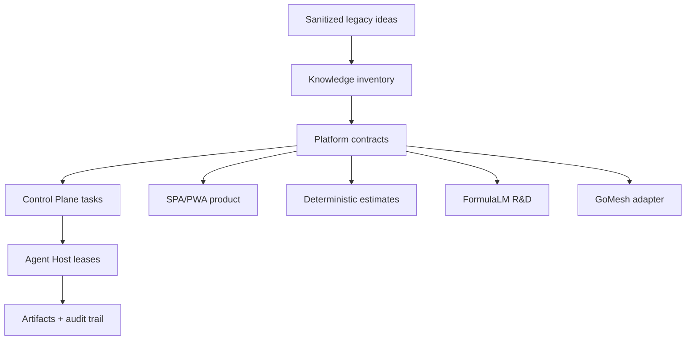

# Sanitized Integration Plan: Kolibri Legacy Ideas

Дата: 2026-06-29  
Роль: `knowledge_integrator`  
Статус: рабочий план переноса идей, без переноса секретов, приватных путей и персональных данных.

## 1. Цель

Перенести полезные идеи из локального наследия Kolibri в текущую платформу так, чтобы они стали проверяемыми контрактами, задачами фабрики, тестами и продуктовой дорожной картой.

План не предполагает прямой импорт старого кода. Наследие используется как источник архитектурных паттернов:

- runtime-first платформа вместо еще одной LLM-обертки;
- воспроизводимые агентные задачи через Control Plane;
- формульные и детерминированные слои поверх LLM;
- сметы как первый коммерческий вертикальный продукт;
- GoMesh как внешний транспортный/mesh слой с четкой границей владения;
- archiver/formula compression как R&D для артефактов, knowledge snapshots и проверяемого хранения.

## 2. Санитарные ограничения

Запрещено переносить в публичные документы, задачи, коммиты и артефакты:

- абсолютные локальные пути, домашние директории, внутренние сетевые адреса и имена машин;
- токены, ключи, пароли, cookie, session secrets, OAuth/cache/IDE логи;
- персональные имена, телефоны, email, customer documents и реальные коммерческие файлы;
- сырые логи `.qwen`, `.gemini`, `.cursor`, IDE history и browser logs без отдельной санитарной проверки;
- утверждения о научном или продуктном превосходстве без воспроизводимого бенчмарка;
- код GoMesh или другого активного направления без явной передачи зоны ответственности.

Разрешено переносить:

- обезличенные идеи, контракты, схемы, acceptance criteria, тестовые harnesses;
- относительные пути внутри текущего репозитория;
- названия компонентов и feature flags без значений секретов;
- synthetic fixtures, если они не восстанавливают реальные данные.

## 3. Текущая платформа как целевой контур

Целевой интеграционный слой уже задан текущей платформой:

- `Control Plane`: задачи входят через `/v1/tasks`, ноды регистрируются и шлют heartbeat, работа идет через leases;
- `Agent Host`: выполнение в node-local worktree/artifacts, без общей writable root filesystem;
- `Inter-agent feed`: события task started/completed/failed, blockers, review requests;
- `Role catalog`: логические роли и capabilities вместо хаотичного запуска скриптов;
- `Estimate engine`: детерминированный расчет, price provenance, input hash, audit fingerprint;
- `FormulaLM`: remote-only R&D overlay/kernel поверх LLM;
- `GoMesh bridge`: внешний mesh слой подключается через documented contracts, feature flag и fallback;
- `SPA/PWA`: основной пользовательский интерфейс, мобильный путь PWA-first.

Главный принцип: legacy-идеи переводятся в контракты текущей фабрики, а не в параллельную платформу.

## 4. Sanitized Inventory

| Legacy-направление | Что берем | Что не переносим напрямую | Целевой слой |
| --- | --- | --- | --- |
| `kolibri-ecosystem` | runtime-first позиционирование, governance, observability, knowledge pipeline, golden tasks, pilot metrics | локальные пути, сырые сессии, приватные data-room материалы | docs, Control Plane roadmap, knowledge registry |
| Formula compression | pattern/formula thinking, lossless restore requirement, human-readable debug layer | неподтвержденные compression claims, удаление исходников без restore proof | FormulaLM R&D, artifact codecs, benchmark harness |
| archiver | versioned archive formats, magic header, backward compatibility, roundtrip SHA checks, web/CLI benchmark UX | claims без независимого воспроизведения, реальные архивы, персональные copyright/metadata | artifact storage R&D, restore tests |
| Swarm1000 | 1000 logical personas, bounded worker pool, task graph, merge queue, events journal | локальный macOS-first executor как production путь | role catalog, leases, inter-agent feed |
| smeta | deterministic estimates, organizations/roles, regions/price zones, catalog prices, AI drafts, review statuses, audit log, export jobs | реальные клиентские данные и неподтвержденные прайсы | estimate engine, DB schema, QA workflow |
| GoMesh | coordinator/agent/chat/mobile concepts, node heartbeat metadata, allowlisted proxy, exec audit redaction, mobile engine | ownership of GoMesh code, hardcoded endpoints, raw exec surface | mesh adapter, shadow nodes, feature flag, fallback |

## 5. Интеграционная архитектура

### Инварианты

1. Все переносимые идеи должны иметь owner, acceptance criteria и rollback path.
2. Любая генерация LLM не является источником истины для расчетов, цен, итогов или статусов.
3. FormulaLM и тяжелые модельные эксперименты запускаются только на удаленных factory nodes.
4. GoMesh остается внешним контуром: Kolibri потребляет documented API и не меняет GoMesh-owned code без handoff.
5. Archiver/formula compression считается R&D, пока нет roundtrip tests на synthetic fixtures и проверенного бенчмарка.
6. Сметы не становятся коммерчески пригодными без QA status, immutable revision и audit trail.

## 6. План Переноса По Направлениям

### 6.1 kolibri-ecosystem -> текущая платформа

Переносим как слой стратегии и операционных контрактов.

Задачи:

1. Зафиксировать sanitized product thesis: Kolibri как runtime/control plane для управляемых агентных систем.
2. Перевести `knowledge pipeline` в текущий `knowledge inventory`:
   - `source_id`;
   - `source_type`;
   - `sanitized_summary`;
   - `risk_level`;
   - `target_component`;
   - `acceptance`;
   - `migration_status`.
3. Добавить golden task набор для фабрики:
   - deterministic estimate case;
   - FormulaLM structured output case;
   - GoMesh bridge acceptance case;
   - docs redaction case;
   - artifact restore case.
4. Использовать GitHub/PR/agent artifacts как внешний audit trail, но без приватных локальных ссылок.

Acceptance:

- нет приватных путей и секретов в generated docs;
- каждая идея привязана к текущему компоненту;
- каждая production-bound идея имеет тест или acceptance checklist.

### 6.2 Formula compression -> FormulaLM и artifact R&D

Переносим не как обещание compression moat, а как инженерный паттерн: LLM извлекает смысл, formula/kernel фиксирует структуру, расчет или восстановление.

Задачи:

1. Создать минимальный `formula_codec` design note:
   - какие данные допустимы: synthetic text, estimate JSON snapshots, task envelopes, knowledge summaries;
   - какие данные запрещены: реальные customer docs, secrets, private logs;
   - какие операции обязательны: encode, decode, hash, compare, explain.
2. Связать с FormulaLM:
   - LLM предлагает variables;
   - deterministic kernel считает;
   - formula/audit layer объясняет, почему результат такой.
3. Добавить benchmark acceptance:
   - valid JSON rate;
   - exact formula consistency;
   - unique output hashes на одинаковом input;
   - roundtrip equality для codecs;
   - latency и error rate.
4. Запретить удаление исходника как продуктовую функцию до прохождения restore proof на независимых synthetic fixtures.

Acceptance:

- roundtrip `input -> formula -> restored` дает byte-equivalent output на synthetic fixture;
- checksum входа и восстановления совпадает;
- любые compression ratios маркируются как результаты конкретного бенчмарка, а не универсальное обещание.

### 6.3 Archiver -> artifact storage R&D

Переносим:

- versioned archive format;
- magic header/version compatibility;
- CLI/web benchmark workflow;
- SHA-256 integrity checks;
- roundtrip restore tests;
- profiles: speed, balanced, max/research.

Не переносим:

- реальные архивы;
- личные metadata;
- claims без повторного прогона;
- code paths, которые восстанавливают не исходные данные, а synthetic reconstruction, если это не отмечено явно.

Задачи:

1. Описать `Kolibri Artifact Archive Contract`:
   - archive version;
   - manifest;
   - file list;
   - content hashes;
   - created_by_role, not person;
   - compression profile;
   - restore command;
   - validation result.
2. Добавить factory task kind для R&D бенчмарка архиватора:
   - synthetic corpora only;
   - no owner files;
   - no private paths in reports;
   - artifact report in JSON and Markdown.
3. Сравнивать только с воспроизводимыми baseline tools и фиксировать версии.

Acceptance:

- архив распаковывается в clean temp directory;
- все SHA-256 совпадают;
- отчет не содержит абсолютных путей, hostnames, usernames или secrets;
- если тест не прошел, artifact получает статус `blocked`, а не “success”.

### 6.4 Swarm1000 -> role catalog и leases

Переносим Swarm1000 как логическую модель покрытия, не как обещание одновременного запуска 1000 процессов.

Задачи:

1. Разложить 1000 logical personas на компактные role families:
   - research;
   - implementation;
   - QA;
   - security/redaction;
   - docs;
   - product;
   - estimates;
   - FormulaLM;
   - GoMesh integration;
   - release.
2. В `factory_role_catalog` держать не persona lore, а:
   - role_slot;
   - role_goal;
   - capabilities;
   - permissions pack;
   - artifact expectations;
   - escalation rules.
3. Маппить Swarm concepts:
   - bounded worker pool -> Control Plane concurrency and leases;
   - task graph -> task envelopes and dependencies;
   - events journal -> inter-agent feed;
   - merge queue -> PR/review workflow;
   - snapshots -> artifacts.
4. Добавить guardrail: worker pool ограничивается capacity, stale heartbeat и backpressure.

Acceptance:

- роль не может получить lease без нужной capability;
- stale ноды не получают heavy tasks;
- события task lifecycle попадают в inter-agent feed;
- merge/review не происходит без test evidence.

### 6.5 smeta -> коммерческий estimate workflow

Переносим сметное наследие в текущий Python/FastAPI продукт постепенно: сначала договор данных и tests, затем schema/storage, затем UI.

Задачи:

1. Расширить текущий estimate model до коммерческого `EstimateRevision`:
   - immutable revision;
   - input hash;
   - region;
   - pricebook version;
   - rules version;
   - QA status;
   - assumptions/questions;
   - audit trail;
   - export snapshot.
2. Перенести идеи schema:
   - organizations and memberships;
   - regions and price zones;
   - catalog items;
   - regional prices;
   - price sources;
   - AI drafts and draft items;
   - estimate items with review status;
   - audit log;
   - export jobs.
3. Зафиксировать deterministic pipeline:
   - canonicalize input;
   - extract scope;
   - normalize structure;
   - match pricebook;
   - apply regional rules;
   - calculate quantities;
   - calculate totals;
   - validate;
   - human QA;
   - publish revision.
4. UI переносить как workflow:
   - rate search;
   - editable estimate table;
   - summary panel;
   - review reasons;
   - revision diff;
   - export status.

Acceptance:

- одинаковый canonical input, pricebook version и rules version дают одинаковый JSON;
- total каждой строки пересчитывается кодом;
- LLM output не публикуется без validation;
- unknown quantities/questions блокируют `approved`;
- audit отвечает на вопрос: откуда взялись количество, цена, формула и итог.

### 6.6 GoMesh -> контрактный bridge

Переносим только интеграционный контракт.

Задачи:

1. Держать GoMesh за feature flag `KOLIBRI_GOMESH_ENABLED`, по умолчанию выключенным для production.
2. Укрепить mesh bridge:
   - shadow node registration;
   - health/backpressure mapping;
   - allowlisted Control Plane paths;
   - signed or token-authorized service calls;
   - redacted exec audit;
   - bounded timeout;
   - fallback through direct Control Plane.
3. Убрать из документации и отчетов любые hardcoded endpoints и hostnames; показывать только config keys.
4. Для mobile engine использовать PWA-first стратегию:
   - SPA/PWA остается основным продуктом;
   - native/mobile mesh engine является опциональным transport layer;
   - heartbeat/status видны через текущий Control Panel.

Acceptance:

- GoMesh unavailable не ломает Control Plane;
- mesh message создает валидный task envelope;
- chat-only mesh message не создает задачу;
- shadow node status не смешивается с real agent host state;
- audit logs redact token/secret/password/key values.

## 7. Порядок Работ

### Phase 0: Redaction Gate

Цель: остановить утечки до миграции.

Deliverables:

- sanitized source inventory template;
- denylist для приватных путей, internal addresses, usernames, tokens, emails, phones;
- pre-publication check для docs/artifacts;
- правило: legacy docs не копируются целиком.

Acceptance:

- любой новый plan/report проходит text scan на чувствительные маркеры;
- legacy references описываются категориями, а не локальными расположениями.

### Phase 1: Contracts First

Цель: описать переносимые идеи как интерфейсы текущей платформы.

Deliverables:

- `KnowledgeItem` schema для идей;
- `EstimateRevision` contract;
- `ArtifactArchive` contract;
- `FormulaKernelBenchmark` contract;
- `MeshBridgeEnvelope` contract;
- role family mapping для Swarm1000.

Acceptance:

- контракты покрыты тестами или checklist;
- каждое поле имеет owner и redaction policy.

### Phase 2: Current Platform Integration

Цель: привязать контракты к существующим компонентам.

Deliverables:

- task envelopes для FormulaLM, archiver R&D, smeta QA и GoMesh bridge smoke;
- role catalog update для `knowledge_integrator`, `estimate_methodologist`, `formulalm_researcher`, `mobile_gomesh_integrator`, `artifact_archiver_researcher`;
- Control Panel status cards для estimates, FormulaLM, mesh и artifacts;
- docs без legacy raw paths.

Acceptance:

- задачи запускаются через Control Plane;
- результаты возвращаются artifact-first;
- stale/unavailable nodes возвращают blocker.

### Phase 3: Verification

Цель: доказать, что идеи работают в текущем контуре.

Test set:

- deterministic estimate reproducibility;
- estimate invalid input gate;
- FormulaLM baseline vs kernel comparison;
- archiver roundtrip on synthetic fixtures;
- GoMesh bridge envelope creation;
- Swarm role lease/capability matching;
- docs redaction scan.

Acceptance:

- тесты либо проходят, либо создают blocker artifact;
- нет “нарисованных” результатов;
- все R&D claims имеют дату, версию harness и corpus label.

### Phase 4: Productization

Цель: превратить проверенные идеи в пользовательские возможности.

Deliverables:

- smeta workflow: estimate -> documents -> export -> QA;
- knowledge search over sanitized inventory;
- FormulaLM report page with honest metrics;
- mesh status surface with fallback state;
- artifact archive/replay page for factory outputs.

Acceptance:

- пользователь видит статус, причину блокера и следующий шаг;
- beta/pilot assets не раскрывают приватные материалы;
- claims сформулированы как проверенные возможности, а не общие обещания.

## 8. Risk Register

| Риск | Вероятность | Влияние | Митигатор |
| --- | --- | --- | --- |
| Утечка приватных путей или локальных адресов | Средняя | Высокое | redaction scan, ручная проверка docs, запрет raw legacy копий |
| Перенос неподтвержденных compression claims | Высокая | Среднее | R&D label, roundtrip tests, воспроизводимый benchmark |
| Смешивание GoMesh ownership с Kolibri Platform | Средняя | Высокое | feature flag, documented API, explicit handoff only |
| LLM меняет финансовые итоги сметы | Средняя | Высокое | deterministic kernel, validation, QA status |
| Swarm1000 воспринимается как обещание 1000 live workers | Средняя | Среднее | формулировать как logical personas + bounded worker pool |
| Legacy code ломает текущую платформу | Средняя | Высокое | contracts-first, no direct import, small PRs with tests |

## 9. Definition Of Done

Интеграция legacy-идей считается выполненной, когда:

1. Есть sanitized inventory без приватных путей, секретов и персональных данных.
2. Каждое направление имеет целевой компонент текущей платформы.
3. Для каждого направления есть минимум один проверяемый contract/test/checklist.
4. FormulaLM, archiver и compression остаются R&D до воспроизводимого benchmark.
5. Smeta workflow имеет deterministic расчет, QA gate и audit trail.
6. GoMesh интегрирован только через feature flag, adapter и fallback.
7. Swarm1000 представлен как role/capability/task graph model внутри Control Plane.
8. Все результаты возвращаются как artifacts, а не как неотслеживаемые локальные файлы.

## 10. Immediate Backlog

1. Создать sanitized inventory schema и заполнить первыми `KnowledgeItem` для шести направлений.
2. Добавить redaction checklist в docs workflow.
3. Описать `EstimateRevision` contract и сравнить его с текущим estimate model.
4. Подготовить task envelope для FormulaLM benchmark с remote-only guard.
5. Подготовить task envelope для archiver roundtrip benchmark на synthetic fixtures.
6. Зафиксировать Swarm1000 -> role family mapping в role catalog.
7. Укрепить GoMesh bridge acceptance tests вокруг shadow nodes, chat-only messages, fallback и redaction.
8. Сформировать UI backlog: estimates editor, FormulaLM metrics, mesh status, artifact replay.

## 11. Готовая Формулировка Переноса

Kolibri legacy переносится в текущую платформу не как набор старых файлов, а как sanitized knowledge layer:

- `kolibri-ecosystem` дает стратегию runtime-first и governance;
- Formula compression дает идею формульного, проверяемого kernel поверх LLM;
- archiver дает R&D-контур versioned artifacts и roundtrip integrity;
- Swarm1000 дает модель logical personas, bounded execution и audit events;
- smeta дает коммерческий workflow с deterministic estimate, pricebook, QA и audit;
- GoMesh дает внешний mesh transport, подключаемый через контракт и fallback.

Итоговая форма переноса: current Control Plane + Agent Host + deterministic product kernels + artifact-first audit trail + PWA-first UI. Все, что не проходит redaction, reproducibility и ownership gates, остается в legacy/R&D и не попадает в production path.
