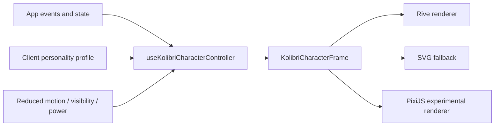

# Техническая спецификация живой птицы Kolibri

Статус: готовая спецификация v1 для дизайна, frontend и QA.
Роль: `living_character_director`.
Дата: 2026-06-29.

## 1. Цель

Птица Kolibri - продуктовый персонаж платформы, а не декоративная CSS-анимация. Она должна:

- показывать состояние приложения и AI-фабрики;
- реагировать на ввод, ожидание, выполнение задач, успехи, ошибки и offline;
- иметь настраиваемую личность для каждого клиента;
- оставаться спокойной, дорогой и рабочей частью интерфейса;
- деградировать до SVG без потери смысла;
- не ухудшать производительность, доступность и читаемость.

Основной runtime: Rive state machine с Data Binding / View Model.
Fallback runtime: текущий SVG/React-компонент.
Расширенный fallback/experimental runtime: PixiJS для игрового или более физического поведения.

## 2. Не цели v1

- Не делать полноценного питомца с постоянным геймплеем.
- Не использовать Lottie как основной мозг персонажа: Lottie допустим только для коротких линейных вставок.
- Не показывать птицу как единственный индикатор статуса: текстовые статусы приложения остаются обязательными.
- Не запускать несколько canvas-инстансов в списке сообщений: для маленьких аватаров используется SVG fallback.
- Не отправлять клиентские данные в Rive-файл или внешние сервисы.

## 3. Локальный контекст проекта

Уже есть:

- `docs/living-bird.md` - краткий продуктовый стандарт;
- `docs/project-policy.md` - требование Rive state machine, inputs `mood`, `energy`, `attention`, `taskState`, `clientTrait`;
- `frontend/src/components/KolibriBird.jsx` - текущий SVG + framer-motion;
- `frontend/src/components/KolibriAvatar.tsx` - TypeScript-версия SVG;
- текущая runtime-логика `birdState = loading ? "thinking" : connected ? "idle" : "error"` в `frontend/src/App.jsx`.

Спецификация ниже совместима с этим контекстом: текущий SVG остается рабочим fallback, а Rive подключается через новый слой `LivingKolibri`, не ломая существующие места вызова.

## 4. Архитектура



Рендер выбирается так:

1. `rive`, если runtime доступен, файл загружен, пользователь не отключил расширенную анимацию, компонент видим.
2. `svg`, если Rive не загружен, отключен флагом, включен строгий reduced motion, произошла ошибка или это маленький аватар в ленте.
3. `pixi`, только по явному feature flag для экспериментального режима.

## 5. Контракт компонента

```ts
export type KolibriBirdState =
  | "idle"
  | "greeting"
  | "listening"
  | "thinking"
  | "writing"
  | "working"
  | "learning"
  | "success"
  | "warning"
  | "error"
  | "offline"
  | "celebrating"
  | "sleepy"
  | "calm"
  | "happy"
  | "surprised"
  | "angry-soft"
  | "flying";

export type KolibriRenderer = "auto" | "rive" | "svg" | "pixi";

export type KolibriPersonalityPreset =
  | "minimal"
  | "calm"
  | "business"
  | "friendly"
  | "energetic";

export interface KolibriPersonality {
  preset: KolibriPersonalityPreset;
  energy: number;      // 0..1
  warmth: number;      // 0..1
  formality: number;   // 0..1
  playfulness: number; // 0..1
  confidence: number;  // 0..1
  celebration: number; // 0..1
}

export interface LivingKolibriProps {
  state: KolibriBirdState;
  taskState?: "none" | "queued" | "running" | "blocked" | "completed" | "failed";
  personality?: KolibriPersonality;
  renderer?: KolibriRenderer;
  size?: "xs" | "sm" | "md" | "lg" | number;
  interactive?: boolean;
  reducedMotion?: boolean;
  className?: string;
  ariaLabel?: string;
  onCharacterEvent?: (event: KolibriCharacterEvent) => void;
}

export interface KolibriCharacterEvent {
  type:
    | "hover"
    | "click"
    | "settled"
    | "state-entered"
    | "state-exited"
    | "attention-request";
  state?: KolibriBirdState;
  source: "rive" | "svg" | "pixi";
}
```

Совместимость:

- `idle` и `calm` мапятся в спокойную базовую позу;
- `happy` мапится в `success`, а при сильном событии в `celebrating`;
- `angry-soft` мапится в `warning`, но визуально без агрессии;
- `surprised` мапится в мягкое предупреждение или реакцию `nudge`;
- `flying` остается декоративным состоянием для onboarding/landing, не для рабочих списков.

## 6. Rive-файл

Файл: `frontend/public/kolibri/kolibri-character.riv`.
Artboard: `KolibriBird`.
State machine: `KolibriCharacterMachine`.
View Model: `KolibriCharacterVM`.
Default View Model Instance: `Default`.

Обязательные группы в Rive:

- `Body` - туловище, хвост, грудка;
- `Head` - голова, клюв, хохолок;
- `Eyes` - зрачки, веки, блики;
- `Wings` - переднее и заднее крыло;
- `Tail` - хвостовые перья;
- `Shadow` - мягкая тень под птицей;
- `StatusMarks` - `success`, `warning`, `error`, `offline`, `sleepy`;
- `Sparkles` - короткие частицы успеха;
- `HitArea` - невидимая область интерактивности.

Размер artboard: 256 x 256.
Safe bounds: птица не выходит за 232 x 232 при любом state, чтобы не резать крылья и не создавать layout shift.
Pivot: центр масс около `(128, 140)`, не геометрический центр головы.

## 7. Rive View Model / inputs

Канонический путь - View Model properties. Legacy state machine inputs допустимы только как временная совместимость, если конкретный runtime/экспорт не поддерживает нужный binding.

| Property | Тип | Диапазон/значения | Кто пишет | Назначение |
| --- | --- | --- | --- | --- |
| `appState` | Enum | `idle`, `greeting`, `listening`, `thinking`, `writing`, `working`, `learning`, `success`, `warning`, `error`, `offline`, `celebrating`, `sleepy` | frontend | Главный semantic state |
| `taskState` | Enum | `none`, `queued`, `running`, `blocked`, `completed`, `failed` | frontend | Состояние фабрики/задачи |
| `mood` | Enum | `neutral`, `curious`, `focused`, `pleased`, `concerned`, `tired`, `offline` | controller | Эмоциональный слой |
| `energy` | Number | `0..100` | controller | Скорость микродвижений |
| `attention` | Number | `0..100` | controller | Насколько птица смотрит на пользователя/поле ввода |
| `focusX` | Number | `-1..1` | controller | Направление взгляда по X |
| `focusY` | Number | `-1..1` | controller | Направление взгляда по Y |
| `motionScale` | Number | `0..1` | controller | Общий множитель амплитуды |
| `traitEnergy` | Number | `0..1` | client profile | Персональная живость |
| `traitWarmth` | Number | `0..1` | client profile | Мягкость выражения |
| `traitFormality` | Number | `0..1` | client profile | Сдержанность реакций |
| `traitPlayfulness` | Number | `0..1` | client profile | Частота playful micro-events |
| `traitConfidence` | Number | `0..1` | client profile | Уверенность позы |
| `isOnline` | Boolean | `true/false` | frontend | Сеть доступна |
| `isCompact` | Boolean | `true/false` | frontend | Маленький размер, меньше деталей |
| `reducedMotion` | Boolean | `true/false` | frontend/user prefs | Уважать reduced motion |
| `accentColor` | Color | RGBA | theme/client profile | Тонировка бликов/акцента |
| `triggerGreet` | Trigger | fire-and-forget | frontend | Короткое приветствие |
| `triggerUserSent` | Trigger | fire-and-forget | frontend | Пользователь отправил сообщение |
| `triggerTaskStarted` | Trigger | fire-and-forget | frontend | Фабрика начала работу |
| `triggerTaskPulse` | Trigger | fire-and-forget | frontend | Промежуточный прогресс |
| `triggerTaskCompleted` | Trigger | fire-and-forget | frontend | Успех задачи |
| `triggerTaskFailed` | Trigger | fire-and-forget | frontend | Ошибка задачи |
| `triggerBillingSuccess` | Trigger | fire-and-forget | frontend | Оплата/апгрейд |
| `triggerNudge` | Trigger | fire-and-forget | frontend | Мягкая просьба внимания |
| `triggerSleep` | Trigger | fire-and-forget | controller | Переход в сон |
| `triggerWake` | Trigger | fire-and-forget | controller | Выход из сна |

Правила записи:

- `appState` пишет только controller, не отдельные компоненты.
- UI-события отправляют semantic events, а controller решает priority.
- Триггеры не используются для долгого состояния. Долгое состояние всегда отражено в `appState`, `taskState`, `mood`.
- `reducedMotion=true` выставляет `motionScale <= 0.2`, отключает бесконечные wing/hover loops и оставляет только статическую позу + редкие opacity/eye changes.

## 8. State machine layers

### 8.1 `BaseState`

Единственный слой, определяющий основную позу.

| State | Визуальное поведение | Вход | Выход |
| --- | --- | --- | --- |
| `idle` | Спокойное дыхание, редкое моргание, мягкая тень | default, task none | focus, task, error, offline, sleep |
| `greeting` | Короткий наклон головы, легкий взмах | `triggerGreet` | `idle` через exit time 100% |
| `listening` | Взгляд к composer, чуть приподнятая голова | chat focus / voice listen | send, blur, idle timeout |
| `thinking` | Собранная поза, малый hover, взгляд в сторону | AI request pending | stream starts, task starts, error |
| `writing` | Ритм микрокивков, крыло почти статично | streaming tokens | complete, error |
| `working` | Более устойчивое hover-положение, "factory pulse" | task queued/running | success, warning, error |
| `learning` | Мягкая сосредоточенность, маленький book/status mark | long context/indexing | success, idle |
| `success` | Один короткий bounce, sparkle <= 900ms | task/message complete | idle |
| `celebrating` | 1-2 выразительных взмаха, sparkle, но без фейерверка | billing/deploy/report success | idle |
| `warning` | Голова вбок, бровь/вопрос, без паники | recoverable issue | idle/error |
| `error` | Сжатая поза, знак внимания, без тряски | hard error/blocker | idle after user action |
| `offline` | Цвет приглушен, крыло неподвижно, offline mark | `isOnline=false` | restore online |
| `sleepy` | Закрытые веки, низкая тень | idle timeout | wake/focus |

### 8.2 `Attention`

Слой управляет глазами и головой:

- `attention < 20` - взгляд свободный, редкое scan-movement;
- `20..65` - взгляд следует за фокусом в UI;
- `> 65` - взгляд в composer / active task card;
- `focusX/focusY` ограничены clamp `-0.75..0.75` в Rive, чтобы глаза не выглядели сломанными.

### 8.3 `Energy`

Слой управляет амплитудой дыхания, частотой моргания, хвостом и крылом.

Формула controller:

```ts
energy = clamp(
  baseStateEnergy[state] * 0.55 +
  personality.energy * 35 +
  personality.playfulness * 10 -
  personality.formality * 8,
  0,
  100
);
```

### 8.4 `StatusMarks`

Статусные marks не должны заменять реальные UI-ошибки.

- `success`: sparkle/галочка только кратко;
- `warning`: вопрос/мягкий `!`;
- `error`: `!` и приглушение цвета;
- `offline`: маленький облачный/connection mark;
- `sleepy`: веки, без постоянной буквы `Z` в рабочем интерфейсе; `Z` допустима только в onboarding/empty state.

### 8.5 `MicroReactions`

Независимые короткие реакции:

- blink;
- head tilt;
- wing twitch;
- tail settle;
- sparkle after success;
- tiny hover shift.

Ограничения:

- не чаще 1 раза в 3 секунды в рабочем UI;
- не чаще 1 раза в 7 секунд для `minimal`;
- полностью отключаются при `motionScale=0`;
- не запускаются во время `error` дольше 5 секунд без пользовательского действия.

## 9. Transition priority

Controller обязан применять priority до записи в Rive:

1. `offline`, если `isOnline=false`.
2. `error`, если есть hard blocker.
3. `warning`, если есть recoverable issue.
4. `working`, если factory task `queued/running`.
5. `thinking`, если AI request pending до streaming.
6. `writing`, если assistant streaming.
7. `listening`, если composer/voice focused.
8. `celebrating`, если событие high-value success.
9. `success`, если обычное завершение.
10. `sleepy`, если idle timeout и нет focus/task/error.
11. `idle`.

Переходы:

| From | To | Condition | Transition |
| --- | --- | --- | --- |
| any | `offline` | `isOnline=false` | 160ms fade/desaturate, no bounce |
| `offline` | previous stable state | online restored | 240ms color restore |
| any | `error` | hard failure | 120ms, no shake loop |
| `error` | `idle` | user dismiss/retry success | 240ms |
| any | `warning` | soft issue | 180ms head tilt |
| `idle/listening` | `thinking` | user send / request pending | 180ms |
| `thinking` | `writing` | first token | 120ms |
| `thinking/working/writing` | `success` | completion | play full success, exit 100% |
| `success` | `idle` | success exit time 100% or 1500ms | 240ms |
| any stable | `sleepy` | idle >= 90s desktop, >= 45s mobile | 800ms |
| `sleepy` | `greeting/listening` | focus/click/wake | 240ms |

Exit Time:

- `success` и `celebrating` обязаны проигрываться до 100%, если не пришли `offline/error`.
- `error/offline` перебивают любые celebratory transitions.
- `thinking/working` не должны "залипать": после 30 секунд без новых событий controller снижает `energy` и переводит mood в `focused`, не в `sleepy`.

## 10. Personality per client

Профиль хранится на уровне клиента/организации и применяется на frontend как deterministic config.

```json
{
  "version": 1,
  "clientId": "org_123",
  "preset": "business",
  "traits": {
    "energy": 0.42,
    "warmth": 0.55,
    "formality": 0.82,
    "playfulness": 0.18,
    "confidence": 0.78,
    "celebration": 0.32
  },
  "palette": {
    "accentColor": "#26BDF2"
  },
  "motion": {
    "allowExpressiveMotion": true,
    "userMotionScale": 1
  }
}
```

Presets:

| Preset | Energy | Warmth | Formality | Playfulness | Confidence | Поведение |
| --- | ---: | ---: | ---: | ---: | ---: | --- |
| `minimal` | 0.15 | 0.35 | 0.9 | 0.05 | 0.65 | Почти статичная, только статус и моргание |
| `calm` | 0.28 | 0.6 | 0.72 | 0.16 | 0.68 | Тихая, надежная, мягкая |
| `business` | 0.42 | 0.55 | 0.82 | 0.18 | 0.78 | Деловая, собранная, минимум playful |
| `friendly` | 0.55 | 0.85 | 0.45 | 0.5 | 0.62 | Теплая, внимательная, приветливая |
| `energetic` | 0.78 | 0.72 | 0.35 | 0.72 | 0.7 | Более живая, но в рабочих местах ограниченная |

Как traits влияют:

- `energy` повышает wing/tail micro-motion и скорость переходов;
- `warmth` смягчает глаза, улыбку, cheek color и greeting;
- `formality` уменьшает sparkle, bounce и amplitude;
- `playfulness` повышает вероятность harmless micro-reactions;
- `confidence` выпрямляет posture и уменьшает тревожность warning/error;
- `celebration` масштабирует только `success/celebrating`, не idle.

Детерминизм:

- случайность seeded через `clientId + date + sessionId`;
- после reload птица не должна внезапно менять характер;
- A/B-тесты меняют только preset/traits, не Rive graph.

## 11. Event mapping

| App event | Controller action |
| --- | --- |
| `app:booted` | `state=idle`, `triggerGreet` один раз за session |
| `chat:focus` | `state=listening`, `attention=80` |
| `chat:blur` | снизить `attention`, через debounce вернуть `idle` |
| `chat:send` | `triggerUserSent`, `state=thinking` |
| `ai:thinking` | `state=thinking`, `mood=focused` |
| `ai:first_token` | `state=writing` |
| `ai:complete` | `state=success`, затем `idle` |
| `factory:task_started` | `triggerTaskStarted`, `taskState=running`, `state=working` |
| `factory:task_progress` | `triggerTaskPulse`, без смены state |
| `factory:task_completed` | `triggerTaskCompleted`, `state=success` |
| `factory:task_failed_soft` | `state=warning`, `mood=concerned` |
| `factory:task_failed_hard` | `triggerTaskFailed`, `state=error` |
| `billing:success` | `triggerBillingSuccess`, `state=celebrating` |
| `network:offline` | `isOnline=false`, `state=offline` |
| `network:online` | `isOnline=true`, восстановить previous stable state |
| `visibility:hidden` | pause Rive/Pixi ticker |
| `visibility:visible` | resume only if not reduced/offscreen |
| `idle:timeout` | `triggerSleep`, `state=sleepy` |

## 12. Rive runtime integration

Рекомендуемый React-путь:

- изолировать `useRive` в отдельном `KolibriRiveRenderer`, чтобы canvas не пересоздавался случайно;
- грузить Rive через dynamic import и feature flag;
- использовать `stateMachines: "KolibriCharacterMachine"`;
- использовать `autoBind: true`, если Default VM полностью совпадает с контрактом;
- для строгого контроля использовать `useViewModel`, `useViewModelInstance`, `useViewModelInstanceNumber`, `useViewModelInstanceEnum`, `useViewModelInstanceBoolean`, `useViewModelInstanceTrigger`;
- выставлять `shouldDisableRiveListeners: true`, если интерактивность обрабатывает React wrapper;
- если все assets локальные, выставлять `enableRiveAssetCDN: false`;
- на unmount вызывать cleanup runtime через штатный React runtime lifecycle;
- при `document.hidden`, offscreen или `motionScale=0` вызывать pause.

Псевдокод:

```tsx
function KolibriRiveRenderer({ frame }: { frame: KolibriCharacterFrame }) {
  const { rive, RiveComponent } = useRive({
    src: "/kolibri/kolibri-character.riv",
    artboard: "KolibriBird",
    stateMachines: "KolibriCharacterMachine",
    autoplay: true,
    autoBind: true,
    shouldDisableRiveListeners: true,
    enableRiveAssetCDN: false,
  });

  const vmi = rive?.viewModelInstance;
  const appState = useViewModelInstanceEnum("appState", vmi);
  const taskState = useViewModelInstanceEnum("taskState", vmi);
  const energy = useViewModelInstanceNumber("energy", vmi);
  const attention = useViewModelInstanceNumber("attention", vmi);
  const reducedMotion = useViewModelInstanceBoolean("reducedMotion", vmi);
  const taskCompleted = useViewModelInstanceTrigger("triggerTaskCompleted", vmi);

  useEffect(() => {
    appState.setValue?.(frame.appState);
    taskState.setValue?.(frame.taskState);
    energy.setValue?.(frame.energy);
    attention.setValue?.(frame.attention);
    reducedMotion.setValue?.(frame.reducedMotion);
    if (frame.fireTaskCompleted) taskCompleted.trigger?.();
  }, [frame]);

  return <RiveComponent className="living-kolibri__canvas" />;
}
```

Renderer package decision:

- Start: `@rive-app/react-canvas-lite`, если Rive-файл использует только базовую vector/state-machine механику.
- Upgrade: `@rive-app/react-canvas` или `@rive-app/react-webgl2`, если нужны features, которые не поддерживает lite renderer.
- Все варианты подключаются lazy, чтобы не увеличивать initial route cost.

## 13. SVG fallback

SVG fallback является обязательным production path, не временной заглушкой.

Источник: текущие `KolibriBird.jsx` и `KolibriAvatar.tsx`.

Требования:

- сохранить `role="img"` и человекочитаемый `aria-label`;
- использовать тот же `KolibriBirdState`;
- мапить неизвестное state в `idle`;
- не запускать бесконечные framer-motion loops при `prefers-reduced-motion`;
- в размерах `xs/sm` скрывать декоративные marks, оставлять только силуэт и ключевой статус;
- использовать CSS custom properties для accent color;
- не требовать canvas, wasm и network.

Fallback state map:

| Canonical | SVG class |
| --- | --- |
| `idle`, `calm` | `kolibri-avatar--idle` |
| `listening` | `kolibri-avatar--listening` |
| `thinking`, `working` | `kolibri-avatar--thinking` |
| `writing` | `kolibri-avatar--writing` или `thinking` до добавления класса |
| `learning` | `kolibri-avatar--learning` |
| `success`, `happy`, `celebrating` | `kolibri-avatar--success` |
| `warning`, `surprised`, `angry-soft` | `kolibri-avatar--warning` |
| `error` | `kolibri-avatar--error` |
| `offline` | `kolibri-avatar--offline` |
| `sleepy` | `kolibri-avatar--sleepy` |
| `flying` | `kolibri-avatar--flying` |

Когда использовать SVG принудительно:

- message list avatar меньше 40px;
- reduced motion strict;
- canvas/WebGL заблокирован;
- Rive load error;
- mobile low-power mode;
- много Kolibri-инстансов на одной странице.

## 14. PixiJS fallback / experimental path

PixiJS не заменяет Rive как основной интерактивный редакторский workflow. Он нужен, если потребуется более игровая физика: инерция полета, particles, sprite sheet, pointer-follow.

Файл assets:

- `frontend/public/kolibri/pixi/kolibri.atlas.json`;
- `frontend/public/kolibri/pixi/kolibri.png`;
- optional `frontend/public/kolibri/pixi/kolibri-low.webp`.

Pixi state model:

```ts
interface PixiKolibriClip {
  state: KolibriBirdState;
  frames: string[];
  fps: number;
  loop: boolean;
  reducedMotionFrame: string;
}
```

Runtime rules:

- один `Application` на один крупный interactive character;
- `await app.init({ backgroundAlpha: 0, autoDensity: true, resolution: Math.min(devicePixelRatio, 2), powerPreference: "low-power" })`;
- assets грузить через `Assets.load`, использовать aliases и cache;
- sprite anchor `(0.5, 0.55)`;
- ticker обновляет только transform/texture index, не React state;
- pause ticker on hidden/offscreen/reduced;
- `eventMode="static"` только если `interactive=true`;
- `hitArea` задается явно, чтобы не считать hit test по прозрачным пикселям;
- filters, blur и particles выключены на mobile low-power.

Pixi не должен быть fallback для accessibility: при проблемах canvas сначала используем SVG.

## 15. Performance budgets

| Метрика | Бюджет |
| --- | --- |
| Initial render | SVG immediately, Rive lazy after main UI |
| Rive `.riv` | target <= 180KB gzip/brotli, hard max 300KB |
| Rive runtime | prefer smallest renderer that supports file |
| Canvas instances | 1 visible Rive canvas per screen by default |
| Message avatars | SVG only |
| Idle CPU desktop | target < 3% |
| Frame cost desktop | average < 1.5ms for character renderer |
| Frame cost mobile | average < 3ms, degrade to 30fps if needed |
| Layout shift | no CLS from character mount; fixed width/height/aspect-ratio |
| Memory | cleanup on unmount, no retained Rive/Pixi instances |
| Network | Rive/Pixi assets cacheable, no third-party CDN in production |

Runtime behavior:

- lazy-load Rive after route is interactive or when character enters viewport;
- prefetch `.riv` only on routes where large character is expected;
- pause when `document.visibilityState === "hidden"`;
- pause or switch to SVG if `IntersectionObserver` reports offscreen;
- disable expensive idle loops under `prefers-reduced-motion`;
- cap DPR to 2 for Rive/Pixi canvas;
- avoid per-frame React state updates.

## 16. Accessibility

Motion:

- honor `prefers-reduced-motion`;
- provide app setting `Минимум движения`;
- non-essential automatic motion longer than 5 seconds must be pausable, hidden, or reduced;
- no blinking/flashing near 3Hz;
- success/celebration <= 1500ms normal, <= 300ms reduced;
- warning/error must not shake indefinitely.

Screen readers:

- default wrapper: `role="img"` with label like `Колибри думает` only when the character communicates meaningful state;
- decorative usage: `aria-hidden="true"`;
- no `aria-live` on the character itself by default, to avoid noisy announcements;
- app status text must exist outside the bird for loading/error/offline;
- interactive mode must be a real `<button>` wrapper or adjacent button, not clickable canvas only.

Keyboard:

- bird is not focusable unless it has an action;
- if focusable, visible focus ring is required;
- keyboard activation maps to the same event as click;
- pointer-only Rive listeners are disabled unless mirrored in React/DOM.

Visual:

- color is never the only status signal;
- marks/icons are paired with state labels elsewhere;
- character must not cover input, message text, settings, or toast actions;
- on mobile, the bird uses reserved dimensions and safe-area-aware placement.

## 17. Product placement rules

Header:

- size 32-40px;
- SVG or small Rive only if already loaded;
- no continuous wing loop.

Welcome / empty state:

- size 80-128px;
- Rive allowed;
- greeting can play once.

Composer:

- attention follows focus;
- never overlap placeholder, send button, voice button.

Task/factory panel:

- `working`, `warning`, `success`, `error` states useful;
- do not render many animated birds per row.

Landing:

- expressive `flying` allowed;
- must not become marketing clutter over actual product.

Error boundary:

- SVG fallback preferred for reliability;
- Rive should not be required to display an error screen.

## 18. Implementation phases

### Phase 0 - Contract and asset brief

Deliverables:

- this spec accepted;
- final state list approved by product/design/frontend;
- Rive artboard naming confirmed;
- feature flag name: `livingKolibriRive`.

Acceptance:

- no code path depends on Rive being present;
- SVG fallback state map covers every canonical state.

### Phase 1 - Frontend controller + SVG compatibility

Deliverables:

- `LivingKolibri` wrapper;
- `useKolibriCharacterController`;
- state priority resolver;
- personality presets in config;
- reduced motion hook.

Acceptance:

- current UI still works with SVG only;
- existing `KolibriBird`/`KolibriAvatar` call sites can migrate incrementally;
- unit tests cover state priority and legacy aliases.

### Phase 2 - Rive prototype

Deliverables:

- `kolibri-character.riv`;
- `KolibriBird` artboard;
- `KolibriCharacterMachine`;
- `KolibriCharacterVM`;
- all BaseState animations;
- reduced motion static states;
- exported QA matrix video or screen captures.

Acceptance:

- all canonical states reachable in Rive preview;
- no visual clipping in 256 x 256 artboard;
- `success` exits cleanly;
- `offline/error` interrupt any celebration.

### Phase 3 - Rive runtime integration

Deliverables:

- lazy-loaded Rive renderer;
- Data Binding property writer;
- load/error fallback to SVG;
- visibility/offscreen pause;
- performance instrumentation.

Acceptance:

- Rive load failure does not break UI;
- no layout shift during SVG->Rive swap;
- state changes from app events visible within 200ms;
- reduced motion keeps state meaning but removes non-essential motion.

### Phase 4 - Client personality

Deliverables:

- persisted org/client personality profile;
- preset editor in settings or admin-only config;
- deterministic seeded micro-reaction timing;
- analytics on renderer fallback and motion setting usage.

Acceptance:

- changing preset changes motion/personality without changing semantic state;
- minimal preset is calm enough for dense work sessions;
- user-level reduced motion overrides org personality.

### Phase 5 - PixiJS experiment

Deliverables:

- Pixi renderer behind `livingKolibriPixi` flag;
- sprite atlas;
- same `KolibriCharacterFrame` contract;
- cleanup/pause tests.

Acceptance:

- Pixi can be enabled/disabled without touching Rive/SVG paths;
- mobile low-power falls back to SVG;
- no extra runtime is loaded unless Pixi flag is on.

### Phase 6 - Rollout and monitoring

Deliverables:

- feature flag rollout plan;
- Sentry/logging for Rive load failures;
- performance dashboard for route load and frame budget;
- QA screenshots desktop/mobile/reduced motion.

Acceptance:

- 0 blocking errors from character runtime;
- fallback rate understood and acceptable;
- no accessibility regressions in keyboard/reduced-motion checks.

## 19. QA matrix

Functional:

- every state from `KolibriBirdState`;
- every task state transition;
- offline -> online restore;
- Rive load error -> SVG;
- reduced motion before load and after load;
- personality preset switch at runtime;
- unmount/remount without duplicate canvas/ticker.

Viewport:

- desktop 1440 x 900;
- laptop 1280 x 800;
- tablet 768 x 1024;
- mobile 360 x 740;
- iOS safe area;
- Android PWA standalone.

Accessibility:

- keyboard navigation;
- screen reader label sanity;
- `prefers-reduced-motion: reduce`;
- app-level minimum motion toggle;
- no status conveyed only by color;
- no focus trap on canvas.

Performance:

- initial route with SVG only;
- route with lazy Rive;
- hidden tab pause;
- offscreen pause;
- low-end mobile throttling;
- memory after repeated navigation.

## 20. Open decisions

1. Финальный renderer package: `react-canvas-lite` vs `react-canvas` vs `react-webgl2` после проверки Rive-фич конкретного файла.
2. Где хранить personality: backend org profile или frontend config до появления профиля клиента.
3. Нужен ли пользователю явный UI toggle `Минимум движения` в первой версии или достаточно системного `prefers-reduced-motion`.
4. Будет ли landing использовать отдельный более expressive artboard или тот же `KolibriBird`.

## 21. Источники

Проверено по официальным источникам 2026-06-29:

- Rive State Machine Overview: https://rive.app/docs/editor/state-machine/state-machine
- Rive Transitions and Conditions: https://rive.app/docs/editor/state-machine/transitions
- Rive Listeners: https://rive.app/docs/editor/state-machine/listeners
- Rive View Model Properties: https://rive.app/docs/editor/data-binding/property-types
- Rive React Data Binding: https://rive.app/docs/runtimes/react/data-binding
- Rive React runtime: https://rive.app/docs/runtimes/react/react
- Rive runtime sizes: https://rive.app/docs/runtimes/runtime-sizes
- Rive caching a file: https://rive.app/docs/runtimes/react/caching-a-rive-file
- PixiJS Application: https://pixijs.com/8.x/guides/components/application
- PixiJS Assets: https://pixijs.com/8.x/guides/components/assets
- PixiJS Sprite: https://pixijs.com/8.x/guides/components/scene-objects/sprite
- PixiJS Events / Interaction: https://pixijs.com/8.x/guides/components/events
- MDN `prefers-reduced-motion`: https://developer.mozilla.org/en-US/docs/Web/CSS/@media/prefers-reduced-motion
- WCAG 2.2 SC 2.3.3 Animation from Interactions: https://www.w3.org/WAI/WCAG22/Understanding/animation-from-interactions.html
- WCAG 2.2 SC 2.2.2 Pause, Stop, Hide: https://www.w3.org/WAI/WCAG22/Understanding/pause-stop-hide.html
