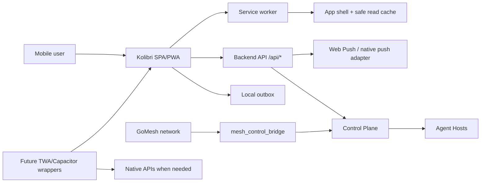

# Mobile/GoMesh Integration Pack

Дата: 2026-06-29
Роль: `mobile_gomesh_integrator`

## 1. Цель и границы

Цель pack: довести мобильный слой Kolibri до управляемой PWA-first стратегии
для Android/iOS, описать будущие native wrappers и зафиксировать контрактную
интеграцию с GoMesh без принятия владения чужим GoMesh-кодом.

Ключевые границы:

- базовый продукт остается одним React SPA/PWA;
- мобильный клиент не является Agent Host и не получает права выполнять
  фабричные задачи;
- GoMesh остается отдельным направлением, Kolibri интегрируется через
  documented contracts, feature flags и fallback через текущий Control Plane;
- секреты, service-to-service подписи, push keys и mesh credentials живут на
  backend/bridge стороне, не в PWA bundle;
- текущие remote-first инварианты сохраняются: `/v1/tasks`,
  `/v1/nodes/register`, `/v1/nodes/<node_id>/heartbeat`, leases, artifacts,
  node-local execution.

Non-goals:

- не переписывать GoMesh;
- не заводить отдельный мобильный продукт вместо web-first интерфейса;
- не делать PWA зависимой от наличия mesh;
- не кешировать чувствительные документы offline до явной security policy.

## 2. Текущий baseline в репозитории

Найденные опоры:

- `docs/mobile-gomesh.md`: PWA-first стратегия, Android install, iOS Home
  Screen, TWA/Capacitor позже, GoMesh через контракт и fallback.
- `docs/api.md`: Control Plane endpoints для nodes/tasks/agent-messages.
- `ops/MOBILE_GOMESH_INTEGRATION.md`: краткий mobile/GoMesh стандарт.
- `frontend/public/manifest.webmanifest`: `display: standalone`, `scope: /`,
  `start_url: /`, icons 192/512.
- `frontend/public/service-worker.js`: app shell cache, navigation fallback,
  static asset cache, API/WS не перехватываются.
- `frontend/public/pwa-register.js`: регистрация service worker.
- `frontend/src/components/control/SettingsPanel.jsx`: PWA status в Control
  Settings.
- `frontend/tests/mobile_layout_guard.mjs`: guard для `100svh/100dvh`, safe
  bottom и composer mobile layout.
- `ops/mesh_control_bridge.py`: bridge читает GoMesh nodes/messages, создает
  shadow nodes `mesh-*` через `/v1/nodes/register`, создает задачи через
  `/v1/tasks` с `mesh_first: true`.
- `tests/test_mesh_control_bridge.py`: контрактные smoke-тесты для bridge.

Gap, который закрывает этот pack: нет единого release/runbook документа, где
связаны PWA installability, offline/outbox, push, native wrapper readiness,
GoMesh contracts, node registration и mobile QA.

## 3. Целевая архитектура



Principles:

- Browser/PWA path is the source of truth for UX and functional readiness.
- Native wrappers are distribution/adaptor layers, not separate logic forks.
- Offline mode keeps the app usable and honest: cached shell, clear stale
  states, queued safe actions, no fake successful server operations.
- GoMesh bridge owns mesh-to-Control translation; mobile app talks to backend,
  not directly to Control Plane or GoMesh internals.
- Push is opt-in and capability-detected; it improves re-engagement but must
  not be required for core tasks.

## 4. Delivery plan

### Phase 0 - Contract freeze and ownership

Deliverables:

- this pack accepted as the mobile/GoMesh implementation baseline;
- owner-facing note that GoMesh code is not touched without handoff;
- feature flags documented:
  - `KOLIBRI_GOMESH_ENABLED`;
  - `KOLIBRI_MOBILE_OFFLINE_ENABLED`;
  - `KOLIBRI_PUSH_ENABLED`;
  - `KOLIBRI_NATIVE_WRAPPER_MODE=none|twa|capacitor`.

Acceptance:

- every mobile/mesh task references a contract section from this pack or
  creates a doc update first;
- Control Plane remains usable when all mobile/GoMesh flags are disabled.

### Phase 1 - PWA Android/iOS hardening

Deliverables:

- manifest includes stable identity:
  - `name`, `short_name`, `lang`, `display`, `scope`, `start_url`;
  - add manifest `id` before push rollout to keep install identity stable;
  - icons 192/512 maskable plus explicit `apple-touch-icon`;
  - production `theme_color`/`background_color` aligned with UI.
- service worker cache versioning policy:
  - shell cache for `/`, manifest, icons and built static assets;
  - no blind caching of `/api/*` or `/ws/*`;
  - update prompt or safe reload path when new bundle is activated.
- standalone/mobile UX:
  - safe areas on iOS;
  - no horizontal scroll at 360px;
  - Control FAB, composer, bottom sheet and keyboard do not overlap;
  - PWA status visible in Control -> Settings.

Android acceptance:

- Chrome installability passes on production HTTPS origin;
- installed PWA opens standalone and preserves session;
- offline shell loads after first successful visit;
- Lighthouse PWA/installable audit has no critical blockers.

iOS acceptance:

- Safari Add to Home Screen creates standalone app shell;
- `display: standalone` path has no missing critical controls;
- safe area and keyboard behavior are checked on iPhone viewport/device;
- offline shell does not white-screen;
- push permission is not requested until user action and installed context.

### Phase 2 - Offline and sync

Offline tiers:

| Tier | Scope | Behavior |
| --- | --- | --- |
| Shell | app frame, nav, Control shell | must open offline after first load |
| Read cache | providers, billing plans, last factory status, recent chat headers | stale marker + last updated timestamp |
| Drafts | chat input, estimate draft, document metadata draft | stored locally until sent |
| Outbox | safe POST actions | queued with idempotency key and visible status |
| Sensitive files | uploaded docs, generated paid docs | no offline cache until policy approves |

Proposed local outbox item:

```json
{
  "client_action_id": "mob_01J...",
  "kind": "chat_message|estimate_request|document_action",
  "created_at": "2026-06-29T00:00:00Z",
  "endpoint": "/api/chat",
  "method": "POST",
  "body": {},
  "idempotency_key": "mob_01J...",
  "state": "queued|sending|acked|failed|conflict",
  "retry_after": null,
  "error": null
}
```

Backend requirements:

- accept `Idempotency-Key` for outbox-supported mutations;
- return stable `server_action_id`;
- distinguish `409 conflict`, `422 validation_error`, `429 retry_after`,
  `503 offline_or_degraded`;
- never report queued local actions as completed server work.

UX requirements:

- offline banner/state in chat and Control;
- queued message/action row with retry/cancel;
- clear stale labels for cached factory/billing/status data;
- reconnect sync with bounded retries and no duplicate server actions.

### Phase 3 - Push notifications

Web Push path:

- use standards-based Push API + Notifications API + Service Worker;
- permission request only after direct user action;
- iOS support is scoped to Home Screen web apps with standalone behavior;
- capability detection, not browser sniffing;
- backend stores push subscriptions per user/device/session with revocation.

Proposed API:

```http
POST /api/mobile/push/subscribe
POST /api/mobile/push/unsubscribe
GET  /api/mobile/push/status
```

Subscription payload:

```json
{
  "device_id": "sha256-local-install-id",
  "platform": "web-pwa|ios-home-screen|android-pwa|twa|capacitor-ios|capacitor-android",
  "subscription": {
    "endpoint": "https://...",
    "keys": {
      "p256dh": "...",
      "auth": "..."
    }
  },
  "capabilities": {
    "push": true,
    "badge": true,
    "notification_actions": false
  }
}
```

Push event taxonomy:

| Event | User value | Default priority |
| --- | --- | --- |
| `estimate_ready` | estimate/commercial offer finished | normal |
| `document_processed` | uploaded document is indexed/ready | normal |
| `billing_action_required` | payment failed or subscription needs action | high |
| `factory_task_completed` | owner/operator task completed | normal |
| `factory_degraded` | owner/operator-only factory health alert | high |
| `chat_reply_ready` | async answer ready | normal |

Rules:

- no marketing push without explicit category opt-in;
- no sensitive document content in notification body;
- badge count derived from server unread/action counters;
- native wrappers may use FCM/APNs through an adapter, but taxonomy and user
  preferences stay shared with Web Push.

### Phase 4 - GoMesh contracts

Current bridge env:

- `KOLIBRI_MESH_CHAT_URL`, default `http://10.99.0.1:8082`;
- `KOLIBRI_MESH_COORD_URL`, default `http://10.99.0.1:8080`;
- `KOLIBRI_FACTORY_CONTROL_URL`, default `http://10.99.0.2:9101`;
- `KOLIBRI_MESH_BRIDGE_AGENT_ID`, default `orchestrator`;
- `KOLIBRI_MESH_BRIDGE_POLL_SECONDS`, default `5`.

#### 4.1 Mesh node discovery input

Bridge expects `GET {KOLIBRI_MESH_COORD_URL}/api/nodes` to return a list:

```json
[
  {
    "id": "home",
    "name": "home",
    "ip": "10.99.0.1",
    "role": "agent",
    "status": "online",
    "last_seen": "2026-06-29T00:00:00Z"
  }
]
```

#### 4.2 Control Plane shadow node registration

Bridge registers GoMesh nodes as shadow nodes:

```http
POST /v1/nodes/register
```

Current core payload:

```json
{
  "node_id": "mesh-home",
  "agent_id": "mesh-home",
  "hostname": "home",
  "capabilities": ["mesh", "mesh_node"],
  "health": "online"
}
```

Recommended extension for a future schema update:

```json
{
  "mesh": true,
  "mesh_source_node_id": "home",
  "mesh_ip": "10.99.0.1",
  "mesh_role": "agent",
  "mesh_last_seen": "2026-06-29T00:00:00Z",
  "backpressure": {
    "queue_depth": 0,
    "cpu_pressure": "low",
    "accepting_tasks": true
  }
}
```

Compatibility note: current Control Plane persists core node fields. If UI or
automation needs mesh metadata, add a small schema/test update to Control Plane
instead of depending on ignored extra fields.

#### 4.3 Mesh message input

Bridge expects `GET {KOLIBRI_MESH_CHAT_URL}/api/messages?agent_id=...`:

```json
[
  {
    "id": "owner-msg-1",
    "from": "owner",
    "to": "orchestrator",
    "role": "director",
    "task": "Проверь фабрику через mesh",
    "payload": {
      "priority": "P0",
      "required_capability": "generic_implementation",
      "target_node": "home-live"
    }
  }
]
```

Chat-only kinds must not create Control Plane tasks:

- `owner_chat_message`;
- `orchestrator_chat_response`.

#### 4.4 Control Plane task created from mesh

```http
POST /v1/tasks
```

Envelope:

```json
{
  "task_id": "MESH-owner-msg-1",
  "kind": "owner_remote_task",
  "root_goal_id": "KOL-MESH-FIRST-001",
  "target_node": "home-live",
  "required_capability": "generic_implementation",
  "priority": "P0",
  "project_path": "/home/ladik/kolibri-ai-platform",
  "branch": "codex/factory-ha-spool-20260627",
  "objective": "Проверь фабрику через mesh",
  "mesh_message_id": "owner-msg-1",
  "mesh_from": "owner",
  "mesh_to": "orchestrator",
  "mesh_role": "director",
  "mesh_first": true,
  "evidence_required": [
    "node_id",
    "agent_id",
    "pid",
    "heartbeat",
    "worktree",
    "branch",
    "remote_logs",
    "result_path"
  ]
}
```

#### 4.5 Mesh response

Bridge posts acceptance/failure back to GoMesh:

```http
POST {KOLIBRI_MESH_CHAT_URL}/api/respond
```

Payload:

```json
{
  "message_id": "owner-msg-1",
  "from": "orchestrator",
  "result": {
    "status": "accepted",
    "task_id": "MESH-owner-msg-1",
    "transport": "mesh",
    "executor": "queued"
  }
}
```

#### 4.6 Service-to-service signing

Required before exposing GoMesh beyond trusted private network:

- `X-Kolibri-Timestamp`;
- `X-Kolibri-Nonce`;
- `X-Kolibri-Signature`;
- HMAC over method, path, timestamp, nonce and body hash;
- reject clock skew over configured window;
- store nonce replay cache;
- rotate bridge secret without PWA redeploy.

### Phase 5 - Node registration and mobile presence

Do not register normal mobile PWA installs as Control Plane execution nodes.
They do not have worktree, lease runner, artifact discipline or safe shell
permissions.

Use separate mobile presence if needed:

```http
POST /api/mobile/presence/register
POST /api/mobile/presence/heartbeat
```

Presence payload:

```json
{
  "device_id": "sha256-local-install-id",
  "user_id": "server-user-id",
  "platform": "android-pwa|ios-home-screen|web|twa|capacitor-ios|capacitor-android",
  "app_version": "2026.06.29",
  "capabilities": ["offline_shell", "push_web", "share_target"],
  "network": {
    "online": true,
    "effective_type": "4g"
  }
}
```

Future native GoMesh peer mode:

- only native wrapper with explicit user/admin enablement may host a GoMesh
  peer;
- register through GoMesh coordinator first, then bridge creates
  `mesh-mobile-*` shadow node;
- capabilities must be limited, for example `["mesh", "mobile_client"]`;
- never grant `generic_implementation`, `write_worktree`, `shell` or
  `git_push` to mobile devices;
- mobile peer drain/offline must be treated as normal churn, not incident.

### Phase 6 - Future native wrappers

#### Android TWA

Use when Play Store distribution is needed and web UX is already strong.

Requirements:

- production HTTPS origin;
- manifest installability passes;
- Digital Asset Links configured for app/site ownership;
- Bubblewrap or equivalent build path documented;
- fallback behavior checked if verification fails;
- no native-only feature required for the first wrapper.

Best for:

- quick Play Store presence;
- same web runtime and cookies/session model;
- minimal wrapper code.

Not best for:

- deep native plugins;
- heavy offline filesystem;
- background jobs beyond web capabilities.

#### Capacitor iOS/Android

Use when native APIs become product-critical:

- push adapter over APNs/FCM;
- share extension/import from Files;
- secure storage for selected tokens;
- native file picker/scanner;
- app-store-specific purchase/account flows if required.

Rules:

- web app remains primary logic;
- native plugin surface is isolated behind `mobileCapabilities`;
- wrapper builds must run the same core web smoke suite;
- App Store/Play Store metadata and privacy disclosures become release
  blockers before submission.

### Phase 7 - Mobile QA matrix

Automated checks:

```bash
npm --prefix frontend run build
npm --prefix frontend run test:mobile-layout
PYTHONDONTWRITEBYTECODE=1 python3 -m compileall -q ops/mesh_control_bridge.py ops/factory_control.py ops/agent_host.py
PYTHONDONTWRITEBYTECODE=1 pytest -q tests/test_mesh_control_bridge.py tests/test_factory_runtime_contracts.py tests/test_factory_autonomy_contracts.py
```

Browser/device checks:

| Area | Android Chrome | iOS Safari/Home Screen | Desktop sanity |
| --- | --- | --- | --- |
| Install | install prompt/Lighthouse | Add to Home Screen | manifest visible |
| Launch | standalone | standalone | normal browser |
| Offline shell | airplane/offline reload | airplane/offline reload | DevTools offline |
| Chat | send/retry/error | send/retry/error | send/error |
| Control FAB | tap/open/close/tabs | tap/open/close/tabs | click/keyboard |
| Keyboard | composer visible | composer visible + safe area | n/a |
| Push | permission + test push | installed app + user action + test push | permission + test push |
| Theme | system/light/dark | system/light/dark | system/light/dark |
| Factory status | stale/degraded labels | stale/degraded labels | full panel |

GoMesh QA:

- bridge starts with configured env and writes structured logs;
- `GET /api/nodes` online/offline nodes become Control shadow nodes;
- chat-only mesh messages do not create tasks;
- task mesh messages create `/v1/tasks` envelope with `mesh_first: true`;
- Control Plane fallback works with `KOLIBRI_GOMESH_ENABLED=false`;
- stale/offline mesh node does not receive critical tasks;
- bridge response reports accepted/failed with task id and transport.

Offline QA:

- first load online, then offline reload opens shell;
- queued action persists across reload;
- reconnect sends one server mutation per idempotency key;
- validation/conflict errors are visible and do not loop forever;
- sensitive document content is not present in Cache Storage/IndexedDB unless
  explicitly approved.

Push QA:

- no prompt on first page load;
- subscribe button triggers permission flow;
- subscription can be revoked and backend stops sending;
- notification body excludes sensitive content;
- badge/unread count clears after opening relevant item;
- push-disabled user still sees in-app status.

Native wrapper QA:

- TWA verifies Digital Asset Links and falls back safely if verification fails;
- Capacitor wrapper exposes only approved plugins;
- wrapper version and web version are visible in diagnostics;
- store builds do not contain development endpoints or secrets;
- privacy disclosure matches actual device APIs.

## 5. Release sequencing

1. Accept this pack and link it from the broader docs index in a separate docs
   steward change.
2. PWA hardening PR: manifest `id`, apple touch icon verification, service
   worker update UX, mobile QA screenshots.
3. Offline PR: local drafts/outbox, idempotency contract, stale UI states.
4. Push PR: backend subscription storage, Web Push send path, PWA permission
   UI, notification preferences.
5. GoMesh contract PR: persist mesh metadata if needed, signing, bridge tests.
6. Android TWA spike: Bubblewrap project outside core app or under a clearly
   owned wrapper directory.
7. Capacitor spike only after native APIs are product-critical.

## 6. Acceptance checklist

Product/PWA:

- [ ] Kolibri installs and launches as standalone PWA on Android Chrome.
- [ ] Kolibri installs and launches as standalone Home Screen web app on iOS.
- [ ] Offline shell opens after first successful online load.
- [ ] Chat, Control FAB, Control Panel tabs and Settings PWA status work on
      360px, 390px, tablet and desktop viewports.
- [ ] Keyboard, safe area and Control FAB do not overlap critical controls.
- [ ] Build and mobile layout guard pass.

Offline:

- [ ] Read cache shows stale timestamps.
- [ ] Drafts/outbox survive reload.
- [ ] Reconnect sync is idempotent.
- [ ] Failed queued actions expose retry/cancel.
- [ ] Sensitive documents are not cached offline without approval.

Push:

- [ ] Push permission is requested only after user action.
- [ ] Web Push subscription/unsubscription APIs exist and are tested.
- [ ] iOS push path is tested from installed Home Screen app.
- [ ] Android PWA push path is tested from installed PWA.
- [ ] Notification taxonomy and user preferences are enforced.
- [ ] No sensitive content is sent in push payloads.

GoMesh:

- [ ] `KOLIBRI_GOMESH_ENABLED=false` leaves product and Control Plane usable.
- [ ] Mesh node discovery registers `mesh-*` shadow nodes.
- [ ] Mesh task messages create Control Plane tasks with `mesh_first: true`.
- [ ] Chat-only mesh messages do not create tasks.
- [ ] Health/backpressure/stale node behavior is visible and tested.
- [ ] Service-to-service signing is implemented before untrusted exposure.

Node registration:

- [ ] Normal mobile PWA installs are not registered as Agent Host nodes.
- [ ] Mobile presence, if needed, uses `/api/mobile/presence/*`.
- [ ] Future mobile GoMesh peer uses limited `mesh-mobile-*` capabilities.
- [ ] Mobile devices never receive worktree/shell/git permissions.

Native wrappers:

- [ ] Android TWA is gated by production PWA readiness and Digital Asset Links.
- [ ] Capacitor is used only for approved native capabilities.
- [ ] Wrapper builds share the same web smoke tests.
- [ ] Store builds contain no development endpoints or secrets.

Mobile QA:

- [ ] Android Chrome real-device or emulator pass recorded.
- [ ] iOS Safari/Home Screen real-device or simulator pass recorded.
- [ ] Offline, push-disabled, degraded backend and degraded GoMesh cases
      recorded.
- [ ] Factory/GoMesh bridge contract tests pass.
- [ ] Release notes list known platform limitations and fallback behavior.

## 7. Reference links checked

- Apple WWDC23 Web Apps: https://developer.apple.com/videos/play/wwdc2023/10120/
- WebKit Web Push for iOS/iPadOS Home Screen apps:
  https://webkit.org/blog/13878/web-push-for-web-apps-on-ios-and-ipados/
- Chrome Trusted Web Activity overview:
  https://developer.chrome.com/docs/android/trusted-web-activity
- Chrome TWA quick start:
  https://developer.chrome.com/docs/android/trusted-web-activity/quick-start
- Capacitor docs: https://capacitorjs.com/docs
