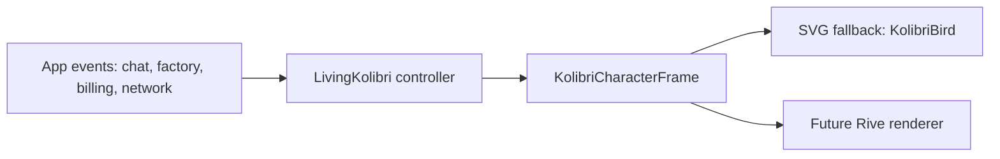

# Motion-бриф живой птицы Kolibri

Роль: Motion-дизайнер птицы Kolibri.
Дата: 2026-06-29.
Статус: development brief для ближайшего среза без изменения кода.

## Назначение

Птица Kolibri - продуктовый state indicator, а не декоративный mascot. Она
должна тихо помогать пользователю понимать, что сейчас делает приложение:
слушает ввод, думает, выполняет фабричную задачу, ждёт сеть, показывает успех,
предупреждение или ошибку.

Этот документ уточняет текущий срез разработки поверх уже существующих
документов:

- `docs/living-bird.md` - продуктовый стандарт живой птицы;
- `docs/agent-work/living-bird-rive-spec.md` - полный Rive/SVG контракт;
- `frontend/src/components/LivingKolibri.jsx` - текущий controller-wrapper;
- `frontend/src/components/KolibriBird.jsx` - текущий SVG fallback.

## Что делать сейчас

Ближайший срез должен закрыть не весь Rive-персонаж, а надёжный runtime
контракт: единый список состояний, приоритеты, события приложения, SVG fallback
для каждого состояния и QA gates. После этого Rive-asset можно будет подключать
лениво, без переписывания app logic.

### P0 состояния

Эти состояния должны попасть в разработку сейчас, потому что они уже связаны с
реальными пользовательскими сценариями chat-first приложения, Контрола,
фабрики, биллинга и сети.

| Canonical state | Смысл | Текущий SVG смысл | Когда включать |
| --- | --- | --- | --- |
| `idle` | спокойное ожидание | базовая поза | нет активного ввода, загрузки, ошибки или offline |
| `listening` | пользователь печатает или сфокусировал composer | внимательная поза | `chat:focus`, непустой composer, voice/listen в будущем |
| `thinking` | AI запрос отправлен, ответа ещё нет | лёгкий hover/поворот | `chat:send`, pending `/api/chat` или WebSocket response |
| `writing` | ассистент начал отдавать ответ | сейчас допустим map в `thinking` | `ai:first_token`, streaming assistant message |
| `working` | фабрика или Control Plane выполняет задачу | сейчас допустим map в `thinking`/`learning` | queued/running task, submit envelope, long factory action |
| `success` | обычное успешное завершение | sparkle/scale | AI complete, task completed, network restored |
| `warning` | восстановимая проблема | сейчас map в `surprised`/мягкий mark | soft fail, degraded factory status, billing fallback lead |
| `error` | blocker или hard failure | mark `!` | hard fail, error boundary, checkout/API failure |
| `offline` | нет соединения или backend недоступен | сейчас map в `sleepy`, но нужен отдельный смысл | `network:offline`, WebSocket disconnected after retry |
| `sleepy` | долгий простой без активных задач | закрытые веки | idle timeout: desktop >= 90s, mobile >= 45s |
| `celebrating` | high-value success | сейчас map в `happy`/`success` | successful billing confirmation, deploy/report ready |

### P1 состояния

Эти состояния важны, но не должны блокировать первый production-safe pass:

- `greeting` - однократное приветствие при первом открытии сессии или onboarding;
- `learning` - индексация knowledge artifact, upload документов, обновление
  контекста;
- `calm`/`happy`/`surprised`/`angry-soft`/`flying` - legacy/expressive aliases
  SVG, которые остаются совместимыми, но не должны становиться основным API.

### Правило приоритета

Controller должен выбирать одно смысловое состояние. Приоритет:

1. `offline`;
2. `error`;
3. `warning`;
4. `working`;
5. `thinking`;
6. `writing`;
7. `listening`;
8. `celebrating`;
9. `success`;
10. `sleepy`;
11. `idle`.

`offline` и `error` перебивают celebration. `success` и `celebrating`
проигрываются коротко и возвращаются в `idle`, если за это время не пришёл
более высокий приоритет.

## SVG fallback и будущий Rive

Текущий SVG не временная заглушка, а обязательный production fallback. Rive
будет основным motion-runtime только когда asset и lazy renderer готовы, но app
logic должна уже сейчас говорить с птицей через semantic state/events.

### Как они связаны

Общий контракт:

- UI отправляет события и app/factory state, а не CSS-классы;
- controller решает canonical state, приоритет и duration;
- SVG получает безопасный visual state уже сейчас;
- Rive позже получает тот же `appState`, `taskState`, `mood`, `energy`,
  `attention`, `reducedMotion`, triggers и personality traits;
- при Rive load error, `prefers-reduced-motion`, маленьком аватаре, low-power
  mobile или множественных инстансах всегда используется SVG.

### Обязательная совместимость

| Canonical | SVG сейчас | Rive потом |
| --- | --- | --- |
| `idle` | `idle`/`calm` | base idle, blink, low energy |
| `listening` | `listening` | attention to composer, head up |
| `thinking` | `thinking` | focused hover, side glance |
| `writing` | `thinking` до отдельного класса | subtle nod rhythm |
| `working` | `thinking` или `learning` | factory pulse, steady hover |
| `success` | `success`/`happy` | short bounce + sparkle <= 900ms |
| `warning` | `surprised` или `angry-soft` без агрессии | head tilt, concerned mood |
| `error` | `error` | compact pose, no shake loop |
| `offline` | `sleepy` сейчас, отдельный `offline` позже | desaturate, still wing, offline mark |
| `sleepy` | `sleepy` | closed eyelids, low shadow |
| `celebrating` | `happy`/`success` | 1-2 expressive flaps, <= 1500ms |

Rive не должен быть требованием для boot, error boundary, message avatars или
Control Panel. В маленьких аватарах сообщений остаётся SVG.

## Micro-interactions

Все micro-interactions должны быть короткими, редкими и привязанными к смыслу.
В рабочем UI не чаще одного заметного micro-event в 3 секунды, для
`minimal/business` профилей - ещё спокойнее.

### Chat

- `chat:focus`: птица переводит взгляд к composer, повышает `attention`, без
  прыжка layout.
- `chat:blur`: внимание мягко снижается, возврат в `idle` через debounce.
- `chat:send`: короткий user-sent trigger, затем `thinking`.
- `ai:first_token`: `thinking` переходит в `writing` без celebration.
- `ai:complete`: короткий `success`, затем `idle`; если ответ пустой или error -
  `warning`/`error`.
- Streaming avatar в message list остаётся SVG и не запускает canvas/Rive.

### Factory

- `factory:task_started`: `working`, уверенная собранная поза, без тревожного
  движения.
- `factory:task_progress`: маленький pulse или tail settle, state не меняется.
- `factory:task_completed`: `success` с коротким sparkle; не перекрывать Control
  FAB и task details.
- `factory:task_failed_soft`: `warning`, мягкий вопрос/наклон головы.
- `factory:task_failed_hard`: `error`, без бесконечной тряски.
- Degraded Control Plane без hard failure - `warning`, а не `error`.

### Billing

- Открытие tab `billing`: не celebration, максимум attention/nudge к панели.
- Выбор тарифа: лёгкий acknowledgement, state остаётся `idle`/`listening`.
- Checkout pending: `thinking` или `working`, если ждём внешний redirect/API.
- Fallback lead saved: `warning` или restrained `success` по microcopy; нельзя
  визуально обещать активированную подписку.
- T-Банк confirmed success: `celebrating`, затем `success` и `idle`.
- Payment failed/cancelled: `warning`; hard API/token/security issue: `error`.

### Network

- `network:offline`: мгновенно `offline`, приглушение цвета, остановка wing loops.
- Retry/reconnect: можно оставаться `offline` с редким pulse, без spinner-like
  тревожности.
- `network:online`: восстановить предыдущий stable state или короткий `success`.
- WebSocket degraded, но REST работает: `warning`, не `offline`.
- Hidden/offscreen tab: pause Rive/Pixi ticker; SVG остаётся статичным.

## Visual QA gates

### Функциональные gates

- Все P0 canonical states достижимы через stories/test harness или ручной QA
  сценарий.
- Legacy SVG states не ломаются: `idle`, `greeting`, `listening`, `thinking`,
  `writing`, `learning`, `success`, `error`, `happy`, `surprised`,
  `angry-soft`, `calm`, `sleepy`, `flying`.
- Event coverage подтверждён для `chat:focus`, `chat:blur`, `chat:send`,
  `ai:thinking`, `ai:first_token`, `ai:complete`, `factory:task_started`,
  `factory:task_progress`, `factory:task_completed`,
  `factory:task_failed_soft`, `factory:task_failed_hard`, `billing:success`,
  `network:offline`, `network:online`, `idle:timeout`.
- Rive отсутствует или не загрузился -> SVG остаётся рабочим и понятным.
- `prefers-reduced-motion` сохраняет смысл состояния и убирает несущественные
  бесконечные циклы.

### Layout gates

- Нет layout shift при смене state и при будущей SVG -> Rive замене.
- Птица не перекрывает composer, send button, Control FAB, Control Panel,
  billing form, toast/error actions и текст сообщений.
- Header avatar 32-40px читаем как статус, но без постоянного движения.
- Welcome/landing bird 80-128px может быть выразительнее, но не отвлекает от
  продукта.
- Message list avatars меньше 40px используют SVG only.
- Проверить desktop 1440x900, laptop 1280x800, tablet 768x1024, mobile
  360x740, iOS safe area и Android PWA standalone.

### Accessibility gates

- Если птица сообщает meaningful state, есть `role="img"` и понятный
  `aria-label`; декоративное использование получает `aria-hidden`.
- Нет `aria-live` шума от самой птицы; реальные loading/error/offline статусы
  остаются в UI текстом.
- Птица не фокусируемая, если у неё нет действия; если действие есть, wrapper -
  настоящая кнопка с visible focus.
- Цвет не единственный канал статуса: marks, posture и текстовый статус в UI
  дублируют смысл.
- Нет flashing/blinking около 3Hz; warning/error не трясутся бесконечно.

### Performance gates

- Initial render работает на SVG без ожидания Rive.
- Будущий Rive lazy-load не увеличивает initial route cost без отдельного
  решения.
- Один visible Rive canvas на экран по умолчанию; списки и compact UI - SVG.
- Hidden/offscreen/reduced motion ставят runtime на pause или переводят в SVG.
- Цель для Rive asset: <= 180KB gzip/brotli, hard max 300KB.
- Нет per-frame React state updates, retained canvas/ticker после unmount и
  заметного CPU в idle.

## Acceptance для ближайшей разработки

Срез можно считать готовым, когда:

- `LivingKolibri` остаётся единым входом для app state/events;
- SVG fallback покрывает все P0 canonical states через явную state map;
- будущий Rive renderer может подключиться к тому же контракту без изменения
  вызывающих экранов;
- chat/factory/billing/network события описаны и имеют приоритеты;
- visual QA gates внесены в release/product QA;
- reduced motion и Rive load failure не ломают интерфейс;
- ни один сценарий не передаёт клиентские данные в Rive asset или внешние motion
  сервисы.

## Открытые решения

1. Делать ли отдельный SVG class для `offline`, `working`, `writing` и
   `warning` в ближайшем pass или оставить временный map до Rive prototype.
2. Где хранить personality profile до появления клиентского профиля:
   frontend config, backend org profile или admin-only settings.
3. Нужен ли пользовательский toggle `Минимум движения` в первом релизе, помимо
   системного `prefers-reduced-motion`.
4. Использует ли landing отдельный expressive Rive artboard или общий
   `KolibriBird` с более высоким energy/personality.
