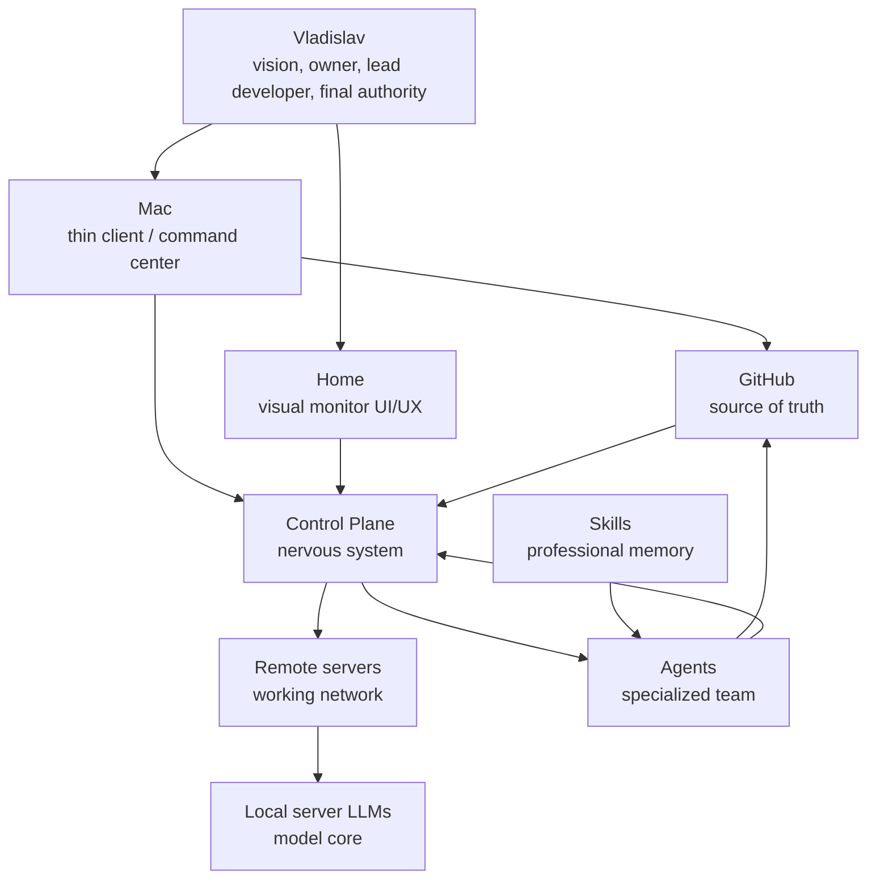

# Kolibri Superfactory Canvas

Date: 2026-07-01

## Owner

Кочуров Владислав Евгеньевич.

Role: Chief Visionary, Owner, Lead Developer, Final Authority.

Vladislav defines the vision, taste, priorities, acceptance criteria, and final
decision. Agents may propose and execute inside the factory law, but they do
not replace Vladislav's final authority.

## Project

Kolibri Factory is a distributed AI/platform factory.

The target state is a self-developing, distributed, sovereign AI factory with:

- strict runner contract;
- GitHub always-current operation;
- fleet resource usage;
- skill registry;
- team mesh;
- local LLM ring;
- FormulaLM integration;
- business/revenue engine;
- video-avatar meeting layer;
- anti-degradation system;
- eventual full autopilot command.

## Current Known State

- GitHub is source of truth.
- Mac is command center / thin client for issuing commands, reviewing, editing
  canvas/docs, and dispatching tasks.
- Heavy execution, full tests, server validation, agents, local LLMs, image
  generation, FormulaLM, and CI-like validation must run on remote servers,
  Control Plane, or GitHub Actions.
- Control Plane sees 20 server node cards.
- Direct SSH from Mac reaches only `main` and `primary-candidate`; 18/20 nodes
  time out.
- `uiap` and `qjns` report 0.0 GB disk free.
- Server GitHub auth is broken for noninteractive clone/fetch.
- Runtime repos on `main` and `primary-candidate` are dirty.
- PR #46 is valuable but too large and must be split.
- Agent Host generic runner contract is not strict enough and must be hardened
  first.

## System Roles

### Mac

Mac is a thin client and command center.

Mac is used for issuing commands, reviewing GitHub state, editing docs/canvas,
dispatching tasks, and supervising the factory. Mac should not silently become
the heavy worker for server-only execution.

### Home

Home is the visual monitor and UI/UX command room.

Home should show the live state of the factory: nodes, queues, active agents,
running tasks, GitHub PRs, CI, server resources, model capacity, incidents,
logs, and owner-facing messages. Raw log tail is not the final UX.

### GitHub

GitHub is the source of truth.

Every meaningful change should become a branch, PR, issue, run artifact, or
merged record. The project is assembled through small reviewable PRs, not
through one giant mixed branch.

### Control Plane

Control Plane is the nervous system.

It routes tasks, manages leases, records state, receives heartbeats, preserves
result references, and carries the operational truth of the factory. It must
not accept fake completed states.

### Remote Servers

Remote servers are the working network.

They run heavy tests, CI-like validation, model execution, audits, scans,
FormulaLM work, image generation, and long-running jobs. Server execution must
use Control Plane contracts or isolated temporary checkouts, not casual
mutation of production runtime repositories.

### Local Server LLMs

Local LLMs on servers are the model core.

They provide sovereignty, resilience, private inference capacity, local routing,
and a path away from API-only dependence. External APIs remain useful but must
not be the only spine of the factory.

### Skills

Skills are shared professional memory.

They preserve workflows, constraints, domain practices, server runbooks, review
patterns, and factory law so agents do not restart from zero every session.

### Agents

Agents are a team of specialized workers.

Agents need explicit roles, capabilities, contracts, write scopes, required
outputs, tests, artifacts, and review paths. They are not random shell
executors.

## Factory Law

Autonomy means full responsibility inside the law of the factory. It does not
mean permission to destroy, spam, deceive, hide state, forge success, bypass
constraints, leak secrets, or override Vladislav's final authority.

Non-negotiable rules:

- No secrets printed.
- No push to `main`.
- No force push.
- No destructive git commands.
- No deleting dirty work.
- No fake completed status.
- No claiming tests passed if unavailable.
- No blind install of unaudited internet code on servers.
- No abusing free resources or violating Terms of Service.
- No automatic money movement or bank actions without owner approval.
- No use of phone/video relay for 2FA, bank approvals, or security bypass.
- No bypassing GitHub as source of truth.
- No bypassing Control Plane contracts for factory work.
- No mutating production runtime repositories casually.
- No mixing unrelated subsystems in one PR when separation is required.

Positive responsibility:

- Preserve evidence.
- Report blockers honestly.
- Keep artifacts traceable.
- Keep work reviewable.
- Prefer reversible changes.
- Respect write scope.
- Make failure visible.
- Escalate ambiguity instead of inventing authority.
- Improve skills, docs, and contracts when the factory learns something.

## Assembly Policy

Kolibri is assembled by mergeable layers, not by one giant branch.

Every layer should have:

- one clear purpose;
- explicit constraints;
- GitHub branch and PR;
- CI or documented test status;
- remote validation when the work is heavy or server-related;
- run artifacts: `PLAN.md`, `ACTIONS.md`, `TESTS.md`, `RESULT.md`, `NEXT.md`;
- a next recommended task.

Do not mix:

- runner contracts with Home UI/UX;
- Home UI/UX with billing;
- billing with FormulaLM;
- FormulaLM with server GitHub auth;
- server repair with product feature work;
- dirty runtime diff preservation with new product features;
- phone/video relay policy with bank/security bypass;
- skill registry with unreviewed internet code execution.

## Execution Order

1. Harden Agent Host generic runner contract.
2. Create Superfactory documentation package.
3. Create GitHub always-current policy.
4. Inventory whole fleet.
5. Repair degraded nodes: `uiap`/`qjns` disk and server GitHub auth.
6. Preserve dirty runtime diffs.
7. Create skill registry and internet skill discovery pipeline.
8. Create agent team mesh.
9. Create anti-degradation system.
10. Rerun P0 integration contract audit.
11. Split PR #46.
12. Sync approved skills to servers.
13. Design 100000 logical agents scheduler.
14. Design local LLM ring and sovereign model factory.
15. Add business/revenue engine with finance safety gates.
16. Add phone/video relay policy.
17. Add video-avatar meetings.
18. Define future START full-autopilot command.

## Target Architecture

## START Autopilot Boundary

The future full-autopilot command must be explicitly defined before it exists.

It must include:

- allowed scope;
- forbidden scope;
- budget limits;
- server selection rules;
- model routing rules;
- write scope;
- GitHub branch/PR policy;
- finance gates;
- security gates;
- rollback policy;
- owner notification rules;
- stop command;
- audit log.

Full autopilot is not permission to operate outside factory law.

## Immediate Interpretation

The factory should become more autonomous only after trust is restored.

Current priority:

- complete and merge Agent Host runner hardening;
- make GitHub always-current;
- build the Superfactory docs package;
- repair degraded server capacity and auth;
- preserve dirty runtime work;
- then expand agent teams, local LLM ring, skills, and Home UI/UX.
