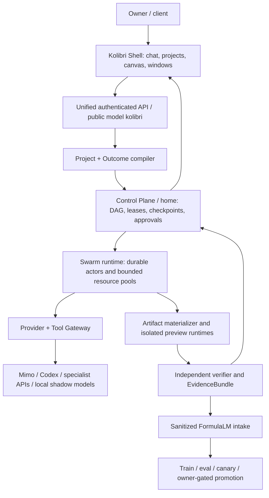

# Kolibri AI OS: master plan

Статус: доказательный план реализации, а не заявление о готовности.
Дата evidence-срезов: 2026-07-10.
Дата плана: 2026-07-11.
Владелец и final authority: Кочуров Владислав Евгеньевич.

## Executive Summary

- **Kolibri AI OS должна стать системой `goal → verified outcome`, а не чат-ботом и не витриной артефактов.** Обычная фраза пользователя создаёт долговечный проект, проверяемый план работы, набор исполнителей и инструментов, типизированные результаты, независимую проверку и checkpoint для продолжения с любого клиента.
- **Сильные части продукта уже существуют, но находятся в разных поколениях и ещё не образуют один доказанно работающий релиз.** На Mac обнаружены component OS Shell, действующий Python execution plane, Rust foundation, construction/document engines и несколько полезных enterprise-паттернов. GitHub подтверждает один канонический product/runtime repository и большой donor/research portfolio. Их нужно консолидировать через contracts, tests и provenance, а не объединять целыми каталогами.
- **Физическая сетка не равна работающей фабрике.** Текущий срез подтверждает 21 уникальный mesh-member, свежесть `20/21`, но строгая capability execution proof — `0/21`: ни одна завершённая задача одновременно не содержит content-bound hash и независимый verifier verdict. До устранения этого разрыва нельзя заявлять `21/21 factory ready`.
- **Первый рыночный вертикальный результат — Construction OS.** Запрос «хочу построить дом, дай комплект документов» должен выдавать не текстовую рекомендацию, а versioned project pack: требования, замеры/takeoff, детерминированную смету, график, закупки, договорные и исполнительные документы, approvals, provenance и оговорки о необходимости профильной экспертизы.
- **Собственный AI развивается только через безопасный FormulaLM learning plane.** Внешние Mimo/Codex/специализированные providers сначала являются workers и teachers. Внутренняя модель работает в shadow, проходит независимые eval и canary. Никаких синхронных изменений production-весов, переноса закрытых весов или обучения на данных без consent/license.
- **Порядок действий: truth и сохранность → Home factory reliability → Shell/project continuity → construction vertical end-to-end → 21-node evidence и swarm scale → FormulaLM shadow → подписанная progressive release.** Следующая генерация отдельного приложения, второго Control Plane или очередного монолитного frontend не приближает продукт к этой цели.

## 1. Как читать этот план

Каждый существенный тезис относится к одному из трёх классов:

- **PROVEN** — непосредственно наблюдался в read-only census, действующем контракте, текущем Git/GitHub metadata или live read API в указанное время.
- **INFERRED** — устойчиво следует из нескольких независимых источников, но ещё не подтверждён runtime attestation или acceptance test.
- **PROPOSED** — целевое решение или порядок реализации; оно не считается внедрённым, пока не пройдены его gates.

Этот документ не означает, что:

- весь Mac, каждый файл, каждый Git branch и каждый server filesystem семантически изучены;
- Home runtime, новый Shell, Rust Core, PostgreSQL/NATS/S3 или FormulaLM trainer уже раскатаны;
- все 21 узел выполняют реальные задачи;
- production `kolibriai.ru` соответствует этому плану;
- любой README-claim о production, AGI, скорости или качестве подтверждён.

## 2. Определение продукта

### 2.1. North Star

**PROPOSED:** Kolibri AI OS — кроссплатформенная операционная среда для превращения цели владельца или клиента в законченный, проверенный и возобновляемый результат.

```text
Natural-language goal
  → Project + Workstream
  → OutcomeSpec + DeliverableGraph
  → SwarmPlan + approvals + budgets
  → provider/tool/agent execution
  → immutable artifacts + evidence
  → independent verification
  → Canvas result + checkpoint/resume
  → sanitized FormulaLM learning candidate
```

Kolibri считается умеющей capability не тогда, когда capability записана в каталоге, а когда разрешённый маршрут может выполнить реальную задачу и вернуть результат, связанный с attempt, artifact hash и verifier verdict.

### 2.2. Что видит клиент

**INFERRED из повторяющихся продуктовых контрактов:**

- один лёгкий Shell с фирменной птицей Kolibri, без дублирующего маскота и визуального шума;
- один основной проектный workspace, в котором обычная беседа остаётся одной беседой;
- новое сообщение в том же проекте не создаёт новое OS-окно;
- новый проект создаёт отдельный долговечный workspace;
- Projects, Files, History и типизированные результаты открываются как настоящие окна;
- на mobile остаётся одна focused surface, а не уменьшенная копия desktop;
- технический provider скрыт за публичной моделью `kolibri`; provenance доступна в деталях и `/control`;
- если задача требует смету, документ, сайт или приложение, Shell показывает исполняемый или редактируемый результат, а не только текст о том, что он создан.

### 2.3. Definition of Done для клиентской задачи

**PROPOSED:** response может стать `completed`, только если одновременно выполнены условия:

1. цель и acceptance criteria сохранены в Project/OutcomeSpec;
2. все обязательные plan nodes завершены текущими fenced attempts;
3. результат непустой и относится к текущему `attempt_id` и `lease_owner`;
4. каждый обязательный artifact materialized, immutable и content-addressed;
5. заявленные verifier gates прошли независимо от автора результата;
6. approvals получены для финансовых, production, credential, destructive и security-sensitive действий;
7. checkpoint позволяет продолжить тот же workstream;
8. клиенту показан пригодный результат или точный blocker, а не ложный success.

## 3. Доказанная исходная точка

### 3.1. Mac и локальные разработки

| Факт | Статус | Следствие |
| --- | --- | --- |
| 137 Git-маркеров, 133 распознанных repo/worktree, 89 git-common families | PROVEN | Нужны registry и consolidation; новая копия репозитория ухудшит ситуацию. |
| 40 worktree в главном `kolibri-ai-platform` family | PROVEN | Большая часть свежей работы — ветви одной системы, а не независимые продукты. |
| Component OS worktree имеет 15-строчный `App.jsx`, отдельные `shell/`, `windows/`, `workbench/`, `control/`, `runtime/` | PROVEN | Это текущий UX/component donor и база Shell, но не готовый production-релиз. |
| Канонический implementation worktree существенно dirty | PROVEN | Сначала reviewable commit slices и сохранность; нельзя деплоить shared dirty tree. |
| Mac: Apple M1, 8 GiB RAM; Rust/Node/Python/Docker/Ollama/Codex/Mimo toolchain присутствует | PROVEN в local census evidence | Mac подходит как owner client и Apple build station, но не как тяжёлый постоянный LLM/fleet worker. |
| Vista/Fone, construction, hotel, content-factory и legacy AI линии содержат полезные части | PROVEN на уровне inventory/docs | Импортировать только capability contracts, fixtures и проверенные компоненты. |

### 3.2. GitHub portfolio

| Факт | Статус | Следствие |
| --- | --- | --- |
| 37 owner repositories; 21 public, 16 private | PROVEN | Portfolio полностью перечислен на уровне owner repos. |
| 447 branches, 147 open PR, 32 issues | PROVEN на 2026-07-10 | Требуется branch/PR evidence ledger, а не массовый merge. |
| `kolibri-ai-platform`: 296 branches, 91 open PR | PROVEN | Это единственный canonical product/runtime repo, но его backlog требует triage. |
| Remote default `main` был green на snapshot HEAD | PROVEN | Это baseline конкретного commit, не доказательство local dirty branch или production. |
| GitHub API показывал canonical repo как public | PROVEN | Нужен history exposure/secret/topology audit; visibility нельзя менять без owner approval. |
| Vista не является каноническим GitHub source | PROVEN | Его UI нужно импортировать в canonical repo с provenance и tests. |

### 3.3. Fleet и runtime

| Слой | Baseline на срезе | Статус |
| --- | ---: | --- |
| Уникальные physical membership records | `21/21` | PROVEN для текущей projection |
| Fresh canonical Agent Host | `20/21`; `main` stale | PROVEN, partial |
| Mac bootstrap через существующие direct + Home ProxyJump paths | `20/21`; `main` недоступен | PROVEN в prior read-only audit, partial |
| Home SSH route | `19/21` | PROVEN в prior read-only audit, partial |
| Raw Control Plane registrations | 136 = 21 canonical + 115 legacy/logical duplicates | PROVEN, hygiene failure |
| Strict completed capability tasks with content hash + independent verifier | `0/21` | PROVEN absence; factory readiness не доказана |
| Canonical nodes declaring Codex/Mimo availability | `21/21` metadata | PROVEN как probe metadata, не execution proof |
| Generic API/local LLM probes | `0/21 available` | PROVEN |
| Signed release installer status | `0/21 available/proven` | PROVEN gap |
| PostgreSQL HA, NATS JetStream, S3/CAS production deployment | отсутствует доказательство | MISSING |
| Protected execution API inventory | `503 execution_api_auth_not_configured` | PROVEN fail-closed, operational blocker |
| `/api/factory/status` | не следовал полной pagination | PROVEN defect; `/control` не может считать его полной truth |

### 3.4. Честная формулировка текущего состояния

**PROVEN:** есть реальная 21-entry mesh projection, живой Home Control Plane и значимый кодовый/продуктовый corpus.
**NOT PROVEN:** единая 21-node execution fabric, production-ready Shell, полностью подключённый backend, 1000-actor runtime, собственная production LLM или 24-hour stable release.

## 4. Зафиксированные архитектурные решения

### 4.1. Единственные authority

| Область | Authority | Правило |
| --- | --- | --- |
| Product/runtime source | `kolibri-ai-platform` | Новые product/runtime features входят только через этот repo и reviewed canonical branch. |
| Task/control authority | логическая identity `home` | Никаких `main`, `primary`, старых IP или второго scheduler fallback. |
| Public model | `kolibri` | Mimo, Codex и другие routes — внутренняя provenance. |
| Network component | versioned `kolibri-mesh` + signed membership contract | Hostname/IP — metadata, не durable identity. |
| UX authority | component OS Shell после focused integration | Vista остаётся donor, не вторым приложением. |
| Domain contract | `contracts/kolibri-os-v1/*` | Python compatibility и Rust Core сохраняют одинаковые IDs/state semantics. |
| Learning safety | FormulaLM boundary | Только sanitized candidate pipeline; никакого request-path training. |
| Release authority | signed canonical commit + owner approval | GitHub CI или heartbeat отдельно не разрешают production claim. |

### 4.2. Home-only не означает незащищённый single point of failure

**PROPOSED:** `home` остаётся одной логической authority, но её долговечность достигается не переключением на legacy Control Plane, а единым service identity, quorum data layer, leader fencing, replicated event log и tested restore.

Разрешённая будущая HA-схема:

- один активный scheduler leader под identity `control-plane/home`;
- PostgreSQL quorum для durable metadata;
- NATS JetStream quorum для events/mailboxes;
- fencing token/term для leader transitions;
- standby processes не принимают mutation без действующего lease/term;
- service discovery сохраняет имя `home`;
- provider fallback не влияет на control authority;
- recovery тестируется как restore/leader continuity, а не скрытый fallback на `main` или `primary`.

До внедрения этих gates Home outage должен давать честный degraded/read-only state, а не split-brain.

## 5. Доменная модель Kolibri AI OS

**PROPOSED:** минимальный устойчивый набор first-class сущностей:

| Entity | Назначение |
| --- | --- |
| `Project` | Долговечный контейнер цели, участников, политики, файлов и результатов. |
| `Workstream` | Непрерывная линия работы внутри проекта, связанная с Codex/Mimo/Telegram/Shell. |
| `Conversation` | Диалоговый вход и объяснение; не единственный source of truth. |
| `OutcomeSpec` | Цель, ограничения, acceptance criteria, deliverables, budget и approvals. |
| `DeliverableGraph` | Зависимости между документами, приложениями, расчётами и evidence. |
| `SwarmPlan` | Исполнимый DAG typed tasks с resource/capability policy. |
| `Actor` | Durable state machine + mailbox, не отдельный OS process. |
| `TaskAttempt` | Fenced попытка с lease owner, timeout, retry и write scope. |
| `Artifact` | Immutable content-addressed результат с kind, lineage и renderer. |
| `EvidenceBundle` | Hashes, test/build/browser/security/verifier verdicts, связанные с attempt. |
| `Checkpoint` | Возобновляемое состояние проекта, active step, decisions и pending approvals. |
| `CapabilityPack` | Versioned vertical/tool contract с schema, planner rules, tools, renderers, tests и policies. |
| `LearningCandidate` | Sanitized, consent/license-compatible запись для FormulaLM pipeline. |
| `Approval` | Owner или role-gated решение с scope, expiry и audit trail. |

Все records несут opaque durable ID, schema version, timestamps и provenance. Hostname, IP, provider name и worktree path не используются как identity.

## 6. Пользовательские потоки

### 6.1. Обычная беседа

1. Пользователь открывает или создаёт Project workspace.
2. Сообщение добавляется в текущую Conversation.
3. Если intent не требует durable deliverable, ответ стримится в эту же ленту.
4. Второе сообщение остаётся в том же workspace; новое окно не создаётся.
5. Checkpoint обновляет summary, decisions и active context.

### 6.2. Типизированная работа

1. Intent compiler обнаруживает требуемый outcome: смета, документ, сайт, приложение, исследование, автоматизация.
2. Shell показывает OutcomeSpec/plan для редактирования, если требования неоднозначны.
3. Control Plane создаёт SwarmPlan и запускает разрешённые workers/tools.
4. В проекте открывается одно устойчивое result window соответствующего типа.
5. Артефакт обновляется versioned revisions, а не новыми окнами на каждый turn.
6. Завершение показывается только после verifier gate.

### 6.3. Продолжение между клиентами

`POST /v1/resume` выбирает workstream по explicit binding, последнему checkpoint и backlog. Новый проект создаётся только с `create_new=true`. Codex, Mimo Code, Mimo Chat, Telegram и Shell видят один active step и один decision log, но получают только разрешённый scope.

### 6.4. Operator `/control`

Owner видит:

- Home authority и текущий term;
- membership, freshness и strict execution как три разных показателя;
- actors, queues, leases, retries, DLQ и critical path;
- provider attempts, quotas, risk-control и fallbacks;
- artifacts/verifier coverage;
- FormulaLM intake/candidate/promotion state;
- release waves, installed digests и rollback evidence;
- incidents и approvals.

Public session никогда не получает topology, secrets или owner mutation authority.

## 7. Целевая архитектура



### 7.1. Shell layer

- React/TypeScript component architecture; `App` остаётся router/composition only.
- Один product contract для web/PWA, Telegram Mini App, Home kiosk и будущей Tauri desktop shell; native surface не создаёт отдельную business logic.
- Window manager, Dock, system bar, project workspace, composer и renderers — отдельные bounded modules.
- Desktop: movable/resizable windows; mobile: one focused surface/sheets.
- Canonical mascot asset only; один mascot на visible screen.
- No mock fleet/task/provider success in production.
- Browser E2E и responsive screenshots обязательны для каждого release slice.

### 7.2. Unified API и Project/Outcome compiler

- OpenAI-compatible `/v1/responses`, `/v1/chat/completions`, `/v1/models`.
- Durable `/v1/projects`, `/workstreams`, `/backlog`, `/decisions`, `/checkpoints`, `/v1/resume`.
- Typed `/v1/estimates`, `/documents`, `/builds`, `/automations`, `/canvases`, `/previews`.
- Outcome compiler превращает цель в typed schema, вопросы, deliverables и verifier requirements.
- LLM может предложить план, но policy/compiler валидирует types, budgets, approvals и deterministic operations.

### 7.3. Control Plane

- Только планирует, лизит, checkpoint-ит, проверяет и управляет состояниями.
- Не выполняет provider inference, browser/build или document rendering внутри scheduler process.
- Mutations идемпотентны; outbox/inbox исключает двойные transitions.
- Lease fencing по `attempt_id`, `lease_owner` и leader term.
- Late/stale result сохраняется как evidence, но не меняет authoritative state.

### 7.4. Swarm runtime

- 1000 активных logical actors — durable states/mailboxes, не 1000 тяжёлых процессов.
- Physical slots ограничены реальной telemetry: CPU, RAM, disk, model, browser, build и provider quotas.
- Scheduling: critical path, work stealing, map/reduce и verifier branches.
- Code writers получают отдельные worktree/write scopes.
- Reducer потребляет только verified inputs.
- Ubuntu выполняет общую работу; Mac — owner client и Apple-specific build/signing/simulator stages.

### 7.5. Provider and Tool Gateway

- Публичный model ID всегда `kolibri`.
- Route order задаётся policy, а не UI: Mimo Auto → entitlement-safe Codex route → approved specialist provider/tool → internal shadow/local route.
- Названия моделей, включая новые Codex routes, считаются доступными только после runtime entitlement probe; документация не является entitlement.
- Provider error создаёт `provider.attempt.failed` и запускает следующий allowed route.
- Skills, plugins и native tools проходят discovery + real safe probe; catalog entry не равна working capability.
- Tool completion требует соответствующего structured event, непустого результата, hash binding и verifier verdict.
- Provider credentials не попадают в frontend, events или arbitrary worker environment.
- Добавление внешнего API через owner interface создаёт credential reference, policy и probed capability record; raw key не сохраняется в project/UI state, а новый route остаётся `degraded` до успешного безопасного probe.
- MCP/ACP/API integrations входят через один versioned integration catalog с scopes, rate/cost limits, approval class и revoke path.

### 7.6. Artifact, Canvas and verifier plane

- Artifact bytes хранятся в S3-compatible CAS; metadata и lineage — в PostgreSQL.
- Каждый replacement создаёт новую immutable version.
- Обязательные renderers: web/app preview, browser session, PDF/PDF-X, XLSX, DOCX, estimate, image/audio/video, code/diff/PR, terminal/log/test, plan/swarm graph, desktop/mobile build evidence.
- Untrusted previews запускаются в isolated Ubuntu container с CSP, network allowlist, TTL и отдельным profile.
- Verifier отделён от producer: build/tests, schema, deterministic recomputation, browser QA, security checks и domain review.

### 7.7. Data plane

| Target | Authority | Переходное состояние |
| --- | --- | --- |
| PostgreSQL HA | projects, workstreams, plans, tasks, checkpoints, tenancy, metadata | SQLite compatibility сохраняет V1 semantics до миграции. |
| NATS JetStream quorum | events, actor mailboxes, delivery | Redis остаётся compatibility queue на две проверенные release waves. |
| S3-compatible CAS | immutable artifact bytes | Текущие node-local paths импортируются только с hash/lineage. |
| Local SQLite | client cache/offline state | Не является production global authority. |

Миграция выполняется snapshot → shadow compare → final delta → rollback gate. Ни одна datastore замена не совмещается с неконтролируемой UI/runtime заменой.

## 8. Fleet: от membership к доказанной фабрике

### 8.1. Canonical inventory contract

**PROPOSED:** Home API должен собирать signed, redacted, read-only snapshots через task contracts:

```text
POST /v1/inventory/refresh
GET  /v1/inventory/snapshots/latest
GET  /v1/inventory/nodes/{node_id}
GET  /v1/inventory/repositories
GET  /v1/inventory/releases
GET  /v1/inventory/models
GET  /v1/inventory/data-services
GET  /v1/inventory/artifacts/summary
```

Snapshot связывает `node_id`, manifest digest, release digest, `attempt_id`, payload hash и verifier verdict. Allowlist запрещает env values, source content, prompts, credentials, raw logs и private filenames.

### 8.2. Node acceptance gate

Новый или восстановленный node считается членом execution fabric только после:

1. dynamic enrollment и replicated membership;
2. unique opaque identity и mesh IP;
3. verified signed runtime bundle;
4. resolution только Home authority;
5. capability/resource attestation;
6. fresh heartbeat;
7. real capability-appropriate task;
8. immutable artifact hash;
9. independent verifier pass;
10. release/rollback digest registration.

SSH reachability или установленный binary сами по себе не проходят gate.

**PROPOSED:** mesh registrar v2 является distributed membership service: каждый принятый server может проверить и relay-ить подписанное enrollment-событие, а итоговый manifest реплицируется на всех registrar-узлах. Это не создаёт второй Control Plane: mesh membership распределён, task authority остаётся только `home`. Новый node автоматически получает opaque identity, динамический mesh IP, canonical node runtime release и Home discovery; static host/IP list не участвует в scheduler decisions.

Node software распространяется одним подписанным, versioned runtime bundle с одинаковыми unit/policy/upgrade contracts. Hardware profiles могут давать разные capability pools, но не разные случайные установщики или divergent Agent Host logic.

### 8.3. Текущий 21-node recovery sequence

1. Настроить owner-gated execution API principal, не делая protected routes public.
2. Исправить pagination `/api/factory/status`.
3. Ввести explicit identity lineage для 115 legacy/logical registrations.
4. Восстановить или осознанно re-enroll stale `main` как обычный worker, не Control Plane.
5. Превратить hostname role signals в typed capabilities/resource pools.
6. Установить один signed immutable Agent Host/runtime bundle canary-first.
7. Выполнить по одной подходящей real task на каждом canonical node.
8. Сохранить per-node EvidenceBundle и агрегированный 21-node readiness report.

## 9. Первый vertical: Construction OS

### 9.1. Outcome contract

Запрос «хочу построить дом, дай комплект документов» компилируется в `construction.project-pack.v1`, а не в один LLM response.

Минимальный полный pack:

1. project brief и реестр исходных данных;
2. assumptions/questions/missing-input checklist;
3. measurements/takeoff с provenance;
4. versioned deterministic estimate;
5. material/equipment specification;
6. schedule и milestone plan;
7. procurement/tender package;
8. коммерческое предложение и scope of work;
9. договорный draft и payment schedule;
10. permit/regulatory checklist с jurisdiction и source dates;
11. risk, decision и approval log;
12. execution/PTO package: work logs, acts, КС-2/КС-3-compatible views where applicable;
13. acceptance/as-built/handover checklist;
14. export bundle PDF/PDF-X, DOCX, XLSX и machine-readable JSON.

Engineering, legal, regulatory и signed-document outputs получают явный status `draft/requires-qualified-review/approved`; Kolibri не изображает лицензированного эксперта там, где требуется человеческое утверждение.

### 9.2. Money and normative authority

- Decimal/C23/Rust deterministic engine является единственным authority финальных денежных итогов.
- LLM извлекает ввод, классифицирует работы, объясняет и предлагает варианты, но не вычисляет authoritative totals.
- Каждая цена, норма, коэффициент, налог и округление несёт source, geography, effective date и version.
- Approved estimate immutable; изменение создаёт revision и diff.
- Golden fixtures включают unit, section, overhead, VAT, rounding, currency, coefficient и export parity cases.

### 9.3. Capability-pack boundary

`verticals/construction` должен содержать:

- JSON Schemas и domain vocabulary;
- planner/dependency rules;
- deterministic calculators;
- document templates и renderer mappings;
- tool/provider requirements;
- approvals/policy packs для Lite/Business/Enterprise;
- golden input/output corpus с provenance;
- domain eval, browser tests и export verification;
- migration adapters из существующих Smeta/Vertical/Kolibri-Stroy formats.

Hotel, content factory и другие вертикали после этого повторяют один CapabilityPack contract, а не создают новый Shell или Control Plane.

## 10. FormulaLM: путь к собственному AI

### 10.1. Что уже есть

**PROVEN в source и focused tests:** durable candidate-only compatibility boundary с consent/license/retention gates, secret/PII scanning, idempotent queue processing и explicit promotion state machine.
**NOT PROVEN:** deployed trainer, независимый eval council, trained production weights, signed canary или превосходство над внешними моделями.

### 10.2. Целевой learning loop

```text
verified trace
  → policy + consent/license + sanitization
  → capability-tagged LearningCandidate
  → deduplication and quality weighting
  → train/distill/retrieval/program synthesis experiment
  → independent capability eval
  → shadow comparison
  → 1% / 10% / 50% / 100% canary
  → owner approval and signed release
  → rollback with external fallback retained
```

### 10.3. Capability parity вместо недоказанного «переноса GPT»

Kolibri получает практическую capability parity через:

- unified project memory and planning;
- provider routing;
- probed skills/plugins/tools;
- browser, code, document, media, data and deployment runtimes;
- typed outcome compilers;
- verifier/eval suites;
- sanitized distillation or internal models where legally and technically permitted.

Закрытые веса, скрытые system prompts, proprietary training data и недоступные provider internals не копируются и не объявляются собственностью Kolibri. Умение считается перенесённым только после независимого benchmark на том же capability contract.

## 11. Portfolio consolidation

### 11.1. Keep / import / quarantine

| Источник | Роль | Действие |
| --- | --- | --- |
| `kolibri-ai-platform` | canonical product/runtime | Стабилизировать correct branch, split dirty work into reviewable commits. |
| Component OS worktree | Shell/window/runtime donor | Импортировать focused slices после lint/unit/build/browser/mobile evidence. |
| Rust foundation/swarm worktree | Core/event/scheduler donor | Сверять с V1 contracts; не удалять Python compatibility преждевременно. |
| Home gateway product slice | Projects/Files/Estimates/Documents reference | Извлечь contracts, fixtures и components; не создавать второй backend. |
| `vertical`, `kolibri`, `kolibri-stroy`, Smeta v21 | Construction donors | Сначала golden schemas/tests, затем минимальный implementation import. |
| `kolibri-studio-factory` | Registrar/gates/ADR donor | Перенести policy/contracts, не runtime authority. |
| qwen Rust gateway | protocol/SSE/tool conformance donor | Перенести tests/adapters в Universal Gateway. |
| Hotel/content factory | tenancy/outbox/workflow/budget patterns | Selective extraction после provenance review. |
| `kolibri-project`, omega, pilot, os-main-8 | research vault | Quarantine; никаких production claims без independent reproduction. |
| ZIP/restored/duplicates | cold evidence | Index and retain; delete/archive only after signed backup and owner approval. |

### 11.2. Capability import pipeline

Каждый donor проходит одинаковый pipeline:

1. stable donor commit/archive hash;
2. license and provenance classification;
3. capability contract and acceptance criteria;
4. golden fixtures/tests imported first;
5. minimal adapter/core implementation;
6. compatibility, security, browser/domain tests;
7. evidence entry in capability ledger;
8. canary through Home;
9. owner-approved release;
10. только затем donor может стать `superseded/archive-candidate`.

### 11.3. Repository governance

- Временно прекратить бесконтрольный fanout branches, кроме P0 fix/release.
- Создать signed worktree registry: repo, path, branch, HEAD, dirty state, workstream, owner, status, replacement.
- Triage 91 open platform PR по ancestry/capability: active, unique evidence, superseded, duplicate, blocked.
- Не merge-ить giant stale branches; переносить focused diffs на свежий canonical base.
- До новых public operational artifacts выполнить full history exposure and secret scan canonical public repo.
- Ничего не удалять без owner-approved retention ledger.

## 12. Рабочие потоки и команда

**PROPOSED:** фабрика создаёт логические команды с отдельными worktree, acceptance и verifier. Это не означает один тяжёлый процесс на агента.

| Track | Ответственность | Обязательный выход |
| --- | --- | --- |
| 1. Program truth / reducer | canonical backlog, decisions, dependency map, integration | один release candidate и evidence index |
| 2. Repository/security governance | worktree/PR ledger, exposure audit, provenance | signed source manifest |
| 3. Shell/product | project workspace, windows, mobile, accessibility | browser evidence и no-monolith guards |
| 4. Project/Outcome compiler | projects, workstreams, resume, deliverable graph | durable end-to-end continuity tests |
| 5. Home Control Plane | state machines, auth, pagination, leases, outbox | CP contract and failover/recovery evidence |
| 6. Swarm runtime | actors, slots, work stealing, reducers, checkpoints | 1000-actor bounded-resource benchmark |
| 7. Provider/Tool Gateway | Mimo/Codex/fallback, tools, quotas, risk-control | real fallback and tool-call evidence |
| 8. Artifact/Document plane | CAS, renderers, preview/browser, verifier | hash-bound artifact matrix |
| 9. Construction vertical | domain schema, calculator, document pack | golden project-pack benchmark |
| 10. FormulaLM/evals | sanitized intake, datasets, eval council, canary | shadow scorecard; no auto-promotion |
| 11. Fleet/SRE/release | inventory, identity lineage, signed rollout, observability | 21-node evidence and rollback proof |
| 12. Independent QA/Eval Council | truth, security, browser, domain, performance | release verdict independent of producers |

Владислав Кочуров остаётся final authority для production, credentials, financial, destructive и security-sensitive operations.

## 13. Последовательность реализации

### Phase A — Truth, сохранность и canonical authority

**Цель:** остановить расхождение поколений и получить воспроизводимую baseline.

- зафиксировать canonical integration branch/commit strategy;
- сделать worktree/branch/PR/capability ledgers;
- сохранить dirty state checksum snapshots;
- провести public repo exposure/secret history audit;
- настроить protected execution API principal;
- исправить `/api/factory/status` pagination;
- классифицировать legacy Control Plane/Telegram/process authority без удаления evidence.

**Exit gate:** один source manifest, один Home endpoint, читаемые protected Project/Runtime APIs, reproducible local test baseline, ни одного неучтённого runtime authority.

### Phase B — Home Factory Core reliability

- привести task/attempt/lease transitions к frozen V1;
- identity lineage для 115 duplicate registrations;
- внедрить inventory snapshots;
- content-hash artifacts и independent verifier records;
- починить provider risk-control/fallback path;
- устранить legacy Telegram senders, доказать singleton authority;
- one-node canary on `agent09`, затем Home/kfrm/highload quorum wave.

**Exit gate:** реальная task проходит `submit → lease → run → artifact → verifier → completed`; failure/retry/DLQ/rollback доказаны; никакой legacy CP не принимает mutations.

### Phase C — Shell and project continuity

- довести component Shell без возврата монолитного `App`;
- conversation stays in one ProjectWorkspace;
- Projects/Files/History как durable backend entities;
- typed estimate/document/site/app flows;
- canvas renderers и isolated preview;
- `/control` только на real Home data;
- mobile and desktop browser E2E.

**Exit gate:** два последовательных chat turns не создают новые окна; новый Project создаёт отдельный workspace; resume между client bindings продолжает один active plan; no mock/503/404 on required backend routes.

### Phase D — Construction vertical end-to-end

- заморозить `construction.project-pack.v1`;
- выбрать authoritative schema/catalog/golden dataset;
- объединить deterministic estimate core и document renderers;
- реализовать approvals/versioning/provenance;
- выполнить три representative project packs: private house, contractor estimate, enterprise/PTO flow;
- получить независимую domain/legal/document review.

**Exit gate:** каждый benchmark возвращает согласованный PDF/DOCX/XLSX/JSON pack; денежные итоги воспроизводятся без LLM; каждый source и approval traceable.

### Phase E — 21-node execution and swarm scale

- progressive signed Agent Host/runtime rollout;
- capability-appropriate task на каждом node;
- 1000 logical actors under bounded slots;
- 10,000 events/minute benchmark;
- worker-loss recovery and no-double-transition tests;
- three parallelizable workload comparisons against sequential baseline.
- canonical benchmark «создать приложение через 100 logical agents»: architecture, frontend, backend, tests, security review, reducer, build, browser evidence, preview и PR.

**Exit gate:** `21/21` strict EvidenceBundles, 1000-actor correctness, published latency/recovery measurements и no split-brain. До этого числа остаются baseline, а не маркетинговым claim.

### Phase F — FormulaLM shadow and capability transfer

- capability datasets только из eligible verified traces;
- versioned eval suites и independent council;
- internal shadow routes without customer authority;
- cost/quality/latency comparison against external teachers;
- 1% canary только после owner approval и rollback proof.

**Exit gate:** одна capability достигает утверждённого threshold без safety regression; external fallback retained; production weights изменяются только signed release.

### Phase G — Production release

- immutable build from canonical commit;
- signed manifest and SBOM;
- canary → quorum → 3 workers → 5 workers → remaining workers → legacy-named workers last;
- backend/frontend/provider/fleet/FormulaLM/control/browser gates;
- automatic rollback test;
- production switch only with owner approval;
- 24-hour soak.

**Exit gate:** readiness matrix закрыта real evidence, а не heartbeat, HTTP acceptance или README.

## 14. 30/60/90-day planning horizon

Это planning horizon, не обещание календарной готовности; следующий блок начинается только после exit gate предыдущего.

### Первые 30 дней: доказуемая основа

- canonical source/worktree registry;
- protected API/auth and pagination fixed;
- one Home authority and Telegram singleton evidence;
- strict artifact/verifier path on canary;
- stable Shell conversation/project behavior;
- frozen Construction Pack schema and golden inputs.

### 31–60 дней: первый полезный продукт

- end-to-end Construction Pack;
- Projects/Files/History/Resume durability;
- real Mimo/Codex provider fallback;
- core document renderers and isolated preview;
- progressive capability tasks across fleet;
- PostgreSQL/NATS/S3 migration canary or documented blocker.

### 61–90 дней: масштаб и learning shadow

- strict `21/21` target evidence;
- 1000-actor and event throughput benchmarks;
- worker-loss recovery and 24-hour pre-production soak;
- FormulaLM shadow candidate/eval cycle;
- owner-gated signed production candidate.

Если security audit, provider entitlement, domain validation или runtime evidence не проходит, срок расширяется; gate не ослабляется.

## 15. Readiness matrix

| Criterion | Baseline | Target evidence |
| --- | --- | --- |
| Membership | 21 unique records | signed/replicated manifest and identity lineage |
| Agent freshness | `20/21` | `21/21` within declared window |
| Mac/Home network | partial `20/21` and `19/21` evidence | separate Mac→21 and Home→21 matrices without VPN disruption |
| Strict execution | `0/21` | per-node fenced attempt + artifact hash + independent verifier |
| Duplicate identities | 115 noncanonical | explicit lineage; no scheduler ambiguity |
| Installed immutable release | not exposed | signed digest/active/previous/rollback on every node |
| 1000 logical actors | target only | bounded-slot correctness benchmark, no lost/double transitions |
| Event throughput | target only | ≥10k events/min with stored benchmark artifact |
| API latency | not established | p95 <500 ms under declared workload |
| Lease claim latency | not established | p95 <250 ms under declared workload |
| Worker recovery | not established | <60 s under declared failure test |
| Swarm speedup | not established | ≥3× on three parallelizable benchmarks without truth-score loss |
| Provider fallback | code/contracts present | forced primary failure → verified fallback completion |
| 100-agent application benchmark | not proven | build + tests + browser evidence + preview + PR from one Project/SwarmPlan |
| Shell continuity | local implementation in progress | browser E2E for same-thread, new project, resume, mobile |
| Construction pack | donor implementations | golden domain + deterministic/export/domain-review gates |
| FormulaLM | safe compatibility boundary | sanitized shadow/eval/canary evidence; no request-path mutation |
| Production soak | not proven | 24 h without split-brain, lost checkpoints, false completion or secret leak |

## 16. API delivery order

1. Preserve and test current `/v1/fabric/*` and `/v1/agents/*` aliases.
2. Make `/v1/responses`, status, cancel and SSE authoritative through durable response/task DAG.
3. Complete `/v1/projects`, workstreams, backlog, decisions, checkpoints and `/v1/resume`.
4. Complete tasks/events/artifacts/approvals with auth and fencing.
5. Add inventory and runtime actor/pool/summary APIs.
6. Add canvases/previews/browser sessions and typed vertical endpoints.
7. Add FormulaLM status/intake/candidate transitions behind protected principal.
8. Remove Redis/legacy aliases only after two consumed, verified release waves.

SPA fallback returning `200 text/html` for a missing API route must be classified as route failure, never implementation success.

## 17. Observability and audit

Каждый customer trace должен позволять ответить:

- кто сформулировал цель и с какой policy;
- какой OutcomeSpec и plan были утверждены;
- какой actor/provider/tool выполнял каждую попытку;
- какая lease/term была действующей;
- какие files/artifacts изменились и каковы их hashes;
- какие tests/verifiers прошли или упали;
- какие approvals выданы;
- что показано клиенту;
- попал ли trace в learning intake и почему accepted/rejected;
- из какого release digest работал каждый node.

Логи и `/control` хранят normalized events и hashes, но не raw secrets, credentials, private prompts или unrestricted tool output.

## 18. Главные риски и меры

| Риск | Текущее evidence | Мера |
| --- | --- | --- |
| Потеря work из dirty worktree | много tracked/untracked изменений | checksum snapshots, focused commits, no destructive cleanup |
| Несколько runtime authorities | исторические main/primary/process paths | single Home resolution, authority audit, mutation fail-closed |
| Ложный `21/21` | membership смешивается с execution | три независимых counters и strict EvidenceBundle |
| Public exposure | canonical repo сейчас reported public | full history scan, classification, no new operational artifacts before review |
| Provider risk-control/quota | probes не доказывают execution | real canary, classified fallback, quotas/latency telemetry |
| Artifact подмена | node-local paths без hashes | CAS, attempt binding, independent verifier |
| FormulaLM data leak | rich traces contain private data | allowlisted sanitized candidates, consent/license/retention gates |
| Ошибочная смета/документ | LLM hallucination или stale norms | deterministic money, source dates, golden data, human approvals |
| Home outage | одна authority без proven HA | quorum data, fenced leader, tested restore, no legacy fallback |
| UI снова становится артефактной свалкой | исторические redesign iterations | project-first UX, renderer registry, component and browser gates |
| Branch/PR entropy | 296 branches/91 PR в canonical repo | capability ledger and focused integration branches |

## 19. Owner decisions and protected gates

План не блокируется ожиданием этих решений, но соответствующие protected действия не выполняются без них:

1. утверждение canonical integration branch и release candidate commit;
2. решение по visibility canonical GitHub repo после exposure audit;
3. утверждение Construction Pack v1 scope и профильных reviewers;
4. создание/rotation production execution principal через secret mechanism;
5. разрешение на progressive production rollout;
6. разрешение на DNS, firewall, service restart, data migration или secret rotation;
7. утверждение первого FormulaLM canary и capability threshold.

## 20. Следующие десять практических действий

1. Сохранить machine-readable repo/worktree/PR/capability manifest.
2. Разрезать current dirty OS implementation на reviewable, test-backed slices.
3. Исправить protected execution API configuration и factory pagination.
4. Ввести canonical identity lineage и убрать scheduler ambiguity 115 duplicate registrations.
5. Завершить same-project chat/window behavior и browser/mobile E2E.
6. Провести real Mimo→Codex fallback canary через Home с verifier evidence.
7. Материализовать первый CAS/hash-bound artifact и независимый verdict.
8. Заморозить `construction.project-pack.v1`, money rules и golden dataset.
9. Выполнить signed inventory task на одном canary node, затем на всех 21.
10. Только после этих gates собрать owner-approved progressive release candidate.

## 21. Evidence index

Основные источники внутри canonical worktree:

- [Mac project census](./MAC_PROJECT_CENSUS.md)
- [GitHub portfolio census](./GITHUB_PORTFOLIO_CENSUS.md)
- [Fleet and project census](./FLEET_PROJECT_CENSUS.md)
- [Kolibri OS V1 contract freeze](../../KOLIBRI_OS_V1_CONTRACT_FREEZE.md)
- [Canonical Control Plane on Home](../../CONTROL_PLANE_HOME_CANONICAL.md)
- [Capability and Tool Gateway](../../CAPABILITY_TOOL_GATEWAY.md)
- [FormulaLM learning boundary](../../FORMULALM_LEARNING_BOUNDARY.md)
- [Source of Truth](../../SOURCE_OF_TRUTH.md)
- [Project Map](../../PROJECT_MAP.md)
- [Bootstrap Truth](../../BOOTSTRAP_TRUTH.md)

Дополнительные inspected donor contracts:

- `/Users/kolibri/Documents/Codex/kolibri-ai-platform/docs/en/KOLIBRI_OS_ARCHITECTURE.md`
- `/Users/kolibri/Documents/Codex/worktrees/kolibri-platform-home-gateway-20260710/README.md`
- `/Users/kolibri/construction-estimator/docs/agents/CONSTRUCTION_OS_CHARTER.md`
- `/Users/kolibri/.codex/worktrees/b56d/kolibri-ai-platform/docs/architecture.md`

## Bottom line

У Kolibri уже есть достаточно кода, продуктовых идей, инфраструктуры и domain knowledge, чтобы не начинать заново. Главная работа теперь — не добавить ещё функций, а превратить разрозненные сильные части в одну проверяемую цепочку:

```text
один Project
→ один OutcomeSpec
→ один Home-authoritative SwarmPlan
→ разрешённые providers/tools
→ immutable artifacts
→ независимый verifier
→ понятный Canvas result
→ resumable checkpoint
→ безопасный FormulaLM candidate
```

Только когда эта цепочка пройдёт сначала на canary, затем на каждом из 21 узлов и выдержит signed progressive release с rollback и soak, можно честно сказать, что Kolibri Factory работает как основа AI OS.
