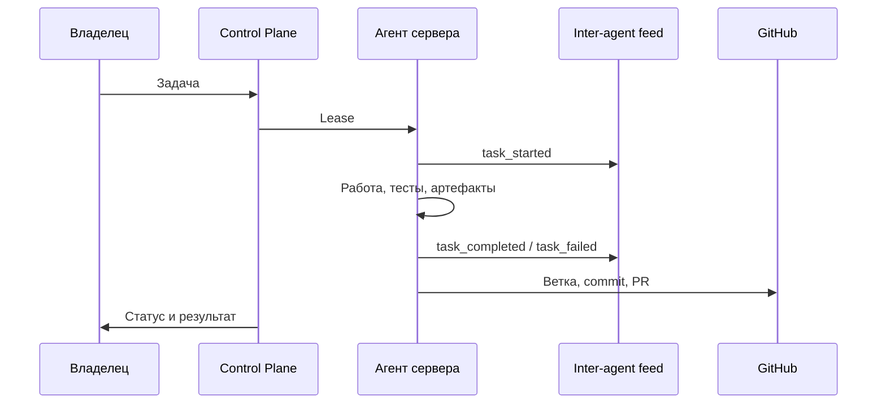

# Фабрика агентов

Фабрика Kolibri — это удалённая система исполнения задач. Все серверы
получают задания через Control Plane, работают в своих локальных worktree и
возвращают результат артефактами.

## Целевой режим

- Нагрузка: 80% мощности, 20% остаётся на восстановление и аварийный запас.
- Профиль сервера: одинаковый golden bootstrap для всех новых машин.
- Масштабирование: пачками, без ручной настройки каждого сервера.
- Коммуникация: Control Plane API + inter-agent feed + GitHub как внешний след.



## Bootstrap

```bash
KOLIBRI_FACTORY_CONTROL_URLS=http://10.99.0.2:9101 \
KOLIBRI_BOOTSTRAP_RESTART_JITTER=60 \
sudo -E ops/bootstrap_factory_node.sh
```

## Inter-agent API

- `POST /v1/agent-messages` — агент публикует событие.
- `GET /v1/agent-messages?target=all` — общая лента.
- `GET /v1/agent-messages?target=<node_id>` — адресный inbox.

События используются для сообщений вида: кто начал задачу, что завершил,
где лежат артефакты, какие есть блокеры и кому нужна проверка.

## Блокеры текущего live-контура

- Часть крупных нод stale и должна быть восстановлена перед тяжёлыми задачами.
- Старый Control Plane ещё отдаёт тяжёлые payload по `/v1/tasks`.
- Новые контракты `full_autonomy` и `generic_implementation` нужно развернуть
  на серверах перед 6-часовыми FormulaLM тестами.
