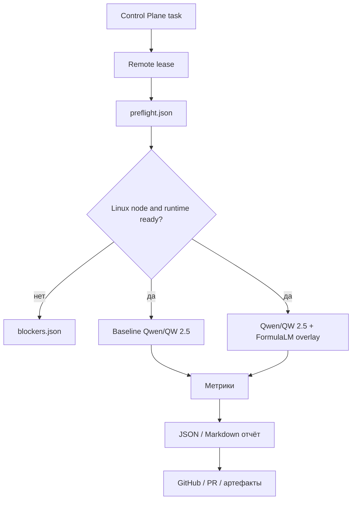
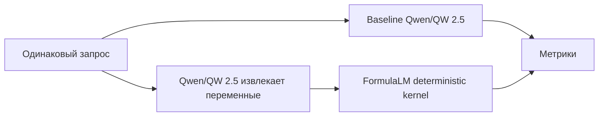

# FormulaLM

FormulaLM — исследовательское направление владельца. Цель: добавить к LLM
формульный слой, который повышает детерминизм, проверяемость и точность в
задачах, где важны расчёты.

## Исполнимый remote guard

Эксперименты FormulaLM, Qwen/QW 2.5 и любые модельные бенчмарки выполняются
только на удалённых серверах через фабрику. Это не пассивный запрет, а
исполнимый порядок для агента:

1. Получить задачу через Control Plane и lease на remote Linux node.
2. Записать `preflight.json` до любого model call.
3. Если `platform.system == "Darwin"`, записать `blockers.json` и завершить
   задачу без запуска модели.
4. Если runtime/model/dataset недоступны, записать blocker artifact с
   безопасным следующим действием.
5. Если preflight прошёл, выполнить benchmark и вернуть `result_reference`.

Mac используется только для управления, редактирования репозитория, отправки
Control Plane envelope и чтения результатов. Model call на Mac не является
результатом FormulaLM.

Детальный пакет:
[FormulaLM Remote R&D Pack](agent-work/formulalm-remote-rd-pack.md). Он задаёт
гипотезы, метрики, remote benchmark protocol, dataset seed, blocker policy,
GitHub report template и Control Plane envelope.

## Что доказываем

FormulaLM не объявляется “лучше LLM” вообще. Мы доказываем конкретное:

- выше стабильность ответа на одинаковых вводных;
- выше доля валидного JSON;
- выше точность расчётов по эталонной формуле;
- меньше ручных исправлений в сметах;
- лучше воспроизводимость результата.

Гипотезы из remote R&D pack:

- `H1`: выше `valid_json_rate` на одинаковом dataset и runtime.
- `H2`: выше `exact_total_rate`, потому что итог пересчитывается kernel.
- `H3`: ниже разброс повторов, измеряемый `unique_output_hashes`.
- `H4`: выше `formula_consistency_rate` по строкам и итогам.
- `H5`: меньше `manual_fix_count` после независимого QA.

## Безопасный подход

- Не изменять веса базовой модели в первом эксперименте.
- Использовать overlay/kernel: LLM извлекает смысл, FormulaLM фиксирует формулы.
- Все результаты сохранять как артефакты.
- Если модель или runtime на сервере не готовы, вернуть blocker вместо
  “нарисованных” результатов.
- Перед benchmark записать `preflight.json`: OS, hostname, model id, runtime,
  disk/RAM и artifact directory.
- Если remote node сообщает Darwin/macOS, задача завершается blocker artifact и
  не запускает модель.
- Baseline и FormulaLM всегда используют одну модель, один dataset и одинаковые
  настройки.

## Первый 6-часовой тест

Envelope: `ops/envelopes/KOL-FORMULALM-REMOTE-BENCH-6H-20260629.json`.

Целевой сервер: `server-kfrm`, после восстановления heartbeat/runtime.

Ожидаемые артефакты:

- `formulalm-benchmark.json`;
- `formulalm-benchmark.md`;
- версия модели/runtime;
- список тестовых задач;
- вывод: доказано, не доказано или заблокировано.

## Метрики

- `valid_json_rate` — доля валидного JSON.
- `exact_total_rate` — доля смет с точным итогом.
- `unique_output_hashes` — разброс ответов при одинаковых вводных.
- `unique_output_hashes_per_case` — разброс по каждому case id.
- `formula_consistency_rate` — соблюдение формул строк и итогов.
- `parse_error_rate` — доля parse errors.
- `manual_fix_count` — количество QA-исправлений.
- `blocked_reason_count` — категории честных blocker-ов.
- `latency_p95` — стабильность скорости.
- `error_rate` — таймауты, parse errors, runtime errors.

## Что сравниваем

## Источники для R&D

- Google Genkit: flows, structured output, evaluation, RAG.
- Vercel AI SDK: agents, tools, structured data.
- xAI Grok API: structured outputs, reasoning, function calling.
- Qwen2.5: Ollama, llama.cpp, vLLM, speed benchmark.
- DSPy/GEPA: prompt/program optimization.
- LoRA/PEFT: будущий remote-only adapter experiment.
- Outlines/vLLM guided JSON/llama.cpp grammars: constrained output.
- AI Feynman/PySR: symbolic formula discovery.

В публичных первичных источниках не найден устойчивый канонический проект с
точным именем `FormulaLM`. В Kolibri это внутренний подход владельца: формульный
детерминированный слой поверх LLM.

## GitHub report

Каждый remote benchmark возвращает GitHub-ready отчёт:

- executive summary: доказано, не доказано или заблокировано;
- ссылка на task id и remote node;
- preflight evidence;
- таблица baseline vs FormulaLM;
- dataset coverage;
- blockers и безопасный следующий шаг;
- решение: продолжать эксперимент, расширять dataset, чинить blocker или
  остановить направление.

Отчёт синхронизируется в
[GitHub Project](https://github.com/users/rd8r8bkd9m-tech/projects/2) в
направление `FormulaLM`.

## Legacy boundary

[Legacy Integration Plan](agent-work/kolibri-legacy-integration-plan.md)
разрешает переносить в FormulaLM только sanitized идеи: formula thinking,
lossless restore requirement, benchmark harness и human-readable debug layer.
Нельзя переносить raw legacy paths, приватные данные, claims без
воспроизводимого benchmark или GoMesh ownership без handoff.
