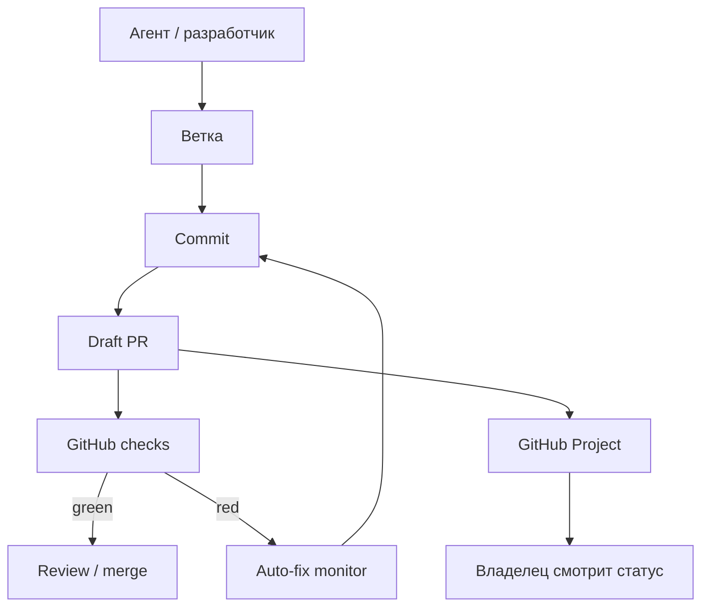

# GitHub Project и CI-мониторинг

GitHub — резервная коммуникационная шина для всех разработчиков и агентов.
Каждое значимое изменение должно иметь ветку, commit, PR и проверяемые
артефакты.

GitHub Project — основной экран владельца для мониторинга: какие агенты
работают, что заблокировано, какие PR проходят CI, где FormulaLM-тесты и как
движутся приоритетные направления.

Детальный агентский регламент находится в
[GitHub Project operating manual](agent-work/github-project-ops.md). Перед
release decision используется [QA-пакет релиза](agent-work/product-qa-pack.md):
он требует evidence по PR, CI checks, Project row и blocker report, если
проверка не зелёная.

## Процесс



## Структура GitHub Project

Название проекта: `Kolibri AI Platform: фабрика ИИ и продуктовый контур`.

URL проекта:
[https://github.com/users/rd8r8bkd9m-tech/projects/2](https://github.com/users/rd8r8bkd9m-tech/projects/2).

Текущие идентификаторы:

- owner: `rd8r8bkd9m-tech`;
- project number: `2`;
- основной экран: GitHub Projects v2;
- источник факта по runtime: Control Plane artifacts, Project является
  owner-facing синхронизацией.

Поля:

- `Статус`: `Новая`, `В работе`, `На проверке`, `Заблокирована`, `Готово`.
- `Приоритет`: `P0`, `P1`, `P2`.
- `Направление`: `Фабрика`, `SPA/PWA`, `FormulaLM`, `Сметы`, `Инвесторы`,
  `GitHub/CI`, `Документация`, `Живая птица`, `Мобильный слой`.
- `Агент`: имя агента или сервера.
- `Следующий отчёт`: дата/время следующего статуса.
- `Артефакты`: ссылка на PR, лог, документ, отчёт или результат теста.

## Правила отчётов агентов

- Каждый агент создаёт или обновляет issue/PR на русском языке.
- В отчёте обязательно есть: что сделано, что проверено, блокеры, следующий
  шаг, ссылка на артефакт.
- Статусы не должны быть рекламными: только факты, команды, ссылки и выводы.
- Если GitHub Project недоступен, агент всё равно пишет в issue/PR, а Project
  синхронизируется после восстановления доступа.
- Для FormulaLM, T-Банк billing, mobile/GoMesh и product QA агент ссылается на
  соответствующий `docs/agent-work/*` пакет и переносит в Project только
  краткий статус, blocker и ссылку на evidence.

## Текущий статус Project API

Старый blocker про невозможность создать GitHub Project больше не актуален:
проект создан и доступен по адресу
[github.com/users/rd8r8bkd9m-tech/projects/2](https://github.com/users/rd8r8bkd9m-tech/projects/2).

`gh` уже имеет scopes:

- `repo`;
- `workflow`;
- `project`;
- `user`;
- `read:org`;
- `gist`.

Команды проверки:

```bash
gh auth status
gh project view 2 --owner rd8r8bkd9m-tech --web
gh project item-list 2 --owner rd8r8bkd9m-tech --limit 20
```

Если конкретная операция Project API всё же падает, это новый blocker по
команде/полю/доступу, а не старый blocker создания проекта. В отчёте нужно
указать команду, stderr, scope из `gh auth status` и безопасный следующий шаг.

## GitHub API inventory

Отдельный `GitHub API inventory` пакет в `docs/agent-work/` сейчас не найден.
До его появления источниками являются этот документ и
[GitHub Project ops](agent-work/github-project-ops.md). После появления inventory
нужно добавить ссылку сюда и сверить поля Project, scopes, команды чтения
issues/PR/checks и ограничения rate limit.

## Интегрированные операционные пакеты

| Направление | Пакет | Как отражать в GitHub Project |
| --- | --- | --- |
| FormulaLM | [FormulaLM Remote R&D](agent-work/formulalm-remote-rd-pack.md) | Remote benchmark task, preflight artifact, metrics report или blocker. |
| Product QA | [QA-пакет релиза](agent-work/product-qa-pack.md) | Release decision, evidence list, CI/Project row, GO/NO-GO. |
| Billing | [T-Банк billing ops](agent-work/tbank-billing-ops.md) | Provider readiness, fallback lead mode, notification/charge blocker. |
| Mobile/GoMesh | [Mobile/GoMesh Integration Pack](agent-work/mobile-gomesh-integration-pack.md) | Feature flag state, bridge contract status, fallback через Control Plane. |
| Legacy integration | [Legacy Integration Plan](agent-work/kolibri-legacy-integration-plan.md) | Sanitized contract, redaction status, R&D label, acceptance checklist. |

## Automation

- `kolibri-hourly-verified-github-sync` — раз в час проверяет worktree,
  коммитит и пушит только проверенное состояние.
- `kolibri-github-ci-auto-fix-monitor` — раз в час проверяет GitHub checks,
  забирает логи, чинит кодовые ошибки и пушит исправления.

## Правила

- Не коммитить секреты.
- Не откатывать чужую работу.
- Упавший CI не игнорировать.
- Если проблема внешняя, создать blocker-отчёт с точной причиной.
- Общение агентов: PR, commit history, issue/PR comments и inter-agent API.
