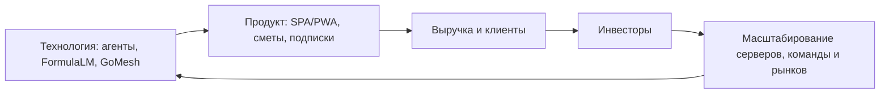

# Инвесторы и венчурная цель

Цель проекта — построить AI-платформу, которая может претендовать на
многомиллиардную оценку за счёт сильной технологии, повторяемой агентной
фабрики, вертикальных продуктов и понятной подписочной модели.

## Инвестиционная гипотеза

Kolibri AI Platform объединяет несколько ценностных слоёв:

- собственная фабрика автономных агентов и серверов;
- прикладной продукт для клиентов через SPA/PWA;
- детерминированные сметы как первый вертикальный рынок;
- платежи и подписки через T-Банк;
- FormulaLM как R&D-направление для усиления моделей;
- мобильный и кроссплатформенный слой через PWA и GoMesh;
- GitHub Project как прозрачная операционная система разработки.

## Кому продавать идею

- AI-native венчурные фонды, которые инвестируют в агентные системы,
  developer tools, вертикальный AI и инфраструктуру.
- ConstructionTech и PropTech инвесторы для сметного направления.
- B2B SaaS инвесторы для подписочной модели и CRM/операционного слоя.
- Стратегические партнёры: банки, строительные экосистемы, маркетплейсы услуг,
  интеграторы и enterprise-платформы.
- Ангелы с опытом в AI, infra, devtools, строительстве и финтехе.

## Материалы для outreach

- One-pager на русском и английском.
- Pitch deck на 10-12 слайдов.
- Demo SPA/PWA с чатом, Control и оплатой.
- Документ по фабрике агентов и безопасности доступа.
- FormulaLM research note с честной методикой и удалёнными тестами.
- Billing/pricing note по T-Банк: тарифы, fallback lead, notification security
  и путь к recurrent payments.
- Product QA evidence pack: что проверено перед показом инвестору или первому
  клиенту.
- GitHub Project snapshot:
  [projects/2](https://github.com/users/rd8r8bkd9m-tech/projects/2) как
  прозрачная операционная доска.
- Финансовая модель: подписки, CAC, LTV, gross margin, server cost.
- Data room: архитектура, roadmap, PR, CI, тесты, клиентские кейсы.

## Agent-work evidence packs

| Пакет | Как использовать в investor/customer evidence |
| --- | --- |
| [Investor Outreach Pack](agent-work/investor-outreach-pack.md) | One-pager RU/EN, первые письма, CRM fields, segmentation и claim boundaries. |
| [FormulaLM Remote R&D Pack](agent-work/formulalm-remote-rd-pack.md) | Research note: только remote-only метрики, без заявления, что FormulaLM уже доказан как универсально лучший подход. |
| [T-Банк billing ops](agent-work/tbank-billing-ops.md) | Подтверждает, что подписочная модель имеет operational path: checkout, fallback lead, notification security, charge-due. |
| [Product QA Pack](agent-work/product-qa-pack.md) | Доказательная база перед демо: SPA/PWA, backend, billing, estimates, factory, Project, mobile и living bird. |
| [Mobile/GoMesh Integration Pack](agent-work/mobile-gomesh-integration-pack.md) | Показывает PWA-first mobile strategy и будущий GoMesh contract без смешивания ownership. |
| [Legacy Integration Plan](agent-work/kolibri-legacy-integration-plan.md) | Объясняет, как старые идеи переносятся как sanitized contracts, а не как рискованный импорт legacy-кода. |

## Первые метрики, которые нужны инвесторам

| Метрика | Зачем нужна |
| --- | --- |
| MRR / ARR | Показывает, что продукт покупают |
| Количество платящих клиентов | Подтверждает спрос |
| Точность смет | Защищает вертикальную ценность |
| Время генерации сметы | Показывает операционное преимущество |
| Стоимость AI-операции | Влияет на маржинальность |
| Успешность агентных задач | Доказывает фабрику |
| Retention | Показывает долгосрочную пользу |
| Billing readiness | Подтверждает, что подписка не только нарисована в UI |
| Product QA pass rate | Снижает риск демо и первых продаж |
| Project sync latency | Показывает управляемость агентной фабрики |

## Честная рамка claims

- FormulaLM остаётся R&D до воспроизводимого remote benchmark с baseline,
  одинаковым runtime и опубликованными артефактами.
- T-Банк integration path нельзя продавать как полностью production-ready, пока
  тестовый терминал не подтвердил `Init`, `NotificationURL`, `RebillId` и
  `Charge`; fallback lead mode допустим как коммерческий мост.
- GoMesh — внешний mesh/mobile слой. Kolibri показывает контрактную интеграцию,
  feature flags и fallback, но не заявляет владение чужим GoMesh-кодом.
- GitHub Project уже создан и используется как прозрачный операционный экран;
  старый blocker Project API снят.

## Работа агента по инвесторам

Агент `Nash` запущен для investor scouting. Его выходной результат должен
содержать:

- список первых 30 инвесторов или стратегических партнёров;
- критерии приоритизации;
- ссылки на источники;
- черновик one-pager;
- план outreach на неделю;
- отметку, какие контакты требуют ручной проверки.
- ссылку на evidence pack, который реально готов к отправке.

Результат после проверки переносится в GitHub Project в направление
`Инвесторы`.
