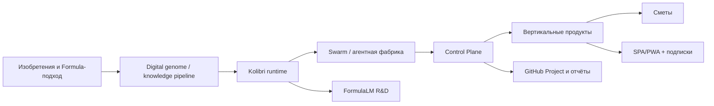

# Карта знаний Kolibri

Документ фиксирует локально найденные материалы Kolibri и смысловую линию
проекта. Публично переносить можно только выжимку без секретов, приватных
путей, ключей, токенов и персональных данных третьих лиц.

## Главная идея

Kolibri задуман как runtime/control plane для воспроизводимых агентных систем,
а не как ещё одна LLM-обёртка. Сильная формулировка:

> Kolibri — фабрика автономных агентов и runtime для управляемого,
> воспроизводимого, наблюдаемого искусственного интеллекта.

## Найденные локальные источники

| Направление | Локальный источник | Что важно |
| --- | --- | --- |
| Product vision | `/Users/kolibri/Projects/kolibri-ecosystem/docs/kolibri_ai_prd.md` | Runtime выигрывает управляемостью, observability, governance и reproducibility |
| Masterplan | `/Users/kolibri/Projects/kolibri-ecosystem/inventions/2025-12-21_kolibri_ai_masterplan.md` | Сбор знаний → обучение → исполнение → распространение |
| Swarm | `/Users/kolibri/Projects/kolibri-ecosystem/docs/SWARM1000.md` | 1000 логических агентов, ограниченный worker pool, audit trail |
| Pitch | `/Users/kolibri/Projects/kolibri-ecosystem/docs/pitch_deck.md` | Runtime for clustered intelligence, demo < 15 минут |
| One-pager | `/Users/kolibri/Projects/kolibri-ecosystem/docs/one_pager.md` | Agent systems are fragile; Kolibri даёт контроль и воспроизводимость |
| Formula research | `/Users/kolibri/Projects/kolibri-project/docs/analysis/FORMULA_COMPRESSION_ANALYSIS.md` | Formula-based pattern compression и human-readable encoding |
| Archiver/R&D | `/Users/kolibri/kolibri-archiver-v85` | Формульные архиваторы и восстановление из формул |
| GoMesh | `/Users/kolibri/kolibri-mesh` | Mesh/VPN слой для инфраструктуры Kolibri |
| Estimates | `/Users/kolibri/kolibri-estimate`, `kolibri-stroy`, `smeta*` | Первый коммерческий wedge: строительные сметы |
| UI assets | `/Users/kolibri/Downloads/Kimi_Agent_КолибриФин/kolibri-v2/public/kolibri-bird.png` | Птичка Kolibri как исходник персонажа |

## Смысловая линия

## Что переносим в текущую платформу

- Runtime-first позиционирование.
- Governance и воспроизводимость как moat.
- Swarm1000 как логическая модель ролей, но исполнение через Control Plane.
- Formula-based thinking как база FormulaLM.
- Сметы как первый платёжный вертикальный продукт.
- Kolibri bird как живой продуктовый персонаж.
- GitHub Project как внешний контур управления и доверия.

## Что нельзя переносить автоматически

- секреты и credential files;
- raw `.qwen`, `.gemini`, `.cursor` логи без санитарной проверки;
- приватные customer documents;
- локальные абсолютные пути в публичную документацию;
- неподтверждённые научные claims как доказанный факт.

## Дальнейшая работа

- Создать отдельного docs steward агента через Control Plane.
- Собрать sanitized knowledge inventory.
- Перенести безопасные материалы в `docs/`.
- Разделить публичный GitHub profile и приватный data room.
- Завести investor/data-room структуру для проверенных материалов.
