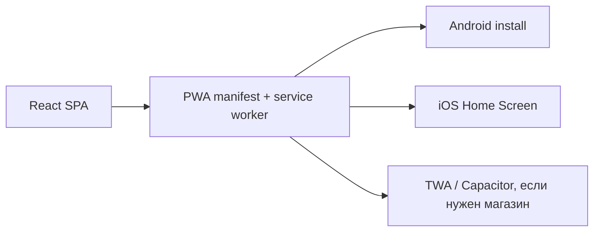

# Мобильное приложение и GoMesh

Kolibri должен устанавливаться на Android и iOS. Базовая стратегия —
SPA/PWA-first: один продуктовый интерфейс, который можно открыть в браузере и
установить на главный экран.

## Мобильная стратегия

## GoMesh

GoMesh — отдельное активное направление другой команды. Его код не трогаем без
явной передачи зоны ответственности.

Kolibri подключается к GoMesh через контракт:

- регистрация mesh-ноды;
- health/backpressure;
- task/message bridge;
- подписанные service-to-service запросы;
- feature flag `KOLIBRI_GOMESH_ENABLED`;
- fallback через текущий Control Plane.

## QA перед выдачей

- Android Chrome installability.
- iOS Safari/Home Screen.
- Offline shell.
- Чат и кнопка `Контрол` в правом нижнем углу.
- Плагины Control Panel.
- Светлая и системная тема.
- Billing и deterministic estimates.
