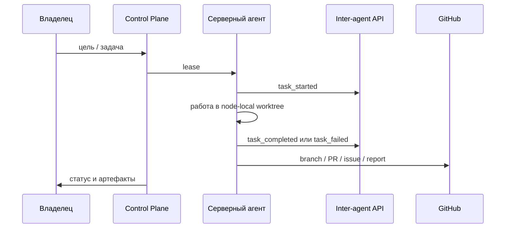

# Политика разработки Kolibri AI Platform

Этот документ — единая политика проекта. Он фиксирует, как мы разрабатываем
приложение, фабрику, агентов, документацию, дизайн, FormulaLM, инвесторский
трек и GitHub-процессы.

Главное правило: мы создаём искусственный интеллект. Любое решение должно
усиливать автономную AI-платформу, а не превращать проект в набор ручных
скриптов.

## 1. Северная звезда

Kolibri AI Platform должна стать AI-фабрикой венчурного масштаба:

- стоимость цели — многомиллиардный продукт;
- первый коммерческий wedge — детерминированные строительные сметы;
- ядро — Control Plane, агентная фабрика, FormulaLM, SPA/PWA и GitHub Project;
- продукт продаётся через подписки, пилоты, enterprise-интеграции и
  стратегические партнёрства;
- всё, что можно автоматизировать, автоматизируется через серверных агентов.

## 2. Роли человека и агентов

Владелец:

- ставит цели через Telegram, чат или Codex;
- смотрит статус в GitHub Project, PR, issue и отчётах;
- принимает стратегические решения и даёт недостающие данные.

Главный Codex-контролёр:

- проверяет результаты, интегрирует изменения, запускает тесты;
- не выполняет тяжёлые эксперименты на Mac;
- создаёт и проверяет task envelopes;
- держит целевой пул из 6 активных субагентов;
- закрывает завершённых субагентов после передачи артефактов;
- поднимает нового субагента сразу после закрытия завершённого, чтобы пул
  снова был равен 6;
- фиксирует политику, документацию и блокеры.

Серверные агенты:

- получают задачи только через Control Plane;
- работают в node-local worktree;
- возвращают результат артефактами;
- докладывают статус через inter-agent API и GitHub;
- не печатают секреты и не используют ad hoc SSH как основной путь.

## 3. Remote-first правило

Mac используется только как пульт управления и редакторская поверхность.

Запрещено на Mac:

- запускать FormulaLM/Qwen/LLM benchmark;
- запускать `ollama`, `vllm`, training, fine-tuning и model inference;
- проводить нагрузочные тесты моделей;
- считать локальный результат доказательством качества FormulaLM.

Разрешено на Mac:

- читать и редактировать репозиторий;
- готовить envelopes;
- отправлять задачи через `ops/kolibri-dispatch submit --file`;
- собирать статусы через Control Plane;
- запускать лёгкие unit/contract tests для проверки кода.

## 4. Фабрика

Фабрика работает через Control Plane:

Правила фабрики:

- целевая загрузка — 80%, резерв — 20%;
- новые серверы готовятся одинаковым golden bootstrap;
- масштабирование — пачками по 10 серверов, без ручной уникальной настройки;
- при 2000 новых серверов применяется тот же bootstrap и role catalog;
- stale-ноды не получают критические задачи, пока heartbeat/runtime не
  восстановлены;
- завершённые субагенты закрываются после сохранения результата;
- локальный supervisor `kolibri-subagent-pool-supervisor` проверяет пул каждые
  15 минут, закрывает completed-агентов и создаёт замену;
- каждый агент обязан оставить артефакт, даже если задача заблокирована.

## 5. Типы задач

Каждая задача должна иметь:

- `task_id`;
- `kind`;
- `required_capability`;
- `goal`;
- `role_slot`;
- `acceptance`;
- `verification_commands`;
- `source`;
- ожидаемые артефакты.

Нельзя отправлять расплывчатые задачи без критериев готовности.

## 6. GitHub

GitHub — главный внешний журнал разработки.

Обязательно:

- каждая значимая работа идёт через branch, commit, PR или issue;
- упавшие GitHub checks мониторятся и исправляются;
- PR содержит, что сделано, как проверено, риски и блокеры;
- агенты пишут отчёты на русском языке;
- GitHub Project является главным экраном мониторинга после расширения OAuth
  scope `project` и `read:project`.

Структура GitHub Project:

- `Статус`: `Новая`, `В работе`, `На проверке`, `Заблокирована`, `Готово`;
- `Приоритет`: `P0`, `P1`, `P2`;
- `Направление`: `Фабрика`, `SPA/PWA`, `FormulaLM`, `Сметы`, `Инвесторы`,
  `GitHub/CI`, `Документация`, `Живая птица`, `Мобильный слой`;
- `Агент`;
- `Следующий отчёт`;
- `Артефакты`.

Пока Project API заблокирован scope, агенты используют issues/PR comments.

## 7. Документация

Документация ведётся на русском языке и обновляется постоянно.

Обязательные разделы:

- обзор проекта;
- quickstart;
- API reference;
- запуск и деплой;
- Control Plane и Agent Host;
- task envelopes;
- inter-agent API;
- SPA/PWA;
- T-Банк и подписки;
- детерминированные сметы;
- FormulaLM;
- GoMesh/mobile;
- GitHub Project и CI;
- инвесторский трек;
- runbooks и incident reports.

Документовод:

- автоматически обходит проект;
- фиксирует новые API, env vars, команды и ограничения;
- готовит русские страницы, схемы Mermaid, runbooks, письма и one-pagers;
- создаёт GitHub issue/PR для документационных долгов;
- не ждёт ручного сбора материалов.

## 8. Продукт и дизайн

Приложение — SPA/PWA премиум-уровня.

Основные правила:

- рабочее приложение остаётся chat-first;
- вся вторичная работа через кнопку `Control` в правом нижнем углу;
- схема расширения — через плагины, как в Codex;
- светлая и системная тема обязательны;
- тёмная тема допустима, но не должна ломать премиум-ощущение;
- landing нужен отдельно от рабочего `/app`;
- дизайн должен быть дорогим, спокойным, точным, без дешёвых декоративных
  эффектов;
- компоненты переиспользуемые, не одноразовая вёрстка.

Проверки дизайна:

- desktop, tablet, mobile;
- safe areas iOS/Android;
- отсутствие overlap;
- читаемость длинных русских строк;
- installable PWA;
- keyboard/focus;
- empty/loading/error/success states.

## 9. Живая птица Kolibri

Птица — продуктовый персонаж, а не CSS-украшение.

Цель:

- реагировать на состояние приложения;
- жить в интерфейсе сама по себе;
- иметь характер для каждого клиента;
- усиливать доверие, не мешая работе.

Технический стандарт:

- основной путь — Rive state machine;
- state inputs: `mood`, `energy`, `attention`, `taskState`, `clientTrait`;
- fallback — PixiJS sprite/runtime или текущий SVG-компонент;
- Lottie используется только для линейных анимаций, не как главный мозг
  персонажа.

Состояния:

- `idle`;
- `listening`;
- `thinking`;
- `working`;
- `success`;
- `warning`;
- `error`;
- `offline`;
- `celebrating`;
- `sleepy`.

Персональность клиента:

- сохраняется в профиле;
- влияет на микродвижения, скорость, реакции и тон;
- не должна ухудшать доступность или производительность.

## 10. Сметы

Сметы должны быть детерминированными.

Если вводные одинаковые, регион одинаковый, прайсбук одинаковый и условия
одинаковые, результат должен совпадать.

Обязательные свойства:

- versioned pricebook;
- canonical input hash;
- deterministic estimate id;
- audit trail;
- редактируемость после генерации;
- отделение работ, материалов, накладных, налогов и итогов;
- честная метрика точности 98-99%, подтверждённая тестами.

## 11. FormulaLM

FormulaLM — отдельное R&D-направление.

Правило изменено с запрета на исполнимый remote guard: агент не просто пишет
"нельзя на Mac", а обязан выполнить ветку `preflight -> execute_or_block ->
artifacts -> report`.

Машинный порядок:

1. Принять задачу только через Control Plane envelope с `target_node`,
   `task_id`, `role_slot`, dataset, pricebook и acceptance.
2. На удалённом lease-владельце записать `preflight.json`: OS, hostname,
   node id, task id, model/runtime, commit, RAM/disk, artifact directory.
3. Если OS равна Darwin/macOS, не запускать модель: записать `blockers.json`
   с `severity=P0`, `category=mac_execution_blocked`, завершить задачу как
   заблокированную.
4. Если remote runtime/model/dataset/pricebook отсутствуют, записать
   `blockers.json` с P1/P2 причиной и безопасным следующим действием.
5. Если preflight прошёл, выполнить baseline и FormulaLM на одном dataset,
   одной модели, одном runtime и одинаковых настройках.
6. Записать `formulalm-benchmark.json`, `formulalm-benchmark.md`,
   `preflight.json`, `blockers.json` при блокерах, точные команды и вывод.
7. Вернуть `result_reference` в Control Plane и GitHub-ready отчёт.

Результаты не выдумываются. Raw logs не публикуются без проверки на секреты и
приватные данные.

## 12. Инвесторы и клиенты

Проект должен быть готов к продаже клиентам и презентации инвесторам.

Обязательные артефакты:

- лендинг;
- one-pager RU/EN;
- pitch deck;
- demo script;
- investor CRM;
- список первых клиентов;
- письма outreach;
- proof-пакет по сметам;
- proof-пакет по фабрике;
- FormulaLM research note.

Агенты по инвесторам и продажам должны готовить документы и письма полностью,
а не только анализ.

## 13. Релизы и QA

Перед тем как отдавать результат владельцу:

- локальные unit/contract tests;
- frontend build;
- backend tests;
- factory contract tests;
- browser screenshots;
- mobile viewport checks;
- независимый QA task через Control Plane;
- проверка GitHub CI;
- список блокеров и nonblocking warnings.

Нельзя говорить “готово”, если есть P0-блокер.

## 14. Секреты и доступы

Запрещено:

- печатать токены;
- коммитить `.env`, auth files, tokens, private keys;
- отправлять секреты в task envelope;
- давать агентам доступ вне политики;
- обходить Control Plane ad hoc SSH как основной механизм.

Разрешено:

- использовать секреты только из безопасного окружения сервера;
- возвращать blocker, если секрета нет;
- логировать факт наличия/отсутствия секрета без значения.

## 15. Автоматизация

Автоматизации:

- hourly verified GitHub sync;
- GitHub CI auto-fix monitor;
- FormulaLM follow-up;
- documentation steward task;
- investor/outreach task;
- premium UI QA task;
- living character R&D task.

Каждая automation должна иметь понятную цель, проверку и артефакт.

## 16. Блокеры

Если агент не может продолжать:

- фиксирует точный блокер;
- пишет, что проверил;
- пишет, что нужно от владельца или инфраструктуры;
- не выдумывает результат;
- оставляет issue/PR/comment или Control Plane artifact.

## 17. Политика памяти

Все важные решения фиксируются в репозитории:

- политика — `docs/project-policy.md`;
- API — `docs/api.md`;
- фабрика — `docs/factory.md`;
- GitHub — `docs/github-ci.md`;
- инвесторы — `docs/investors.md`;
- FormulaLM — `docs/formulalm.md`;
- мобильный слой — `docs/mobile-gomesh.md`.

Если решение не записано, оно считается риском забывания и должно быть
добавлено в документацию.
