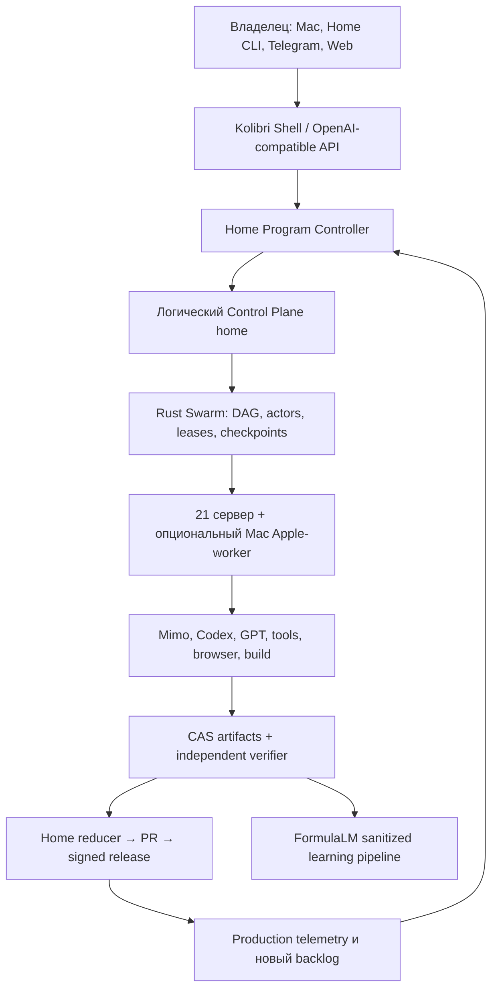

Kolibri AI OS: окончательный Home-first план разработки
1. Цель и принятые решения
Kolibri становится единой AI-операционной системой, которая принимает обычную фразу и возвращает проверенный результат: ответ, исследование, смету, документ, изображение, сайт, приложение, код или автоматизацию.
Я фиксирую следующие решения без дальнейшего выбора между вариантами:
home — постоянная логическая authority разработки и Control Plane.
Mac — тонкий клиент владельца и полноценный Apple-worker, но его выключение не останавливает Linux-разработку.
Git commit — источник истины кода.
PostgreSQL Program Ledger — источник истины целей, решений, backlog и checkpoints.
NATS JetStream — источник истины событий и actor mailboxes.
Content-addressed storage — источник истины артефактов и доказательств.
Codex, Mimo и внешние модели — исполнители, а не хранилище контекста.
Публичная модель называется только kolibri.
Новый продукт создаётся в чистом tracked foundation. Legacy-интерфейс и старый backend не продолжают лататься.
Clean V2 используется как донор контрактов и тестов, но не как production foundation: сейчас он untracked, использует SQLite и недолговечные daemon threads.
Rust foundation используется как донор actor/lease/fencing-примитивов, но текущий shadow-сервис не объявляется authority.
Историческое membership 21 не считается исполнением 21/21; доказательство проводится заново реальными задачами.
После первого релиза развитие не останавливается: Home запускает постоянный системный цикл улучшения.

2. Единая продуктовая экосистема
Все пользовательские поверхности получают один release ID и основной домен:
Маршрут	Назначение
https://kolibriai.ru/	маркетинговый портал и первый рабочий composer
/app	Kolibri Shell
/developers	ключи, playground, usage, webhooks и SDK
/docs	документация API и capabilities
/pricing, /security, /legal, /changelog	коммерческий и доверительный контур
/control	защищённый Control Center
/wallboard	read-only монитор разработки на Home
/share/{token}	ограниченный доступ к одному артефакту
/v1/*	OpenAI-compatible API
*.preview.kolibriai.ru	изолированные временные previews
status.kolibriai.ru	независимый status page, чтобы он оставался доступен при сбое приложения

Анонимный пользователь начинает задачу прямо на главной странице. После создания public session он бесшовно попадает в /app. Внутренняя топология, providers и operator-функции не входят в public bundle.
Выбранное UX-направление
Каноническое направление — Morphing Conversation, доработанное из выбранных desktop/mobile-макетов:
[Desktop reference](/Users/kolibri/.codex/generated_images/019f4892-14c5-7e30-934f-d2ba8f0018f6/exec-947bdaa2-f856-4759-84c9-fa371b4a37bb.png)
[Mobile reference](/Users/kolibri/.codex/generated_images/019f4892-14c5-7e30-934f-d2ba8f0018f6/exec-37c9e723-63d5-4b5d-a70a-8a424b99fadf.png)
Визуальные правила:
Один официальный kolibri-bird.png; одновременно на экране находится ровно одна птица.
Птица не перекрашивается и не перерисовывается.
Общий MascotPortal перемещает её между empty state, top bar и system rail.
Гамбургер и птица динамически сменяют друг друга в одном control slot и никогда не дублируются.
Основная палитра: warm ivory, deep ink, бирюзовый и оранжевый из официального маскота.
App использует Inter Variable; marketing headings — Manrope Variable.
Основной текст: 16 px desktop и 17–18 px mobile.
Минимальная область нажатия: 44×44 px.
Никаких декоративных dashboard-карточек, случайного зелёного цвета, вложенных панелей и визуальных заглушек.
Figma library, design tokens, component states и responsive prototypes фиксируются до реализации экранов.
Storybook и Figma Code Connect связывают дизайн с production-компонентами.
Каждый ключевой экран проходит pixel comparison с выбранным reference на одинаковом viewport.
Shell
Desktop:
Слева 52 px system rail, раскрывающийся до 248 px по hover; нажатие закрепляет его.
Основная поверхность — один текущий проектный чат.
Composer закреплён независимо от scroller.
Vertical workspace появляется только после вызова соответствующего инструмента.
История, документы и артефакты можно detach-ить в OS-окна.
Оконный режим поддерживает drag, resize, minimize, maximize, fullscreen, snap, tile, cascade и restore.
Чат не создаёт новое окно после каждого сообщения.
Dock появляется только при наличии свёрнутых или нескольких активных окон.
Mobile:
Одновременно видна одна полноэкранная поверхность.
Navigation, History, Files и Tools открываются как sheets.
Estimate, PDF, Browser, Code и Canvas открываются full-screen.
Composer учитывает visualViewport, safe-area и экранную клавиатуру.
Один вертикальный scroller, нулевой horizontal overflow.
Desktop-окна не уменьшаются до нечитаемых мобильных карточек.
+ открывает только реально доступные инструменты.
Динамический Work Trace
Вместо статического «Выполняю…» пользователь видит потоковое состояние:
Изучаю требования · 3 исполнителя · найдено 2 источника
Раскрываемый trace показывает:
план и текущую стадию;
роли субагентов;
используемые инструменты;
найденные источники;
проверки и verifier verdict;
готовые артефакты;
запросы уточнения или approval.
Сырые prompts, private chain-of-thought, secrets и внутренняя топология не раскрываются. Показываются реальные безопасные summaries, tool events и результаты проверок. Это соответствует ограничениям Responses/Multi-agent API: Home Swarm формирует собственный доказуемый trace и не зависит от наличия provider reasoning summary.
3. Технологический стек
Используются последние стабильные версии, а не preview-сборки:
Область	Выбранный стек
Core	Rust 1.97, edition 2024, Axum, Tokio, Tower, Serde, SQLx
Contracts	OpenAPI, JSON Schema, utoipa, schemars, generated TypeScript client
Events	NATS 2.14.3 + JetStream quorum
Metadata	PostgreSQL 18.4 HA
Horizontal scale	Citus для events, traces, usage после parity gate
Artifacts	SeaweedFS 4.29 S3-compatible CAS, три реплики
Compatibility/tools	изолированный FastAPI gateway; Python не владеет task state
Shell	React 19.2.7+, TypeScript strict, Vite 8
Portal/docs	Next.js 16.2 stable
State	XState 5 для state machines, TanStack Query для server state
UI	React Aria Components, Floating UI, Motion, vanilla-extract
Editors	Monaco, Tiptap, TanStack Table/Virtual, Univer spreadsheet renderer
PDF/doc conversion	PDF.js, LibreOffice sandbox, Rust PDF/XLSX generators
Cross-platform	Tauri 2 для macOS/Windows/Linux/iOS/Android wrappers
Portable tools	WASI Component Model + Wasmtime sandbox
Containers	rootless Podman/Quadlet, seccomp, AppArmor, network allowlists
Observability	OpenTelemetry, Prometheus, Loki, Tempo, Grafana
Identity	ZITADEL OIDC, passkeys, MFA, short-lived sessions
Supply chain	SBOM, secret scan, vulnerability scan, Cosign signatures

Выбор основан на текущих stable-релизах: Rust, React, Next.js, PostgreSQL, NATS и SeaweedFS.
Структура монорепозитория:
apps/
  portal
  shell
  control
  wallboard
  desktop-mobile

packages/
  brand
  design-tokens
  ui
  contracts
  api-client
  session
  work-trace
  artifact-renderers
  window-manager
  vertical-runtime

services/
  api-gateway
  control-plane
  scheduler
  agent-host
  provider-gateway
  artifact-service
  preview-runtime
  formulalm

crates/
  core
  actors
  events
  policy
  estimates
  sandbox
  telemetry
  secrets
  node-runtime
Route-компоненты не содержат transport, расчётную или window-логику. Монолитные App.jsx, App.css и kolibriApi.js запрещаются архитектурным тестом.
4. Home как единая среда разработки
На Home создаётся чистая каноническая зона:
/home/ladik/src/mirrors/kolibri-ai-platform.git
/home/ladik/src/kolibri-ai-platform/control
/home/ladik/src/kolibri-ai-platform/tasks/<task-id>
/home/ladik/src/kolibri-ai-platform/releases/<release-id>
Правила:
Bare mirror на Home содержит все принятые commits.
control — единственный integration worktree.
Каждый task получает отдельный branch/worktree и одного fenced writer.
Home reducer принимает только commit SHA, тесты, артефакты и verifier verdict.
GitHub автоматически получает принятые commits и служит внешним DR/PR-контуром.
.git, Codex credentials и browser sessions не синхронизируются через NFS/rsync.
Mac и Home получают контекст через POST /v1/resume, а не через память конкретного чата.
ContextPack содержит цель, активный plan step, решения, base commit, acceptance criteria, разрешённые файлы и последние проверки.
Вход в Codex CLI на Home автоматически открывает текущий ContextPack и правильный worktree.
Mac регистрируется как обычный worker, но Apple capabilities появляются только при его доступности.
Xcode, iOS/macOS build, simulator, signing и notarization направляются на Mac; общая работа — на Linux.
Источники истины разделяются явно:
Данные	Authority
Код	Git commit
Цели, backlog, решения, checkpoints	PostgreSQL Program Ledger
Task/attempt/lease transitions	PostgreSQL + JetStream
Артефакты	immutable CAS
Releases	подписанный release manifest
Модели	подписанный model registry
Текущий исполнитель	fenced attempt, не чат и не hostname

Home Wallboard
На Home автоматически запускается Chromium kiosk с /wallboard.
Он показывает в реальном времени:
текущую цель, critical path и активный plan step;
task branches, commits, тесты, PR и release candidate;
queued/running/checkpointing/verifying/DLQ;
Mimo/Codex/provider health, latency, quota и fallback;
21-node grid с активными слотами;
последний реальный результат каждого узла;
FormulaLM intake, datasets, eval и canary;
incidents, rollback readiness и backup age.
Wallboard:
read-only;
не содержит prompts, credentials и управляющих кнопок;
получает события по SSE из Control Plane;
имеет live/partial/stale/unavailable, as_of, source и evidence link;
не превращает отсутствие данных в 0, Online или Completed;
автоматически фиксирует incident и прекращает декоративную ротацию экранов.
5. Rust Control Plane и Swarm
Логическая authority Home
home становится логической service identity, а не hardcoded hostname/IP.
Никаких runtime-ссылок на main, primary, старые IP и legacy Control Plane.
Provider fallback никогда не меняет Control Plane.
PostgreSQL и JetStream работают quorum из трёх data-capable узлов.
Два standby выбираются автоматически по capacity, failure domain и свежей attestation.
Authority term хранится в quorum.
Каждый attempt содержит monotonic authority_epoch.
Старый leader после потери quorum не может принимать mutations.
Workers отклоняют любой stale epoch/fencing token.
При недоказанном состоянии система fail-closed, а не создаёт второй scheduler.
Динамический membership
Новый kolibri-node:
Генерирует собственный Ed25519 keypair локально.
Отправляет подписанный enrollment любому доступному mesh-регистратору.
Получает durable opaque node ID и динамический mesh IP.
Получает подписанный membership manifest и discovery Home.
Скачивает единый подписанный node runtime.
Проходит capability, resource, provider и security attestation.
Только после реальной canary-задачи становится schedulable.
Каждый узел может проверить и relay-ить membership, но task authority остаётся у Home. Общий приватный ключ на 21 сервер не копируется.
Agent Host
Python legacy Agent Host заменяется единым Rust kolibri-node supervisor:
code, test, browser, build, document, model, review, apple slots;
физические слоты рассчитываются из CPU/RAM/disk и 20% safety reserve;
Home всегда сохраняет минимум 2 CPU и 4 GiB RAM для Control Plane/data/backend;
max_inflight реально ограничивает параллельность;
heartbeat передаёт массив active attempts;
один worktree и один write scope на attempt;
producer и verifier не совпадают по attempt, node и identity;
credentials выдаются scoped и не копируются с Mac/Home;
локальный файл или текст «Готово» не считается результатом.
1000 logical actors
Actor — durable state machine с mailbox/checkpoint, а не отдельный процесс.
Scheduler использует DAG, critical-path priority, work stealing, map/reduce и verifier branches.
OpenAI hosted Multi-agent применяется только внутри ограниченной provider-задачи; Home Swarm управляет 100/1000 actors самостоятельно. Это учитывает текущие особенности GPT‑5.6 Multi-agent.
Physical slots, provider quotas, лицензии и стоимость ограничиваются token buckets.
Background backlog занимает только свободную capacity.
20% мощности сохраняется для пользовательских и incident-задач.
При отсутствии полезной задачи узел честно отображается idle.
Полезный background backlog:
regression и browser QA;
visual comparison;
dependency/security review;
GitHub и InventionGraph indexing;
документация и example validation;
FormulaLM sanitation/eval;
artifact verification;
node inventory и repair;
performance benchmarks.
Каждый schedulable узел не реже одного раза за шесть часов должен вернуть содержательный capability-result с CAS hash и независимым verdict. Для каждого релиза выполняется отдельная новая campaign 21/21.
6. Backend, API и данные
Public OpenAI-compatible API
Основная поверхность:
POST /v1/shell/bootstrap

POST /v1/responses
GET  /v1/responses/{id}
GET  /v1/responses/{id}/events
GET  /v1/responses/{id}?stream=true&starting_after=N
POST /v1/responses/{id}/cancel

POST /v1/chat/completions
GET  /v1/models
POST /v1/realtime/sessions
POST /v1/realtime/calls

GET/POST/PATCH/DELETE /v1/projects
GET/POST              /v1/projects/{id}/messages

GET  /v1/capabilities
GET  /v1/tools
GET  /v1/artifacts/{id}
GET  /v1/artifacts/{id}/content
GET  /v1/estimates/{id}
GET  /v1/estimates/{id}/revisions
PATCH /v1/estimates/{id}
POST  /v1/estimates/{id}/exports

GET  /v1/runtime/summary
GET  /v1/runtime/dags
GET  /v1/runtime/actors
GET  /v1/fleet/nodes
GET  /v1/providers/health
GET  /v1/events/stream
Developer и owner APIs отделяются ролями, но используют тот же contract package.
POST /v1/shell/bootstrap атомарно создаёт или восстанавливает session. Холодный старт не выполняет ожидаемый GET, возвращающий 401/403.
Стандартный API client использует API key, browser — Secure HttpOnly cookie с exact-Origin binding. Owner использует passkey/MFA. API-ключ показывается один раз, в базе хранится только hash.
Durable Responses
Одна PostgreSQL-транзакция создаёт:
response;
нормализованный request и request hash;
user message;
единственный assistant placeholder;
idempotency record;
response.created;
outbox response.dispatch.requested.
Правила idempotency:
одинаковые key и request hash возвращают тот же response;
одинаковый key с другим payload возвращает 409;
response и сообщения не могут появиться частично.
Response states:
queued → planning → running
                 ├→ waiting_for_input
                 ├→ approval_required
                 ├→ verifying
                 └→ completed | failed | cancelled
Task states:
queued → leased → running → checkpointing → verifying → completed
                         ├→ retry_wait
                         ├→ dead_letter
                         └→ cancelled
Client disconnect не отменяет задачу. Общего 60-секундного лимита нет. Ограничиваются отдельные provider attempts, resource budget и approval policy. Длинные задачи продолжаются в background и возобновляют stream по sequence number, как в Responses background mode и streaming.
SSE:
response.created;
response.status.updated;
response.output_text.delta;
response.work_summary.updated;
response.tool.started/completed;
response.source.added;
response.artifact.ready;
response.approval.required;
response.verification.updated;
response.completed/failed/cancelled.
Task contract
Каждая задача содержит:
project/workstream/plan/actor/trace IDs;
immutable base commit;
objective и acceptance assertions;
dependencies и critical-path weight;
required capabilities/platform/resources;
provider policy и budgets;
write scope;
allowed artifact types;
total max_attempts;
checkpoint/verifier policy;
FormulaLM consent/license/retention policy;
approval class.
Control Plane назначает attempt_id, lease_id, lease_owner, fencing_token, lease_until и authority_epoch.
completed разрешён только при наличии:
непустого результата;
result SHA-256;
attempt/fence binding;
immutable artifact URI и hash;
source commit/release digest;
test/tool/provider provenance;
независимого verifier verdict.
Data plane
PostgreSQL 18.4 хранит domain metadata и Program Ledger.
JetStream хранит event log, mailboxes и dispatch.
SeaweedFS хранит immutable content-addressed artifacts в трёх репликах.
Redis остаётся только compatibility adapter на две release-волны.
Citus включается после parity для append-heavy events, traces, usage.
Все mutations используют transactional outbox/inbox.
Tenant isolation обеспечивается PostgreSQL RLS.
Artifact bytes никогда не сохраняются в source tree или SQLite.
Home сейчас имеет мало свободного системного диска, поэтому CAS не размещается на нём как основной storage. Storage nodes выбираются автоматически по:
storage_eligible=true;
разным failure domains;
минимум 50 GiB свободного места;
20% свободного резерва;
свежей disk attestation.
Обнаружение нового физического диска не даёт права автоматически форматировать его: разметка остаётся destructive approval.
7. Universal Provider and Tool Gateway
Пользователь всегда выбирает только режим Быстро или Глубоко, а не конкретного provider.
Маршрутизация:
gpt-5.6-sol для planning, reducer и сложной проверки после entitlement probe.
Terra/Luna для дешёвых коротких и массовых веток.
Codex для coding, worktrees, review, browser/build evidence.
Mimo Auto/Code для bounded implementation, документации и параллельных подзадач.
Специализированные API для изображений, речи, видео и документов.
Локальная Kolibri в shadow/canary.
Разрешённый fallback route.
Gateway не использует consumer/browser-сессию как production credential. Production работает с отдельными scoped service credentials. Codex CLI авторизация на Home используется для разработки владельца, а не копируется на все узлы.
Подключаемые capability packs:
web/file search;
code, shell, browser и computer use;
image, audio и video;
documents, PDF, spreadsheets и templates;
Figma/design;
visualize/data analytics;
estimates/legal;
MCP/plugins/skills;
preview/build/deploy.
Инструмент появляется в UI только когда одновременно доказаны:
manifest present
+ credential/entitlement valid
+ live invocation probe
+ healthy route
+ implemented renderer
+ permitted policy
Provider failure создаёт внутренний provider.attempt.failed. Пользовательский terminal error появляется только после исчерпания разрешённых маршрутов. Запрещённая строка Kolibri could not produce a verified response удаляется из source, bundle, API и тестовых fixtures.
Realtime voice использует WebRTC для browser/mobile, а ключи остаются серверными, как требует OpenAI Realtime WebRTC.
Внешний интернет доступен через policy-controlled egress:
основной прямой маршрут;
резервный российский egress service;
health/latency-based выбор;
никаких hardcoded IP;
egress не влияет на identity Control Plane;
переключение не отключает текущий VPN Mac.
8. Contextual verticals и артефакты
Вертикали отсутствуют в постоянном меню. Они появляются из задачи через VerticalManifest:
intent
required_inputs
capabilities
provider_policy
artifact_schema
renderer
editor
verifier
exports
mobile_presentation
Обязательная продуктовая линейка:
Research — web/file sources, citations, notes и report.
Estimates — inputs, takeoff, prices, deterministic calculation, PDF/XLSX.
Documents — structured editor, comments, versions, DOCX/PDF.
Code — Monaco, files, diff, terminal evidence, tests, commit и PR.
Site/App — code, isolated preview, browser QA и build.
Media — реальные image/audio/video bytes.
Automation — triggers, conditions, parallel steps, approvals и history.
Browser — изолированная session без cookies основного приложения.
Artifact считается готовым только после получения bytes, MIME, size, content hash и verifier binding. Текст «изображение создано» без изображения невозможен.
Смета как первая эталонная вертикаль
Название формируется понятно:
Смета: Одноэтажный дом 100 м² — Лениногорск, Татарстан
Workflow:
Model формирует structured scope, assumptions, строки и количества.
Price-research actors собирают актуальные региональные источники.
Приоритет источников: официальные индексы/ФГИС ЦС/Минстрой → региональные базы → датированные предложения поставщиков.
Каждая цена хранит source, регион, дату, единицу, НДС и срок актуальности.
Rust Decimal engine пересчитывает quantity, material, labor, overhead, tax и total.
Verifier присваивает статус:needs_input;
preliminary;
source_backed;
verified.

Editor сохраняет каждое изменение через PATCH + If-Match.
Каждое изменение создаёт immutable revision.
PDF/XLSX формируются только из сохранённой revision.
PDF проходит MIME, %PDF-, render и SHA-256 verification.
Короткий запрос без проекта дома не получает выдуманный «100% точный» итог. Он получает полезную preliminary estimate с диапазоном, assumptions и запросом недостающих данных. Статус verified возможен только при достаточном комплекте данных и актуальных источниках.
Numeric inputs используют type=text и inputMode=decimal; browser spinner arrows отсутствуют.
9. FormulaLM и рекурсивное развитие
FormulaLM становится отдельным learning plane:
verified execution trace
→ secret/PII scan
→ consent/license/retention gate
→ immutable candidate
→ dataset manifest
→ train/distill task
→ independent eval council
→ shadow
→ owner-approved 1% → 10% → 50% → 100%
→ signed model release
Сохраняются:
безопасные work summaries;
планы;
tool outputs;
code diffs;
источники;
тесты;
артефакты;
ошибки;
verifier verdicts;
credit assignment.
Не сохраняются:
credentials;
private chain-of-thought;
запрещённые лицензией provider traces;
PII без разрешения;
приватные файлы вне разрешённого project scope.
Веса production-модели не изменяются внутри пользовательского запроса. Внешние providers остаются teachers/fallback. Тяжёлое обучение запускается только на доказанных GPU-capable узлах или через отдельный approval-gated accelerator provider; наличие GPU в текущих 21 узлах не предполагается.
InventionGraph индексирует:
133 исторических agent launches с дедупликацией;
разрешённые Mac/Home/GitHub repositories;
branches, PR, commits, tests и artifacts;
Vista, estimates, FormulaLM, GoMesh и другие donor-линии.
Пустые, ошибочные или противоречивые отчёты не считаются доказательством. Secrets, dependencies, caches и личные файлы исключаются.
Permanent Improvement Controller
Home непрерывно превращает реальные сигналы в backlog:
production errors;
SLO regressions;
failing tests;
user feedback;
UX audits;
dependency/security advisories;
capability gaps;
FormulaLM eval gaps;
node incidents;
stale documentation.
Порядок:
signal → reproducible issue → priority → SwarmPlan
→ worktrees → tests → verifier → reducer → PR
→ canary → approval → signed release → telemetry
Фабрика может автоматически создавать branches, tasks, repairs и PR. Она не может самостоятельно:
выкатывать production без release approval;
менять credentials;
тратить неразрешённый бюджет;
выполнять destructive/security-sensitive операции;
продвигать FormulaLM weights без model approval.
10. Реализация по обязательным гейтам
Gate 0 — сохранность и фактическая правда
Зафиксировать branch/HEAD mismatch и dirty state текущего workspace.
Выполнить secret scan, Git bundle, patches, checksums и inventory.
Сохранить untracked clean V2 как donor checkpoint.
Сохранить Rust foundation отдельно.
Снять новый read-only census 21 узла.
Найти все legacy Control Plane, Telegram, GoMesh, cron, systemd, containers и процессы.
Ничего не удалять до signed remediation plan.
Выход: воспроизводимый evidence bundle и отсутствие недоказанных claims.
Gate 1 — Home development authority
Создать чистый Home mirror/control/task worktrees.
Установить единый pinned toolchain.
Подключить /v1/resume, Program Ledger и ContextPack.
Запустить локальный CI и read-only Wallboard.
Проверить сценарий: Mac выключен → Home CLI открывает точный checkpoint → task → tests → commit → PR.
Выход: разработка продолжается с Home без зависимости от Mac.
Gate 2 — Contract и design freeze
Зафиксировать OpenAPI, JSON Schema, state machines и error catalog.
Зафиксировать выбранное Morphing Conversation UX.
Создать Figma library, responsive states и component inventory.
Зафиксировать component boundaries и renderer contracts.
Запретить legacy UI imports.
Выход: реализация не требует новых продуктовых решений.
Gate 3 — Durable foundation
Развернуть PostgreSQL, JetStream и SeaweedFS в shadow.
Реализовать Rust project/response/task/event/artifact core.
Сделать FastAPI только compatibility gateway.
Реализовать atomic response/outbox и resumable SSE.
Выполнить crash/restart/idempotency/fencing tests.
Выход: response переживает перезапуск без дублей и потери stream.
Gate 4 — Factory 21/21
Выпустить единый kolibri-node.
Перевести Agent Host на multi-slot supervisor.
Внедрить dynamic capability packs.
Устранить legacy identities и hardcoded routing.
Провести реальную capability campaign на каждом узле.
Для каждого узла сохранить input, result hash, artifact и independent verdict.
Выход: свежая доказанная матрица 21/21, а не heartbeat.
Gate 5 — Portal, Shell и providers
Параллельные factory-треки:
Portal/design system.
Shell desktop.
Shell mobile.
Projects/history/checkpoints.
Responses/provider gateway.
Work Trace/artifacts/windows.
Auth/developer portal.
Control/Wallboard.
Выход: hello, актуальный web-answer, history, fallback и mobile composer работают через production-like stack.
Gate 6 — первая полезная вертикаль
Реальная смета Лениногорска.
Source-backed prices.
Server-authoritative editor.
Revisions и conflicts.
PDF/XLSX exports.
Documents и image artifact canaries.
Выход: пользователь создаёт, редактирует и открывает настоящий документ в одном проекте.
Gate 7 — полный capability product
Research.
Documents.
Code.
Site/App preview.
Browser.
Media.
Automations.
Developer SDK/playground.
Commercial portal, entitlement service и disabled-by-default YooKassa adapter до owner merchant approval.
Выход: любая показанная capability выполняет реальное действие; неподключённые capabilities скрыты.
Gate 8 — Rust authority и scale
Python mutations зеркалируются в Rust shadow.
24 часа нулевых необъяснённых parity diff.
Rust authority: 1% → 10% → 50% → 100%.
Одна задача никогда не имеет двух authorities.
Подключить Citus для high-volume таблиц.
Провести 1000-actor и 10 000 events/min benchmarks.
Выход: Rust становится единственной task/state authority; Python остаётся adapter ещё две release-волны.
Gate 9 — FormulaLM
Dataset builder.
Trainer/eval tasks.
Model registry.
Shadow inference.
Canary и rollback.
Capability promotion только после truth-score threshold.
Выход: первая собственная модель выполняет одну capability в shadow/canary с доказанным качеством.
Gate 10 — подписанный production release
Clean integration commit.
Tests, browser QA, secret scan, SBOM и vulnerability scan.
Подписанные candidate и rollback.
Home side-by-side canary.
Node rollout: 1 → 2 → 3 → 5 → остальные workers → Home authority last.
После каждой волны — реальная handshake task.
Hashed assets размещаются до atomic frontend/backend switch.
Legacy DB становится read-only snapshot; dual-write запрещён.
Legacy Control Plane и Telegram senders удаляются отдельным подписанным remediation.
24-часовой soak.
Выход: production release с evidence bundle и автоматическим rollback.
После Gate 10
Проект не переходит в состояние «работа закончена». Improvement Controller продолжает backlog, проверки, обновления, UX-аудиты, FormulaLM eval и новые capability-релизы через тот же pipeline.
11. Критерии первого полноценного релиза
Пользовательские сценарии
«Привет» начинает стримиться без generic error.
«Как дела в Москве?» использует интернет, показывает актуальность и источники.
Смета дома 100 м² создаёт редактор, источники, revisions, PDF и XLSX.
Генерация изображения возвращает и отображает реальные bytes.
Документ отображается и редактируется в проекте.
Задача по коду создаёт worktree, tests, diff и preview.
Site/App открывается во встроенном sandbox preview.
История создаётся, открывается, удаляется, восстанавливается и переживает reload.
Desktop windows и mobile sheets проходят полный lifecycle.
Telegram использует тот же project/response backend и не отправляет дубли.
Производительность
Optimistic UI feedback ≤100 мс.
Первая безопасная стадия p95 ≤500 мс.
Первый токен короткого ответа p95 ≤2 секунд.
Полный короткий ответ p95 ≤12 секунд.
Portal LCP ≤2,5 секунды.
CLS ≤0,1.
Потеря worker → новая попытка ≤60 секунд.
Не менее 10 000 событий/мин.
1000 logical actors без потерянных/двойных transitions.
Минимум 3× ускорение на трёх параллелизуемых benchmark-задачах без снижения truth score.
Factory и инфраструктура
Реальная release campaign 21/21.
Mac не входит в обязательный серверный denominator.
Новый узел автоматически enroll-ится, получает runtime и canary-task.
Нет runtime fallback на main, primary или старые IP.
Нет второго Control Plane.
Home physical failure не создаёт split-brain; новый authority epoch выдаётся только quorum.
Backup RPO ≤5 минут.
Leader recovery RTO ≤30 минут.
Полный restore ≤2 часов.
Еженедельный restore drill.
UI и качество
Ноль browser console errors.
Нет bootstrap 401/403.
Нет ResizeObserver null errors.
Нет asset/module MIME ошибок.
Service Worker не входит в первый release; PWA caching добавляется только отдельным доказанным gate.
Нулевой horizontal overflow на мобильной матрице.
Любая видимая кнопка работает.
На поверхности одновременно одна птица.
Размер текста и controls соответствует accessibility contract.
Axe, keyboard, focus trap, screen reader и reduced-motion проходят.
Truth и безопасность
unknown не отображается как 0, Online или Completed.
Heartbeat не считается execution proof.
Artifact готов только после bytes/hash/verifier.
Смета не получает verified без источников и достаточных данных.
FormulaLM не принимает secrets, PII и license-negative traces.
Public session не видит provider credentials, topology и owner operations.
Нет Telegram watchdog/GoMesh spam.
Нет ложного Kolibri could not produce a verified response.
24-часовой soak проходит без restart storm, split-brain, потерянных checkpoints, stale lease completion и утечек секретов.
12. Зафиксированные допущения и границы полномочий
Все продуктовые, UX, архитектурные и инженерные решения делегированы мне и зафиксированы этим планом.
Production switch, credentials, DNS/firewall, destructive действия, финансовые операции и model promotion сохраняют owner approval.
Последние stable-версии фиксируются lockfiles и SBOM; preview-релизы в production не используются.
Текущие 21 узел считаются membership baseline, но не execution proof до свежей campaign.
Все 21 узел получают полезную работу, но не фиктивную нагрузку ради красивого процента.
Текущий второй физический диск Home не считается существующим, пока не появится в аппаратном inventory.
Локальные LLM устанавливаются только на узлы, прошедшие memory/GPU/license gate.
FormulaLM не копирует веса или private reasoning сторонних моделей.
Legacy сохраняется только как read-only migration source и compatibility facade на две release-волны.
Первый полноценный релиз считается готовым только после всех E2E, signed rollout и 24-часового soak; после этого системное развитие продолжается постоянно.