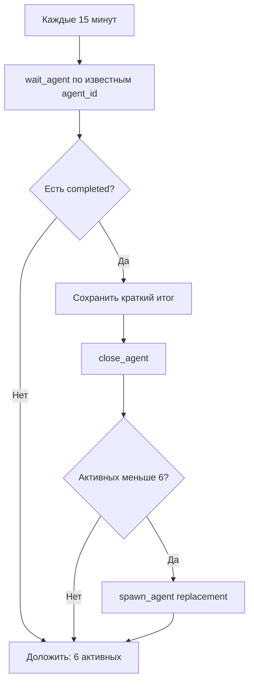

# Пул субагентов

Целевое правило: у главного контролёра всегда должно быть 6 активных
субагентов в работе.

## Текущий стандарт

- `target_active_subagents = 6`
- проверка: каждые 15 минут;
- automation: `kolibri-subagent-pool-supervisor`;
- completed-агент не остаётся открытым;
- результат completed-агента сначала фиксируется в отчёте, затем агент
  закрывается;
- после закрытия создаётся replacement, чтобы снова было 6 активных.

## Текущий пул

| Агент | Роль | Задача |
| --- | --- | --- |
| Godel | `docs_steward` | Developer portal и документация |
| Leibniz | `premium_ui_director` | Премиум-дизайн SPA/PWA и лендинга |
| Descartes | `living_character_director` | Живая птица Kolibri |
| Goodall | `investor_sales_operator` | Инвесторы, клиенты, outreach |
| Halley | `github_profile_curator` | GitHub profile Владислава Кочурова |
| Hooke | `factory_runtime_sre` | Runtime rollout и серверные агенты |

## Алгоритм supervisor

## Replacement backlog

1. `docs_steward`
2. `premium_ui_director`
3. `living_character_director`
4. `investor_sales_operator`
5. `github_profile_curator`
6. `factory_runtime_sre`
7. `qa_lead`
8. `estimate_methodologist`
9. `formulalm_researcher`
10. `mobile_gomesh_integrator`
11. `github_project_operator`
12. `billing_tbank_operator`
13. `legacy_integration_architect`
14. `russian_docs_integrator`

## Agent-work роли и пакеты

| Роль | Пакет | Когда запускать |
| --- | --- | --- |
| `formulalm_researcher` | [FormulaLM Remote R&D Pack](agent-work/formulalm-remote-rd-pack.md) | Remote-only FormulaLM benchmark, dataset, metrics или blocker artifact. |
| `qa_lead` | [QA-пакет релиза](agent-work/product-qa-pack.md) | Перед release decision, investor demo или production change. |
| `github_project_operator` | [GitHub Project ops](agent-work/github-project-ops.md) | Синхронизация issue/PR/Project, blocker hygiene, handoff. |
| `billing_tbank_operator` | [T-Банк billing ops](agent-work/tbank-billing-ops.md) | Checkout, fallback lead, notification security, charge-due, readiness QA. |
| `mobile_gomesh_integrator` | [Mobile/GoMesh Integration Pack](agent-work/mobile-gomesh-integration-pack.md) | PWA hardening, mobile QA, GoMesh contract, feature flag fallback. |
| `legacy_integration_architect` | [Legacy Integration Plan](agent-work/kolibri-legacy-integration-plan.md) | Sanitized перенос legacy-идей в текущие contracts без raw paths. |
| `living_character_director` | [Living Bird Rive Spec](agent-work/living-bird-rive-spec.md) | Rive state machine, SVG fallback, personality и QA matrix. |
| `investor_sales_operator` | [Investor Outreach Pack](agent-work/investor-outreach-pack.md) | One-pager, outreach, CRM segmentation, evidence pack. |

GitHub Project для этих ролей уже создан:
[projects/2](https://github.com/users/rd8r8bkd9m-tech/projects/2). Старый
Project API blocker снят; при сбое `gh project` агент создаёт новый точный
blocker с командой, stderr и scope из `gh auth status`.

## Требование к итогам субагентов

Субагент должен вернуть не только анализ, а готовый артефакт:

- markdown-документ;
- письмо;
- спецификацию;
- task envelope;
- QA checklist;
- rollout plan;
- GitHub issue/PR текст;
- список файлов и проверок.

Для agent-work пакетов итог также должен содержать:

- ссылку на исходный пакет `docs/agent-work/*`;
- что интегрировано в основной русский документ;
- что осталось blocker-ом или follow-up;
- как отразить результат в GitHub Project;
- подтверждение, что код и чужие зоны владения не тронуты, если задача была
  документационной.

## Запреты

- Не оставлять completed-агентов открытыми.
- Не запускать больше 6 без явной причины и отчёта.
- Не терять результат перед закрытием.
- Не запускать FormulaLM/LLM эксперименты на Mac.
- Не печатать секреты.
