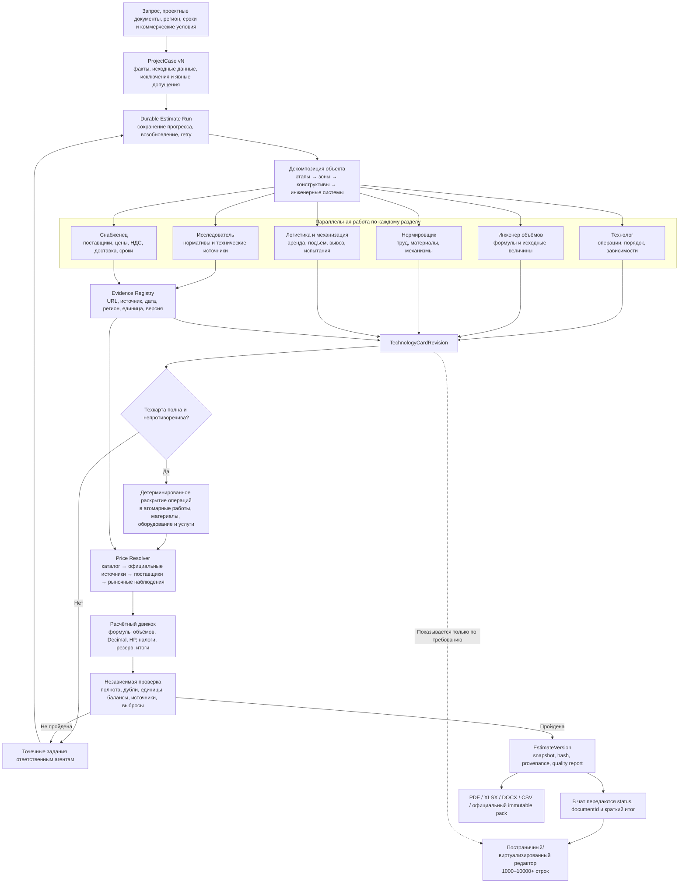

# Durable generation of universal estimates

This document is the normative product contract for the pipeline described by
[ADR 0005](adr/0005-durable-universal-estimate-orchestration.md). It describes
the acceptance boundary; a checklist item is not evidence that the runtime
already implements it.

## Canonical product flow

This diagram is the canonical end-to-end contract. Implementations may split
stages into additional durable tasks, but they must not omit, bypass or replace
any node or gate shown here.



## Authority and artifacts

```text
User inputs / project files
          ↓
ProjectCase revision
          ↓
Durable run ──> section tasks ──> immutable checkpoints
          │                         │
          │                         ├─ technical/price evidence
          │                         └─ project TechnologyCard revision
          ↓
Deterministic expansion and calculation
          ↓
Independent completeness review
          ↓
EstimateVersion + per-row lineage
          ↓
Paged editor / saved-version exports / immutable official pack
```

The V3 backend owns every persistent box. Providers propose structure,
research findings and candidates; they do not publish an `EstimateVersion`,
mark evidence as verified or calculate authoritative totals. Web/mobile state,
AG-UI events and provider threads are derivative views.

## Required stages

1. `project_case` extracts facts, calculated inputs, exclusions and explicit
   assumptions. Missing blocking inputs move the run to `needs_input` with
   concrete questions. Tenant-scoped TXT, CSV, JSON, HTML, PDF, DOCX and XLSX
   attachments are parsed into bounded, hash-linked chunks with explicit
   parse/truncation errors; their content is untrusted user data, never agent
   instructions.
2. `decomposition` creates the WBS by phase, zone, system, section and
   operation.
3. `technology` records the run-local technology-card revision: stable
   operations, order/dependencies, methods, formulas and resources.
4. Quantity engineering, resource norms, technical research, procurement and
   logistics run as separately attributable section tasks. Independent tasks
   may run in parallel.
5. Deterministic expansion emits atomic work, material, equipment, service,
   overhead, tax and contingency rows. Work and its material are never
   combined into one row.
6. The backend calculation applies units, quantities, waste, delivery,
   overhead, tax, discount and contingency with fixed-precision decimal rules.
7. Independent review checks completeness, duplicates, dimensions, evidence,
   outliers, inter-section balances and totals. Only affected sections are
   retried.
8. A successful gate creates a new saved `EstimateVersion`. Technology cards
   remain hidden in the normal editor but are available on explicit request.

The whole run has no request-length deadline. Individual external calls have
bounded timeouts and retry policies; progress and resumability come from the
durable journal rather than an unbounded socket.

Project variables are decimal values with canonical dimensions and explicit
basis. Quantity formulas use the recursive allowlisted AST (`variable`,
`constant`, `multiply`, `add`, `divide`, `ceil`), never provider-authored code
or an unevaluated prose string. Unknown units and dimensionally invalid
formulas fail the affected section and enter its bounded retry/review path;
they are not silently coerced.

## Row acceptance contract

Every published row must have a stable row ID, WBS/section, kind, description,
unit, decimal quantity, quantity formula or basis, decimal price/total,
`operationId`, project technology-card revision and line confidence.

For `source_backed` or `verified`, the referenced price evidence must include a
stable source identifier, observation date, region, source unit/specification,
tax/delivery treatment, freshness/validity and snapshot hash. A row without
such evidence may be `missing` or `preliminary`; it cannot be silently
promoted. Reusing one normalized evidence record across compatible resource
rows is allowed and preferred over repeated web research.

## Large-document transport

`present` is a compact pointer to the saved estimate, never a row transport;
its `rowPage` uses `offset=0`, `limit=0`, the authoritative total and
`hasMore`. Generation metadata distinguishes the originating chat `runId`
from `estimateGenerationRunId` and exposes the accepted technology-card
revision/hash and quality status. The versioned client read contract returns
at most 100 rows per request with a bounded `rowPage`. A delta edit contains
the expected `version`, optional title, `upsertRows`, `deleteRowIds` and
requested return page. A version mismatch returns the typed conflict and never
applies last-write-wins.

The official pack and CSV/XLSX/PDF/DOCX exports read the exact saved version on
the server and include its complete row set. Client pagination must not
truncate exports.

The web same-origin BFF exposes bounded latest/run generation summaries,
explicit technology-card retrieval and authenticated idempotent cancellation.
It forwards the existing session, CSRF and idempotency headers to the V3
backend and does not become a second state authority.

## Quality gates

Row count is an observability metric, not a quality metric. A reference large
estimate passes only when all of the following are true:

- at least 1,000 meaningful atomic rows and 15 technology sections for the
  agreed nine-storey reference scope;
- work, material, equipment and service rows are present;
- every row links to an operation and project technology-card revision;
- every quantity has a reproducible basis;
- every price has evidence or an honest `missing`/`preliminary` status;
- no numbered placeholders, synthetic template families or unexplained exact
  duplicates;
- server totals are reproducible from saved decimal values;
- page read, delta edit, conflict, reload, versions and all exports preserve
  the full saved estimate;
- chat history contains only the compact presentation reference.

Fixture providers may verify SSE, persistence, pagination and export row
counts. They must be named and reported as fixture/transport tests. Only the
separate live gate may establish model-generated semantic quality, and a
missing GPT/Codex or MiMo connection is a reported blocker rather than a
fixture substitute.

## Release evidence

The release report records the run ID, saved estimate document/version,
technology-card hash, row/section/kind counts, semantic-quality report, evidence
coverage by confidence status, calculation version, export row counts and the
live provider profile. It must distinguish `passed`, `failed`, `skipped` and
`blocked`; `skipped` or `blocked` is never summarized as passed.
